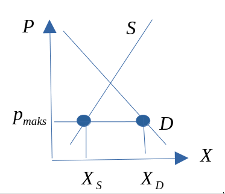
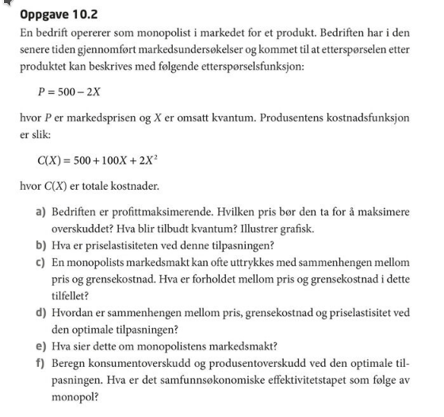
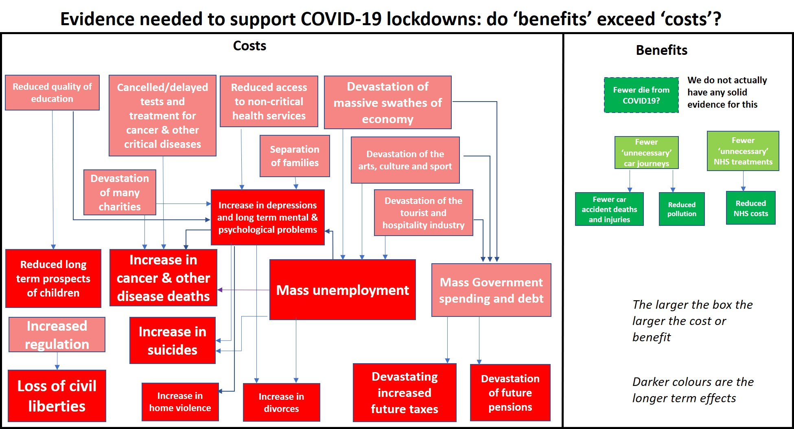
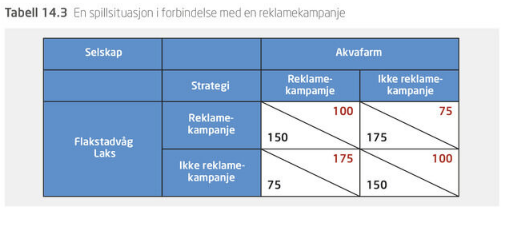
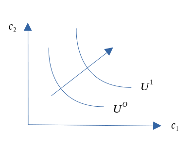
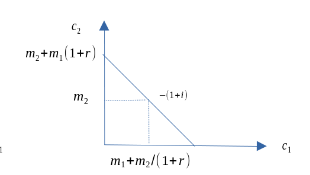

```{r xaringan-tile-view, echo=FALSE, message=F, warning=F}
xaringanExtra::use_editable(expires = 1)
xaringanExtra::use_tile_view()
#xaringanExtra::use_share_again()
xaringanExtra::use_scribble()
xaringanExtra::use_webcam()
#xaringanExtra::use_slide_tone()
xaringanExtra::use_panelset()
library(htmlTable)
library(magrittr)
library(xaringan)
library(plotly)
```

```{r eval=FALSE, include=FALSE}
#- Eksempel med $U(x_1, x_2) = 10x_1x_2$
pathn <- '/forelesninger/hvl'
xaringan::inf_mr(paste0(rprojroot::find_rstudio_root_file(),pathn,'.Rmd'))
system(paste0('brave ',rprojroot::find_rstudio_root_file(),pathn,'.html'))
servr::daemon_stop()
rmarkdown::render(paste0(rprojroot::find_rstudio_root_file(),pathn,'.html'))
```

```{r echo=FALSE, message=FALSE, warning=FALSE}
source(paste0(rprojroot::find_rstudio_root_file(),'/forelesninger/timeplan.R'))
```
# Praktisk informasjon

---

## Timeplan med anbefalte oppgaver

```{r, eval=T, echo=F}
df1_i <- df1[1:6,]
kableExtra::kbl(df1_i[1:6,]) %>% kableExtra::kable_paper(full_width = F) %>% kableExtra::kable_styling(font_size=12)
```

---

```{r, eval=T, echo=F}
df1_ii <- df1[c(7:11),]
kableExtra::kbl(df1_ii) %>% kableExtra::kable_paper(full_width = F) %>% kableExtra::kable_styling(font_size=12)
```

---

## Pensumliste 

.pull-left[

### Hovedbok


```{r, echo=FALSE, out.width="75%", fig.cap=""}
knitr::include_graphics("pensum.jpg")
```

[(Andreassen, Bredesen og Thøgersen)](https://www.cappelendammundervisning.no/_innforing-i-mikrookonomi-9788202640521)

]

.pull-right[

### Oppgavebok


```{r, echo=FALSE, out.width="25%", fig.cap=""}
knitr::include_graphics("oppgaver.jpg")
```

[(Andreassen, Bredesen og Thøgersen)](https://www.cappelendammundervisning.no/_innforing-i-mikrookonomi-ovingsoppgaver-med-losningsforslag-9788202656485)

]


```{r, eval=T, echo=F}
#knitr::kable(df2)
```

---

## Kursgodkjennelse

Består av et obligatorisk arbeidskrav (som må være bestått) for å kunne gå opp til skriftlig eksamen. 

### Obligatorisk innleveringsoppgaver

Utlevert: **10.03**.
Innleveringsfrist: **31.03**.

### Eksamen

Eksamen avholdes den **03.05.2023, 09:00, 4 timer**.

Individuell, skriftlig firetimers eksamen.

Karakterregel: A-F.

Hjelpemidler: Godkjent kalkulator.

---

class: inverse, center, middle

# Kapittel 1: `r tema[1]`

`r paste("Oppdatert:",Sys.Date())`

---

## Hva handler økonomi om?

- Hva handler økonomi om?
- Mikroøkonomi er en del av samfunnsøkonomi. Hvilke temaer forbinder du med samfunnsøkonomi?
- En kort historie om en tur i butikken.
 - Hvilke varer skal du kjøpe?
 - Hvor mye skal du kjøpe av de ulike varene?
- Hva har økonomi med dette å gjøre? Tre relevante forhold:
 - (i) Varene må ha blitt produsert.
 - (ii) Du må tilby noe for å bytte til deg varer. Betalingsmiddel
 - og handel.
 - (iii) Du må ha skaffet betalingsmiddelet.

---

**Altså ...**

- Selv i den «enkle» historien er det:
 - Flere beslutninger involvert.
 - Flere markeder involvert.

- Men: hvorfor får vi ikke alle varer vi vil ha? Rundt oss ser vi (og opplever selv) stor etterspørsel.Vi trenger jo en rekke ting, også i Norge.
	- Svaret er: KNAPPHET!

---

## Definisjon

- Definisjon av økonomi:

*Handler om bruken av knappe ressurser for å dekke menneskelig behov.*

- Den delen av samfunnsvitenskapene som studerer de valgene som individer, bedrifter, myndigheter og samfunn må ta, som følge av knapphet.
- To stikkord: behov og ressurser. Komme tilbake til…
- Bedriftsøkonomi og samfunnsøkonomi: Hvorfor skal dere lære samfunnsøkonomi på dette studiet? Relevant for bedrifter?

---

## Behov

- Økonomers behandling av behov og behovsdannelse. For enkelt? Psykologers behandling av samme tema…
- Et grovt skille:
 - Som må dekkes
 - Ønsker
- Behov avdekkes gjennom preferanser, som igjen kan avdekkes via etterspørsel.
- Kan behov skapes? Jepp. Men er slike skapte behov mer eller mindre viktig enn ”andre” behov, gitt knappe ressurser.
- En måte å skjære gjennom denne problemstillingen på er å legge til grunn *konsumentsuverenitet*.
- ”Folk vet best selv hva som er best for dem”.

---

## Ressurser

- Innsatsfaktor eller produksjonsfaktor kan betegnes som synonyme ord.
<br> $\Rightarrow$ Faktorer som er ”input” i produksjonsprosessen.
- Kategorier:
 - Naturressurser: Fornybare og ikke-fornybare
 - Arbeidskraft
 - Realkapital: Kan brukes direkte eller indirekte
- Ressurser som er KNAPPE.
- Er penger ressurser??

---

## Så kjernen i økonomifaget er dermed:

- Ettersom det er knapphet på ressurser kombinert med store behov, er det ønskelig å bruke ressursene smartest mulig.
<br> $\Rightarrow$  Sikre at utnyttelsen av ressursene er optimal.

- Merk at ressurser ofte har alternativ anvendelse. Dette innebærer at dersom vi bruker en ressurs til å produsere en vare, kan ikke den samme ressursen brukes samtidig til å produsere en annen vare. Av og til ikke i det hele tatt.

---

## Alternativkostnad

- Dette er et helt sentralt begrep i økonomifaget.
- Bruk av ressurser tilfører en verdi som skal dekke menneskelige behov.
- Ressurser har en alternativ anvendelse. Den beste alternative anvendelse har også en verdi. Denne verdien tapes når vi bruker ressursen til et bestemt formål.
- Dette tapet er alternativkostnaden.
  - *Alternativkostnaden er altså verdien av beste alternative anvendelse.*

```{r, echo=FALSE, out.width="45%", fig.cap=""}
knitr::include_graphics("drawio/alternativ.svg")
```

---

## To sentrale spørsmål: spørsmål 1

- (1): Hvordan vil ulike valg bestemme hvilke goder som produseres, hvordan de produseres og for hvem?
 - Goder skal dekke behov og ønsker.
 - Men hva skal vi produsere og hvordan vet vi det?
 - Hvor mye skal produseres?
 - Hvordan? Vil ny teknologi erstatte arbeidskraft og føre til økt arbeidsledighet?
 - Hvem skal det produseres til? Inntektsulikhet.

---

## To sentrale spørsmål: spørsmål 2

- (2): Er det slik at valg som fremmer egeninteresse også fremmer samfunnets beste?
 - Brukes de knappe ressursene på best mulig måte?
 - Egeninteresse: valg som er best for en selv.
 - Sosial interesse: valg som er best for samfunnet som helhet.
 - Dine valg påvirker mange og valgene er knyttet sammen. Anta at alle valgene er gjort av egeninteresse, er det mulig at resultatet også er det beste for samfunnet som helhet?
 - Adam Smith: JA. «Usynlige hånd».

---

## Økonomisk tankemåte: metodologiske tradisjoner

- Økonomifaget defineres ut i fra tema som studeres, men det er en del metodiske tradisjoner.
 1. Et valg er en avveining (trade-off). Knapphet skaper valg.
 1. Kostnad: det du må gi opp.
 1. Fordel (benefit) eller nytte: Gleden du oppnår. Preferanser.
 1. Rasjonelle valg. Bruker all tilgjengelig informasjon, og veier så sammen kostnader og fordeler.
 1. Valg på marginen. Ikke enten-eller, men hvor mye. Marginalkostnad og marginalfordel.
 1. Valg responderer på incentiver. Incentiv: Belønning eller straff som følge av valg.

---

## Økonomi som vitenskap

### Modeller

- Bruker økonomiske modeller.
- Hva er en modell? En forenklet beskrivelse av virkeligheten. Bygger pr. definisjon på forutsetninger.
- Hvorfor bruke modeller? For å kunne fokusere på ett eller noen aspekter av virkeligheten. Virkeligheten er komplisert…
- Modeller gjør at vi kan rense vekk momenter som vi tror ikke har noen spesiell innvirkning på vårt spørsmål.

---

## Økonomi som vitenskap

### Skillet mellom mikroøkonomi og makroøkonomi

- Det finnes flere måter å strukturere økonomifaget på. Disiplinen består av en rekke underområder.
- Mikroøkonomi: Søker å forklare aktørers beslutninger, tilpasning og interaksjon.
- Aktører: Bedrifter, konsumenter, markeder.
- Makroøkonomi: Søker å studere og forklare aggregerte størrelser. Økonomien under ett.
- Makroøkonomi kan deles inn i konjunkturteori og økonomisk vekst.

---

## Appendiks (alle figurene samlet)

```{r, echo=FALSE, out.width="50%", fig.cap=""}
knitr::include_graphics("drawio/oversikt_hele.svg")
```

```{r}
knitr::knit_exit()
```

---

class: inverse, center, middle

# Kapittel 3: En markedsmodell med fullkommen konkurranse

`r paste("Oppdatert:",Sys.Date())`

---

## Innledning

- Bytteøkonomi og markedsøkonomi: I en markedsøkonomi (pengeøkonomi) byttes varer *indirekte*.
- Et marked består av en tilbudsside og en etterspørselsside.
- Vi skal nå se på den enkleste markedsformen i økonomisk teori.
- Markedsformen er likevel nyttig:
  - Selvstendig analyseapparat.
  - Kan utvides langs mange dimensjoner.
  - Er samfunnsøkonomisk effektiv (hva som menes med dette skal vi bruke en del tid på senere).
  - Er en referansemodell som andre modeller og resultater kan sammenlignes mot.

---

## Bakgrunn

- Store deler av kurset vil handle om teorien bak denne modellen. MERK at oppbyggingen gir oss flere selvstendige modeller som er nyttige for økonomiske analyser.
- Modellen går langt tilbake: 
  - Adam Smith (1723-1790) $\rightarrow$ 
  - Nyklassikerne og John Stuart Mill (1806-1873) $\rightarrow$ 
  - Alfred Marshall (1842-1924) $\rightarrow$ 
  -  Paul Samuelson (1915-2009) mfl.
- Vi skal komme tilbake til forutsetningene bak denne modellen i kapittel 9.
- Men merk spesielt: Aktørene er *pristakere* og har ingen innflytelse på pris som enkeltaktør, men *summen* av aktørenes adferd bestemmer markedsprisen.

---

```{r}
knitr::knit_exit()
```


## Markedsetterspørsel

- Etterspørsel etter varer og tjenester. Ofte kalles varer + tjenester for goder.
- Hva bestemmer etterspørselen? Priser, inntekt med mer. 
- Etterspørselsloven:
  - Økt pris $\rightarrow$ lavere etterspørsel, alt annet konstant (cet.par.). 
  - Flere forhold holdes her konstante. Vi ser kun på endringer i prisen på varen. En endring i denne vil flytte oss langs kurven.
  - En endring i konstantene vil føre til skift i kurven.
- Fra et individs etterspørsel til markedsetterspørsel.
```{r, echo=FALSE, out.width="65%", fig.cap=""}
p1 <- paste0(rprojroot::find_rstudio_root_file(),'forelesninger/drawio/ekurve.png')
knitr::include_graphics(p1)
```

---

## Markedstilbud

- Tilbud av varer og tjenester. Tilbudet utgjøres av bedriftene eller produsentene. Tilbudet er altså produksjonen.
- Hva bestemmer tilbudet? Pris på ferdigvare og innsatsfaktorer. Matematisk på tavla.
- Tilbudsloven:
  - Økt pris $\rightarrow$ økt tilbud, cet.par. Kurve.
  - Endringer i prisen på varen fører til bevegelse langs kurven.
  - En endring i konstantene fører til skift i kurven.
- Fra en bedrifts tilbud til markedstilbud.

```{r, echo=FALSE, out.width="65%", fig.cap=""}
p1 <- paste0(rprojroot::find_rstudio_root_file(),'/inst/forelesningsnotater/drawio/tkurve.png')
knitr::include_graphics(p1)
```

---

## Markedslikevekt 

- Utgangspunkt: markedets E-kurve og T-kurve.
- Likevekt: dersom ingen aktører ønsker å endre den eksisterende økonomiske tilpasning.
	-  $X^S = X^D$
	- Overskuddsetterspørsel: $X^D > X^S$
- Anta at prisen er lavere enn likevektspris (makspris).
	- Overskuddstilbud: $X^S > X^D$
- Anta at prisen er over likevektsprisen (minpris).
- Ingenting i modellen som tilsier stabilitet. Men utenfor modellen kan vi resonnere omkring markedskrefter, slik de er beskrevet av Adam Smith.

```{r, echo=FALSE, out.width="50%", fig.cap=""}
knitr::include_graphics("drawio/telikevekt.png")
```

---

## Komparativ statikk/ skift i kurvene

- Vi vet at tilbuds- og etterspørselskurvene er konstruert under en antagelse om at flere forhold antas konstante. Dersom det skjer endringer i noen av disse forholdene, vil kurvene forskyves i diagrammet.
La oss se på noen av disse forholdene.

**Tilbudskurven**

- Ble tegnet for:
	- gitt teknologi for bedriften,
	- gitte priser på innsatsfaktorene.

**Etterspørselskurven**

- Ble tegnet for:
	- en gitt behovsstruktur for konsumenten,
	- gitt samlet inntekt for konsumenten,
	- gitt inntektsfordeling,
	- gitte priser på andre goder.

---

**Helningens betydning**

- Helningen på tilbuds- og etterspørselskurven påvirker hvordan endringer i markedet påvirker pris og mengde.
La oss se på et eksempel der lavere pris på innsatsfaktorene har ført til et positivt skift i tilbudskurven.

```{r, echo=FALSE, out.width="50%", fig.cap=""}
knitr::include_graphics("drawio/telikevekt_ke.png")
```

---

## Effekten av en avgift

- En avgift kan ha flere hensikter, men spesielt er to ting viktig:
	i) Inntekt for staten
	ii) Endrer markedsresultatet. Aktuelt ved behov for korrigering av nåværende situasjon (tilpasning).
- Avgiften kan pålegges kjøperne og selgerne.

---

Anta nå at avgiften $\tau$ blir pålagt selgerne
- Dersom avgiften pålegges produsentene, vil
kostnadene til bedriften stige. Dette skifter isolert sett
tilbudskurven innover. Den vertikale størrelsen på
skiftet er lik avgiften $\tau$.
Resultater:
- Staten får inn $\tau$ kr. pr. enhet.
- Konsumenten betaler: $P^K$
- Produsenten mottar: $P^P$
Produsenten ”sender” nå avgiften til staten, men begge bærer byrden!!

```{r, echo=FALSE, out.width="45%", fig.cap=""}
knitr::include_graphics("drawio/telikevekt_avg.png")
```

---

## Maksimal- og minsteprisen

- Maksimalpris har vi dersom markedsprisen blir overtyrt ved at myndighetene setter et makspris som er *lavere* enn markedsprisen.

```{r, echo=FALSE, out.width="40%", fig.cap=""}

```

---

- Minstrepris har vi dersom markedsprisen blir overtyrt ved at myndighetene setter et minstepris som er *høyere* enn markedsprisen.

```{r, echo=FALSE, out.width="40%", fig.cap=""}
knitr::include_graphics("drawio/telikevekt_min.png")
```

---

## Produksjonsmulighetskurven (PMK)

- Produksjonsmulighetskurven (PMK)
- PMK: kurven kan brukes til å illustrere hvordan produksjonsmulighetene er begrenset. Dette fører til et ressursallokeringsproblem. Videre skal vi illustrere forskjellen på kort og lang sikt.
- Kurven bygger på en antagelse om at alternativkostnadene øker ved stadige overføringer av ressurser mellom sektorer.
- Forutsetninger: to produkter, gitt mengde produksjonsfaktorer (kort sikt) og produksjonsteknologien er konstant.

```{r, echo=FALSE, out.width="60%", fig.cap=""}
knitr::include_graphics("drawio/pmk.png")
```

---

## Appendiks (alle figurene samlet)

```{r, echo=FALSE, out.width="55%", fig.cap=""}
knitr::include_graphics("drawio/markedfullkommen.png")
```

```{r, echo=F,eval=F}
knitr::knit_exit()
```

---

class: inverse, center, middle

# Kapittel 4: `r paste(substring(del[2],4),tema[2])`

`r paste("Oppdatert:",Sys.Date())`

---

## Innledning

- Produsentene eller bedriftene er en av hovedaktørene i en økonomi.
- Produsentens rolle: tilby de varer og tjenester som etterspørres i et samfunn. Basert på konsumentens ønsker må produsenten vite hva som skal produseres, mengde og lokalisering.
- Teknologisk perspektiv: Produsenten bruker innsatsfaktorer til å omforme råvarer til ferdige produkter.
- Vi forenkler produksjonsbildet ved å anta at produsenten bruker to innsatsfaktorer, $N$ og $K$, til å produsere ett produkt, $x$. $N$ er arbeidskraft og $K$ er realkapital.

```{r, echo=FALSE, out.width="65%", fig.cap=""}
pf <- paste0(rprojroot::find_rstudio_root_file(),'/inst/forelesningsnotater/drawio/prodbildetf.png')
knitr::include_graphics(pf)
```

- Bedriften må altså velge effektiv produksjonsprosess.

---

- Økonomisk perspektiv: Her består valget i å velge hvor mye bedriften skal produsere og tilby av produktet.
- For å kunne få størst mulig overskudd må vi kjenne til inntekter og kostnader. Kostnadene er igjen svært avhengig av det teknologiske valget.
- Vi må derfor sammenkoble elementer fra begge disse perspektivene.

---

## Produksjon og teknologiske forhold

- Vi tar utgangspunkt i produksjonsbildet med to innsatsfaktorer og ett produkt.
- Produktfunksjonen:
	- $x = f(N, K)$
- Viser, for enhver mulig faktorkombinasjon, det maksimale antall enheter som kan produseres av produktet.
- $f$ beskriver formen på avhengighetsforholdet mellom produksjonsmengden og innsatsfaktorene. Kan tolkes som forhold (faktorer) som endrer produksjonsmengden uten å endre mengden av innsatsfaktorene $N$ og $K$.

---

**Talleksempel på en produktfunksjonen**

```{r, echo=FALSE}
#knitr::include_graphics("bilder/prodftall.png")
xout <- c(10,24,39,52,61,66,66,64,56,44)
gpout <- c(NA,14,15,17,9,5,0,-2,-8,-12)
gjout <- round(c(10,24,39,52,61,66,66,64,56,44)/seq(1,10),digits=0)
tabell_prodf <- data.frame(N=seq(1,10),K=20,x=xout,GP=gpout,GjP=gjout)
tipf_navn <- c("Arbeidskraft (N)","Kapital (K)","Produksjon", "Grenseprodukt.", "Gjennomsnittsprod.")
kableExtra::kbl(tabell_prodf, col.names=tipf_navn) %>% kableExtra::kable_paper(full_width = F) %>% kableExtra::row_spec(c(4,5,6), bold = T)
```

---

**Forutsetninger om produktfunksjonen**

- For analytiske formål antas funksjonen kontinuerlig og to ganger deriverbar:

.pull-left[
Arbeidskraft

```{r, echo=FALSE, out.width="40%", fig.cap=""}
pkl <- paste0(rprojroot::find_rstudio_root_file(),'/inst/forelesningsnotater/drawio/prodkl.png')
knitr::include_graphics(pkl)
```

- $\frac{\partial f}{\partial N} > 0$
- $\frac{\partial^2 f}{\partial N^2} < 0$

]

.pull-right[
Kapital

```{r, echo=FALSE, out.width="40%", fig.cap=""}
pkk <- paste0(rprojroot::find_rstudio_root_file(),'/inst/forelesningsnotater/drawio/prodkk.png')
knitr::include_graphics(pkk)
```

- $\frac{\partial f}{\partial K} > 0$
- $\frac{\partial^2 f}{\partial K^2} < 0$

]

- Positive, men avtagende grenseproduktiviteter.
- De førsteordens partielle deriverte uttrykker grenseproduktiviteten: hvor mye produsert kvantum endres ved en liten endring i bruken av vedkommende innsatsfaktor.
- Loven om avtakende utbytte gjelder altså her.

---

## Isokvanter og MTSB for produksjon

- For å representere produktfunksjonen grafisk, skal vi bruke et redskap fra matteboka, nemlig nivåkurver.
- Nivåkurven kalles her en *isokvant*: viser alle kombinasjoner av N og K som gir samme produserte kvantum.

```{r, echo=FALSE, out.width="40%", fig.cap=""}
iso <- paste0(rprojroot::find_rstudio_root_file(),'/inst/forelesningsnotater/drawio/isokvant.png')
knitr::include_graphics(iso)
```
 
- Isokvantens form bygger på følgende prinsipp: jo mer bedriften har av en innsatsfaktor, jo mer kan den bytte for én ekstra enhet av den andre faktoren, gitt at produksjonsmengden skal være den samme.
- *MTSB (marginale tekniske substiusjonsbrøk)* beskriver *helningen* på en isokvant for en gitt faktorkombinasjon, dvs. i ett punkt på isokvanten.

---

- Formell utledning av MTSB. Ta utgangspunkt i produktfunksjonen og total differensier.

$$
\overline{x} = f(K,N)
$$

Dersom vi totaldifferensierer dette uttrykket får vi 

\begin{equation*}
\Delta \overline{x} = f'_{K}(K,N)\Delta K + f'_{N}(K,N)\Delta N = 0 
\end{equation*}

Uttrykket ovenfor kan skrives som 

\begin{equation*}
f'_{K}(K,N)\Delta K =- f'_{N}(K,N)\Delta N \\
\frac{\Delta K}{\Delta N} = - \frac{f'_{N}(K,N)}{f'_{K}(K,N)} 
\end{equation*}

\begin{equation*}
MTSB \equiv -\frac{\Delta K}{\Delta N} =  \frac{f'_{N}(K,N)}{f'_{K}(K,N)}>0
\end{equation*}

- Merk: MTSB er gitt ved forholdet mellom grenseproduktivitetene.

---

**Eksempel 4.2 fra pensumbok**

Anta at produktfunksjonen er gitt ved: $x = N^{0,7}+K^{0,3}$ Regn ut MTSB for denne produktfunksjonen.

Grenseproduktiviteten til arbeidskraften er gitt ved $$
\frac{\partial x}{\partial N} = 0,7N^{0,7-1} =  0,7N^{-0,3} 
$$

Grenseproduktiviteten til kapitalen er gitt ved $$
\frac{\partial x}{\partial K} = 0,3K^{0,3-1} =  0,3K^{-0,7} 
$$

MTSB blir derfor $$
MTSB \equiv - \frac{\Delta K}{\Delta N} = \frac{\frac{\partial x}{\partial N}}{\frac{\partial x}{\partial K}} = \frac{0,7N^{-0,3}}{0,3K^{-0,7}} 
$$ 

---

## Substitusjonsegenskaper

- Dette sier noe om hvor lett det er å erstatte innsatsfaktorer med hverandre.
- For eksempel: I noen bransjer er det lettere å erstatte arbeidskraft med kapital enn i andre.
- Dette kan fremstilles med formen på isokvanten.
- Ytterkantene: perfekt substitusjon og ingen substitusjon (perfekte komplementer).

.pull-left[
Linær produksjonsteknologi (perfekte substitutter)

```{r, echo=FALSE, out.width="50%", fig.cap=""}
pss <- paste0(rprojroot::find_rstudio_root_file(),'/inst/forelesningsnotater/drawio/linsub.png')
knitr::include_graphics(pss)
```
]

.pull-right[
Leontief produksjonsteknologi (ingen substitusjon)

```{r, echo=FALSE, out.width="60%", fig.cap=""}
fss <- paste0(rprojroot::find_rstudio_root_file(),'/inst/forelesningsnotater/drawio/lensub.png')
knitr::include_graphics(fss)
```
]


---

## Skalaegenskaper

- Mens grenseprodukt viser endring i bruken av én innsatsfaktor, viser skalaendringer endringer i bruken av *alle* innsatsfaktorer.
- Definisjon: Skalaegenskapene sier noe om hvor mye produksjonsmengden endres ved *proporsjonale* endringer i bruken av innsatsfaktorene.
- Proporsjonale endringer innebærer at forholdet mellom N og K er konstant. 
- Anta en proporsjonal økning på 100%.
- Hva skjer med produksjonsmengden (merk: produksjonsprosesser kan variere i skala)?

---

- i) Konstant skalautbytte
  - Skalaøkning på y % $\Rightarrow$ økning i produsert kvantum på y %.

```{r, echo=FALSE, out.width="40%", fig.cap=""}
koskala <- paste0(rprojroot::find_rstudio_root_file(),'/inst/forelesningsnotater/drawio/koskala.png')
knitr::include_graphics(koskala)
```

---

- ii) Avtagende skalautbytte
  - Skalaøkning på y % $\Rightarrow$ økning i produsert kvantum på mindre enn y %.

```{r, echo=FALSE, out.width="40%", fig.cap=""}
avskala <- paste0(rprojroot::find_rstudio_root_file(),'/inst/forelesningsnotater/drawio/avskala.png')
knitr::include_graphics(avskala)
```

---

- iii) Økende skalautbytte
  - Skalaøkning på y % $\Rightarrow$ økning i produsert kvantum på mer enn y %.

```{r, echo=FALSE, out.width="40%", fig.cap=""}
okskala <- paste0(rprojroot::find_rstudio_root_file(),'/inst/forelesningsnotater/drawio/okskala.png')
knitr::include_graphics(okskala)
```

---

## Appendiks (alle figurene samlet)

```{r, echo=FALSE, out.height="30%",out.width="55%", fig.cap=""}
allp <- paste0(rprojroot::find_rstudio_root_file(),'/inst/forelesningsnotater/drawio/oversikt_prod_i.png')
knitr::include_graphics(allp)
```

```{r, echo=F,eval=F}
knitr::knit_exit()
```

---

class: inverse, center, middle

# Kapittel 5: `r paste(substring(del[2],4),tema[3])`

`r paste("Oppdatert:",Sys.Date())`

---

## Innledning
- Vi skal starte med å se litt generelt på inntekter, kostnader og ulike kostnadsbegreper.
- Deretter skal vi se på kostnadslinja, som ser kostnadene i forbindelse med faktorbruk.
- Vi skiller mellom kort og lang sikt.
- Til slutt skal vi se på bedriftens optimale tilpasning, hvor vi vil legge til grunn at bedriften har et mål om å maksimere antall produserte enheter under en budsjettbetingelse.

---

## Inntekter på kort og lang sikt 

- Bedriftens inntekter bestemmes av antall enheter den selger, og prisen på disse enhetene.
- Pris: $p$. Mengde: $x$.
- Inntekt: $R=px$. Stigende i et $(x,R)$-diagram
- Grenseinntekt: endring i inntekt ved en marginal endring i solgt kvantum: $R'(x)$
- Gjennomsnitsinntekt: inntekt per produsert enhet: $\overline{R}$.

```{r, echo=FALSE, out.width="50%", fig.cap=""}
innt <- paste0(rprojroot::find_rstudio_root_file(),'/inst/forelesningsnotater/drawio/inntf.png')
knitr::include_graphics(innt)
```

---

*Tabelleksempel for salgsinntekter*

```{r echo=F, message=FALSE, warning=FALSE}
library(dplyr)
tabell_inntekt <- data.frame(mengde=c(1,2,3),pris=c("1000","1000","1000"), salgsi=c("1000","2000","3000"), grensei=c("","1000","1000"), gjinnt=c("1000","1000","1000"))
ti_navn <- c("Solge enheter","Pris per enhet","Salgsinntekt", "Grenseinntekt", "Gjennomsnittsinntekt")
kableExtra::kbl(tabell_inntekt, col.names=ti_navn)
```
---

## Kostnader på kort sikt
- Kostnader: De beløp som påløper som følge av virksomhet.
- Faste kostnader  $(C_F)$ : Kostnader som er uavhengige av produsert kvantum.
- Variable kostnader $(C_V$): Varierer i takt med produsert kvantum 
  - $CV = CV(x)$
- Totale kostnader $(C)$: Summen av faste og variable kostnader
  - $C = CF + CV$
- Gjennomsnittskostnader (enhetskostnader): Disse finner vi ved å dividere de respektive kostnadene med antall produserte enheter. 
  - $\overline{C}=\frac{CF}{X}+\frac{CV}{X}=\overline{C}_F+\overline{C}_V$
- Grensekostnader ( $GK$ eller $C'$ ): Endringen i bedriftens totale kostnader ved en liten endring i produsert kvantum 
  - $GK=\frac{dC(x)}{dx}=C'(x)$

---

**Sammenhengen mellom gjennomsnittskostnad og grensekostnad**

*Tabelleksempel a): med avtagende marginalproduktivitet (mest relevant for dette kurset) og uten faste kostnader*

```{r, echo=F}
library(dplyr)
tabell_inntekt_i <- data.frame(prod=c(1,2,3),faktorpris=c("1000","1000","1000"), faktantall=c("1","2","3.1"), varek=c("1000","2000","3100"))
tabell_inntekt_ii <- data.frame(w=c("0","0","0"),a=c("1000","2000","3100"),b=c("","1000","1100"),c=c("","1000","1032"))
ti_navn_i <- c("Produserte enheter","Lønnskostnader","Antall arbeidere", "Variable kostnader")	     
ti_navn_ii <- c("Faste kostnader","Totale kostnader", "Grensekostnader", "Gjennomsnittskostnad") 
kableExtra::kbl(tabell_inntekt_i, col.names=ti_navn_i) 
```
<br>
```{r, echo=F}
kableExtra::kbl(tabell_inntekt_ii, col.names=ti_navn_ii) 
```

---

*Tabelleksempel b): med økende marginalproduktivitet (mindre relevant) og uten faste kostnader*

```{r, echo=F}
library(dplyr)

tabell_inntekt_i <- data.frame(prod=c(1,2,3),faktorpris=c("1000","1000","1000"), faktantall=c("1","2","2.9"), varek=c("1000","2000","2900"))
tabell_inntekt_ii <- data.frame(w=c("0","0","0"),a=c("1000","2000","2900"),b=c("","1000","900"),c=c("","1000","966"))
ti_navn_i <- c("Produserte enheter","Lønnskostnader","Antall arbeidere", "Variable kostnader")	     
ti_navn_ii <- c("Faste kostnader","Totale kostnader", "Grensekostnader", "Gjennomsnittskostnad") 
kableExtra::kbl(tabell_inntekt_i, col.names=ti_navn_i) 
```
<br>
```{r, echo=F}
kableExtra::kbl(tabell_inntekt_ii, col.names=ti_navn_ii) 
```

---

*Tabelleksempel c): med avtagende marginalproduktivitet og med faste kostnader*

```{r, echo=F}
library(dplyr)
tabell_inntekt_i <- data.frame(prod=c(1,2,3),faktorpris=c("1000","1000","1000"), faktantall=c("1","2","3.1"), varek=c("1000","2000","3100"))
tabell_inntekt_ii <- data.frame(w=c("2000","2000","2000"),a=c("3000","4000","5100"),b=c("","1000","1100"),c=c("3000","2000","1700"))
ti_navn_i <- c("Produserte enheter","Lønnskostnader","Antall arbeidere", "Variable kostnader")	     
ti_navn_ii <- c("Faste kostnader","Totale kostnader", "Grensekostnader", "Gjennomsnittskostnad") 
kableExtra::kbl(tabell_inntekt_i, col.names=ti_navn_i) 
```
<br>
```{r, echo=F}
kableExtra::kbl(tabell_inntekt_ii, col.names=ti_navn_ii) 
```

---

**Grensekostnad og gjennomsnittskostnad uten faste kostnader**

```{r, echo=FALSE, out.width="50%", fig.cap=""}
kostku <- paste0(rprojroot::find_rstudio_root_file(),'/inst/forelesningsnotater/drawio/kostku.png')
knitr::include_graphics(kostku)
```

**Grensekostnad og gjennomsnittskostnad med faste kostnader**

```{r, echo=FALSE, out.width="50%", fig.cap=""}
kostkm <- paste0(rprojroot::find_rstudio_root_file(),'/inst/forelesningsnotater/drawio/kostkm.png')
knitr::include_graphics(kostkm)
```

---

## Kostnader på lang sikt
### Kostnadslinjen og isokostlinja
- Totale kostnader for bedriften er summen av variable og faste kostnader. La oss nå se bort fra de faste, dette siden vi antar alle faktorer antas å være variable på lang sikt.
- Vi antar at bedriftens kostnader kan uttrykkes ved summen av utgiftene på de to innsatsfaktorene.
	- Pris på N: w
	- Pris på K: r
- $C = wN + rK$
Totale kostnader (C) er da gitt ved:
$$
C = wN  +  rK
$$
Isokost (låser totalkostnadene til et bestemt nivå, $C^o=C$
$$
C^o= wN + rK
$$

---

Helningen på isokostlinja
\begin{equation}
\Delta C^0= w\Delta N + r\Delta K = 0 \\
 r\Delta K = -w\Delta N  \\
\frac{\Delta K}{\Delta N} = - \frac{w}{r} 
\end{equation}

Bruker hele budsjettet på arbeidskraft $\Rightarrow K=0$
\begin{equation}
C^0= wN + r0 = wN \\
C^0/w = N \\
N = C^0/w 
\end{equation}

Bruke hele budsjettet (kostnaden) på kapital $\Rightarrow N=0$
\begin{equation}
C^0= w0 + rK = wN \\
C^0/r = K \\
K = C^0/r 
\end{equation}

---

```{r, echo=FALSE, out.width="50%", fig.cap=""}
#isokost
#skalau <- paste0(rprojroot::find_rstudio_root_file(),'/inst/forelesningsnotater/drawio/skalau.png')
#knitr::include_graphics(skalau)
```

## Produktmaksimering for en gitt kostnadsramme (optimal tilpasning)
- Målsetting er her å maksimere produsert kvantum innenfor en gitt kostnadsramme.
- Dette kan være typisk for en bedrift i offentlig sektor, der de økonomiske rammebetingelsene utgjøres av en gitt kostnadsramme eller et gitt budsjett som er blitt tildelt over de offentlige budsjetter.

---

- Tar utgangspunkt i produktfunksjonen:
- $x = f(N, K)$
- Helningen er gitt ved MTSB.
- Tar så utgangspunkt i kostnadslinja:
- $C = wN + rK$
- Kombinerer disse for å finne optimal tilpasning.

Max $x=f(K,N)$ gitt $C^0=wN +rK$ gitt (beskrankning)

Lagrange metode:

\begin{equation}
L = f(K,N) - \lambda(wN+rK-C^0)
\end{equation}

Første ordens betingelsen er gitt ved

\begin{equation}
\partial L/\partial N = f'_{N} - \lambda w  =0 \\ 
\partial L/\partial K = f'_{K} - \lambda r =0 
\end{equation}

---

Kombinerer de to første ordens betingelsene gir oss løsningen

\begin{equation}
\lambda w/\lambda r=w/r = \frac{f'_{N}}{f'_{K}} = MTSB
\end{equation}

Optimal løsning er her karakterisert ved tangeringspunktet mellom isokvant og isokostlinjen.

```{r, echo=FALSE, out.width="40%", fig.cap=""}
kosmin <- paste0(rprojroot::find_rstudio_root_file(),'/inst/forelesningsnotater/drawio/kosmin.png')
knitr::include_graphics(kosmin)
```

---

### Endrede faktorpriser 

**Redusert pris på kapital**

```{r, echo=FALSE, out.width="25%", fig.cap=""}
kosminkk <- paste0(rprojroot::find_rstudio_root_file(),'/inst/forelesningsnotater/drawio/kosminkk.png')
knitr::include_graphics(kosminkk)
```

**Redusert pris på arbeidskraft**

```{r, echo=FALSE, out.width="25%", fig.cap=""}
kosminka <- paste0(rprojroot::find_rstudio_root_file(),'/inst/forelesningsnotater/drawio/kosminka.png')
knitr::include_graphics(kosminka)
```

Kjøper mer (mindre) av den innsatsfaktoren som har blitt billigere (dyrere).

---


## Substitumalen: økonomisk substitusjon
- Dersom vi tenker oss flere endringer i bedriftens kostnadsramme med tilhørende optimale isokvant, vil vi få frem en rekke tangeringspunkter. 
```{r, echo=FALSE, out.width="30%", fig.cap=""}
submalen <- paste0(rprojroot::find_rstudio_root_file(),'/inst/forelesningsnotater/drawio/submalen.png')
knitr::include_graphics(submalen)
```
- Kurven gjennom alle disse punktene kalles *ekspansjonsveien* eller *substitumalen*.
- På ethvert punkt på denne kurven kan det leses av produksjonsmengde, tilhørende kostnader og etterspørsel etter innsatsfaktorer.
- Alle punktene på substitumalen viser tilpasninger der det ikke er mulig å øke produktmengden, uten at kostnadene øker. Det er heller ikke mulig å redusere kostnadene, uten samtidig å redusere produsert kvantum.
- Dersom bedriften er utenfor substitumalen kan den alltid bedre sin situasjon ved økonomisk substitusjon.

---

## Appendiks (alle figurene samlet)

```{r, echo=FALSE, out.width="45%", fig.cap=""}
knitr::include_graphics("drawio/oversikt_prod_ii.png")
```

```{r, echo=F,eval=F}
knitr::knit_exit()
```

---

class: inverse, center, middle

# Kapittel 6: `r paste(substring(del[2],4),tema[4])`

`r paste("Oppdatert:",Sys.Date())`

---

## Fortjenestemaksimering som mål for bedriften

- Vi skal nå legge til grunn at bedriften har som mål å maksimere fortjenesten eller profitten.
- Vi skal også legge til grunn av bedriften betrakter alle priser som gitte (gode- og faktorpriser).
- Bedriften tilpasser seg på to markeder: 
  - godemarkedet
  - faktormarkedet (arbeidskraft og kapital)
- På faktormarkedet kjøper bedriften innsatsfaktorer og må velge de kvantum av faktorene som maksimerer fortjenesten. 
- På godemarkedet må bedriften velge den produksjonsmengden som maksimerer fortjenesten. Altså: to valg!!

---

## Hvor stor skal produksjonen være på kort sikt?

- For å finne svar på dette, lar vi produksjonsmengden være variabel.
- Hensikten med denne tilnærmingen er å analysere hvordan bedriften varierer produsert kvantum/ antall enheter den produserer, for å oppnå høyest mulig fortjeneste.
- Produsentens valgvariabel er dermed kvantumet $x$.
- En fordel med denne tilnærmingen er at den gir sammenhengen mellom pris og produsert kvantum på en enkel måte. Dette kan så brukes til å utlede bedriftens tilbudskurve, og i neste omgang markedets tilbudskurve.

---

**Fortjenestemaksimering (kort sikt) med variabel produksjonsmengde**

- Produksjon: $x = f(N)$
- Kostnader: $C(x) = CV(x) + CF$
- Salgsinntekt: $R = px$
- Maks profitt: $F = R – C$ som gir $F=px – CV(x) – CF$
- Bedriften ønsker å maksimere dette uttrykket mhp. bruken av arbeidskraften. Formelt kan vi uttrykke dette som:
$$
\underset{x}{\text{Maks }} F=px-C(x)
$$

---

**Løsning og tolkning**

1.ordensbetingelsen er gitt ved
$$
p = C'(x)
$$
Produksjonen tilpasser seg der hvor produktprisen er lik grensekostnaden.

2.ordensbetingelsen (som sikrer maksimum) 
$$
F''(x)=-C''(x) < 0 \Leftrightarrow C''(x) > 0 
$$

Kostnadsfunksjonen må være konveks (som vi tidligere har sett at kan komme som et resultat av avtagende grenseproduktivitet mhp. bruken av arbeidskraft)


.pull-left[
*Uten faste kostnader*
```{r, echo=FALSE, out.width="45%", fig.cap=""}
kgkufast <- paste0(rprojroot::find_rstudio_root_file(),'/inst/forelesningsnotater/drawio/kgkufast.png')
knitr::include_graphics(kgkufast)
```
]
.pull-right[
*Med faste kostnader*
```{r, echo=FALSE, out.width="45%", fig.cap=""}
kgkmfast <- paste0(rprojroot::find_rstudio_root_file(),'/inst/forelesningsnotater/drawio/kgkmfast.png')
knitr::include_graphics(kgkmfast)
```
]

---

**Øvelse om produksjonen**

Anta at produktprisen er gitt ved 100 og kostnadsfunksjonen som $C(x)=x^2$. Hva blir den optimale produksjon?

**Løsning**

Uttrykket for fortjeneste kan formuleres som 
$$
F=100\cdot x - x^2
$$

Vi ønsker å finne maksimal produksjon. Førsteordensbetingelsen vil hær være gitt ved
$$
F'(x)=100-2x=0 \\
2x=100
x=100/2=50
$$

Andreordensbetingelsen for maksimum er oppfylt siden
$$
F'(x)=-2<0
$$

---

## Hvor stor skal produksjonen være på lang sikt?

- Dersom vi antar *avtagende skalautbytte*, vil denne løsningen også gjelde på lang sikt.
- For konstant eller økende skalautbytte, vil **ikke** maksimeringen av fortjenesten gjør det mulig å bestemme det optimale nivået på $x$ (2. ordensbetingelsen er ikke oppfylt).
- Senere i kurset, skal vi se at for dette tilfelle vil det være etterspørselskurven som bestemmer hvor mye som bli produsert i markedet.

---

## Bedriftens tilbud på kort og lang sikt

- Tilbudet til bedriften må bestemmes gjennom profittmaksimering eller kostnadsminimering.  
- Ettersom dette krever at bedriften er på grensekostnadskurven, vil tilbudskurven være ”den samme” som grensekostnadskurven.
- På kort vil bedriftens tilbud være stigende i et (x,p)-diagram.
- Reservasjonsprisen (minsteprisen) vil være der hvor $p_r=\overline{C}$
  	- Dersom de faste kostnadene er irrreversible (har en alternativ anvendelse), vil $\overline{C}=\overline{C}_V$ 
  	- Dersom de faste kostnadene er reversible (har en alternativ anvendelse), vil $\overline{C}=\overline{C}_V+\overline{C}_F$ 
- På lang sikt vil bedriftens tilbudskurve kunne være horisontal (ved konstant skalautbytte) i et (x,p)-diagram på

.pull-left[
*Uten faste kostnader*
```{r, echo=FALSE, out.width="45%", fig.cap=""}
kgkufast <- paste0(rprojroot::find_rstudio_root_file(),'/inst/forelesningsnotater/drawio/ktilbu.png')
knitr::include_graphics(kgkufast)
```
]
.pull-right[
*Med faste (reversible) kostnader*
```{r, echo=FALSE, out.width="45%", fig.cap=""}
kgkmfast <- paste0(rprojroot::find_rstudio_root_file(),'/inst/forelesningsnotater/drawio/ktilbm.png')
knitr::include_graphics(kgkmfast)
```
]

---

## Hvor stor skal faktorbruken være på kort sikt?

- For å finne svar på dette spørsmålet betrakter vi innsatsfaktoren arbeidskraft som variable, og at disse utgjør beslutningsvariablene til bedriften.
- Bedriften ønsker størst mulig overskudd.
- Produksjon: $x = f(N)$
- Kostnader: $C = wN$
- Salgsinntekt: $R = px$
- Profitten er gitt som inntekter (R) minus kostnader (C): $F = R – C$
- Bedriften ønsker å maksimere dette uttrykket mhp. bruken av arbeidskraften. Formelt kan vi uttrykke dette som:
$$
\underset{N}{\text{Maks }} F=pf(N, K)-wN
$$

---

**Løsning og tolkning**

1.ordensbetingelsen er gitt ved
$$
pf'(N)=W
$$
Bruken av arbeidskraften bestemmes der hvor verdien av grenseproduktiviteten er lik det nominelle lønnsnivået.

```{r, echo=FALSE, out.width="50%", fig.cap=""}
arbktilp <- paste0(rprojroot::find_rstudio_root_file(),'/inst/forelesningsnotater/drawio/klearb.png')
knitr::include_graphics(arbktilp)
```

2.ordensbetingelsen (som sikrer optimum) 
$$
pf''(N) < 0
$$

---

**Øvelse om bruk av arbeidskraft**

Anta at produktprisen er gitt ved 10, lønnskostnadene gitt ved 1, og produktfunsjonen $x=\sqrt{N}$

**Løsning**

Uttrykket for fortjeneste kan formuleres som 
$$
F=10N^{0.5}-N
$$

Vi ønsker å finne maksimal bruk av arbeidskraft. Førsteordensbetingelsen vil være gitt ved

\begin{equation*}
F=1/2\cdot 10N^{0.5-1}-1=0 \\
5\cdot N^{(-0.5)}=1 \\
N^{-0.5}=1/5 \\
N^{0.5}=5 \\
N=5^2 = 25
\end{equation*}

---

## Hvor stor skal faktorbruken være på lang sikt?

- Dersom vi antar avtagende skalautbytte, vil løsningen på forrige side inneholde en ny førsteordensbetingelse som krever at $pf'(K,N)=r$ (dvs. optimalt nivå på kapital tilpasses der hvor verdien av grenseproduktiveteten er lik kapitalkostnaden) 
- For konstant eller økende skalautbytte, har vi antydet at nivået på $x$ vil være bestemt fra etterspørselssiden For å finne optimal faktorbruk i dette tilfelle kan vi for en gitt produksjons minimere faktorutlegget. 
- Formelt kan vi skrive dette som 

\begin{equation*}
\text{ Min } C=wN +rK \text{ gitt } x^0=f(K,N) 
\end{equation*}


---

Vi kan løse dette ved bruk av Lagrange metode. Lagrangefunksjonen er her gitt ved:

\begin{equation}
L = f(K,N) - \lambda(wN+rK-C^0)
\end{equation}

De to første ordens betingelsen er gitt ved

\begin{equation*}
\partial L/\partial N = f'_{N,K} - \lambda w  =0 \\ 
\partial K/\partial K = f'_{N,K} - \lambda w  =0  
\end{equation*}

Kombinerer de to første ordens betingelsene gir oss løsningen

\begin{equation*}
\lambda w/\lambda r=w/r = \frac{f'_{N}}{f'_{K}} = MTSB
\end{equation*}

Optimal løsning er også her karakterisert ved tangeringspunktet mellom isokvant og isokostlinjen.

```{r, echo=FALSE, out.width="20%", fig.cap=""}
kosmin <- paste0(rprojroot::find_rstudio_root_file(),'/inst/forelesningsnotater/drawio/kosmin.png')
knitr::include_graphics(kosmin)
```

---

## Appendiks (alle figurene samlet)

```{r, echo=FALSE, out.width="45%", fig.cap=""}
knitr::include_graphics("drawio/oversikt_prod_iii.png")
```

```{r, echo=F,eval=F}
knitr::knit_exit()
```

---

class: inverse, center, middle

# Kapittel 7: `r paste(substring(del[5],4),tema[4])`

`r paste("Oppdatert:",Sys.Date())`

---

## Innledning

- Vi skal i det følgende forsøke å illustrere hvordan en konsument/husholdning tilpasser seg i et godemarked.
- Husholdning: gruppe av individer med samme preferanser.
- Selvbergingsøkonomi $\Rightarrow$ bytteøkonomi $\Rightarrow$ pengeøkonomi
- Vi skal anta at konsumenten tilpasser seg slik at nytten ved å forbruke de ulike godene blir størst mulig.
- **Men:** konsumenten står ovenfor noen restriksjoner (betingelser).


---

## Nytteteori

- Vi kan dele nytteteori i to:
  1. Kardinal nytte:
    	- Nytten kan måles.
  2. Ordinal nytte:
    	- Ikke målbar nytte. Her forutsetter vi at konsumenten kan ordne eller rangere de ulike godekombinasjonene.
  
---

## Hvilke sentrale faktorer bestemmer etterspørselen etter et gode?
Vi tar utgangspunkt i følgende spørsmål:
Hvilke forhold vil være av *størst* betydning for en konsuments etterspørsel etter et gode?
- Sentrale faktorer:
 - Konsumentens behovstruktur
 - Konsumentens inntekt
 - Prisen på godet
 - Prisen på andre goder

---

## Forenklet fremstilling av konsumentens preferanser og behovsstruktur

- Vi forenkler ved å anta at konsumenten kan velge mellom kun to goder: $x_1$ og 
  $x_2$.
- Ved å konsumere de to godene oppnår konsumenten en nytte: U.
- For å kunne behandle dette formelt, blir vi nødt å gjøre noen antagelser om konsumentens preferanser:
  1. Determinerthetsaksiomet
  1. Ikkemetningsaksiomet
  1. Transitivitetsaksiomet

---

- Når disse forutsetningene (aksiomene) er oppfylt, vil det i prinsippet være mulig å uttrykke hvilken nytte konsumenten får av å konsumere de to godene med en nyttefunksjon:
	- $U = u(x_1, x_2)$
- En nyttefunksjon viser for enhver godekombinasjon den samlede nytte konsumenten oppnår ved å konsumere denne godekombinasjonen.
- For analytiske formål antas denne funksjonen å være kontinuerlig og to ganger deriverbar.

---

### Grensenytte

- Grensenytten av et gode uttrykker den endring konsumenten får i sin nytte ved en liten endring i tilgangen på det godet.
 - Vi skal anta at tilleggsnytten er positiv: 
   	-  $u'_{x_{1}}(x_1,x_2)>0$ og  $u'_{x_{2}}(x_1,x_2)>0$
 - Videre er det også vanlig å anta at nytteøkningen i tillegg er avtagende:
   	-  $u''_{x_{1}}(x_1,x_2)<0$ og $u''_{x_{1}}(x_1,x_2)<0$ 
 - **Altså**: 
        - Konsumenten har positive, men avtagende grensenytter.

```{r, echo=FALSE, out.width="45%", fig.cap=""}
grensenytte <- paste0(rprojroot::find_rstudio_root_file(),'/inst/forelesningsnotater/drawio/grensenytte.png')
knitr::include_graphics(grensenytte)
```


---

### Indifferenskurve

- Nyttefunksjonen kan representeres grafisk med indifferenskurver.
- OBS: Merk at nyttefunksjonen har tre ukjente. Vi må derfor operere med et tre-dimensjonalt diagram. Dette vil vi unngå. Ved å sette de uavhengige variablene ( $x_{1},x_{2}$ ) på aksene i et to-dimensjonalt diagram, kan funksjonen illustreres grafisk for gitte verdier på den tredje variabelen, U.

```{r, echo=FALSE, out.width="45%", fig.cap=""}
indkurve <- paste0(rprojroot::find_rstudio_root_file(),'/inst/forelesningsnotater/drawio/indkurve.png')
knitr::include_graphics(indkurve)
```
- Indifferenskurven viser altså alle kombinasjoner av de to godene som gir konsumenten samme totale nytte.

---

### Forklaring på indifferenskurvens form og marginal substitusjonsbrøk (MSB)
- Kurven heller nedover pga. ikkemetningsaksiomet. Videre ser vi at kurven er konveks mot origo. 
- Det skyldes følgende antagelse: Desto mer du har av $x_1$, jo mindre vil du gi opp av $x_2$ for å få mer av $x_1$.
	-  Loven om fallende MSB.

---

**Matematisk utledning**

\begin{equation*}
U=u(x_{1}, x_{2})  \\
\text{Gitt nyttenivå} \\
\overline{U}=u(x_{1},x_{2}) \\ 
d\overline{U}=d(u(x_{1},x_{2})) \\
0 = u'_{x_{1}}\Delta x_{1}+u'_{x_{2}}\Delta x_{2} \\
-u'_{x_{2}}\Delta x_{2}  = u'_{x_{1}}\Delta x_{1}\\
-\Delta x_{2}/\Delta x_{1}  = \frac{u'_{x_{1}}}{u'_{x_{2}}}\\
MSB\equiv - \frac{\Delta x_{2}}{\Delta x_{1}}  = \frac{u'_{x_{1}}}{u'_{x_{2}}}
\end{equation*}

---


### Indifferenskart

- MSB viser altså antall enheter som en konsument er villig til å gi opp, for å få én ekstra enhet av det andre godet.
	- Bytteforholdet mellom to goder, gitt et konstant nyttenivå.
	- For å få frem ulike nyttenivåer må vi således tegne et indifferenskart.

```{r, echo=FALSE, out.width="35%", fig.cap=""}
indkart <- paste0(rprojroot::find_rstudio_root_file(),'/inst/forelesningsnotater/drawio/indkart.png')
knitr::include_graphics(indkart)
```

---

### Andre former på indifferenskurven

.pull-left[
Ingen substitusjonsmuligheter

```{r, echo=FALSE, out.width="50%", fig.cap=""}
subsingen <- paste0(rprojroot::find_rstudio_root_file(),'/inst/forelesningsnotater/drawio/subsingen.png')
knitr::include_graphics(subsingen)
```
] 
.pull-right[
Perfekte substitusjonsmuligheter

```{r, echo=FALSE, out.width="50%", fig.cap=""}
subsperf <- paste0(rprojroot::find_rstudio_root_file(),'/inst/forelesningsnotater/drawio/subsperf.png')
knitr::include_graphics(subsperf)
```
] 

---


**Øvelse om MSB**

Anta at $u(x_1,x_2) = 10x_1x_2$. Finn uttrykket for MSB.

```{r, echo=F, eval=F}
#**Svar**
MSB = \frac{10x_2}{10x_1}= \frac{x_2}{x_1}
```

Beregn nyttenivået, vis og illustrer inndifferenskurven for de tre verdiene nedenfor:

- (i)  $x_1=2,x_2=4$

\begin{equation*}
U=10\cdot 2 \cdot 4 = 80 \\
MSB =4/2=2
\end{equation*}

- (ii) $x_1=1,x_2=4$

\begin{equation*}
U=10\cdot 1 \cdot 4 = 40 \\
MSB =4/1=4
\end{equation*}

- (iii) $x_1=3,x_2=4$.

\begin{equation*}
U=10\cdot 3 \cdot 4 = 120 \\
MSB =4/3=1.34
\end{equation*}

```{r, echo=F, eval=F}
msb <- function(vxy=c(x=0,y=0)){list(U=10*vxy[2]*vxy[1],msbv=vxy[2]/vxy[1])}
msb(vxy=c(2,4))
# $U
# [1] 80
# 
# $msbv
# [1] 2
# 
msb(vxy=c(1,4))
# $U
# [1] 40
# 
# $msbv
# [1] 4
# 
msb(vxy=c(3,4))
# $U
# [1] 120
# 
# $msbv
# [1] 1.333333
```

---

## Budsjettlinjen

- Vi har nå sett at konsumenten stadig vil trekke mot indifferenskurver som gir høyere nyttenivå.
- MEN: Konsumenten står ovenfor noen restriksjoner:
 -  Fast inntekt: $m$
 -  Pris på gode $x_1: p_1$
 -  Pris på gode $x_2 : p_2$
- Vi antar at konsumenten bruker hele sin inntekt på kjøp av de to godene:
  - $p_1x_1 + p_2x_2 = m$

```{r, echo=FALSE, out.width="30%", fig.cap=""}
budsjbet <- paste0(rprojroot::find_rstudio_root_file(),'/inst/forelesningsnotater/drawio/budsjbet.png')
knitr::include_graphics(budsjbet)
```
- Budsjettlinja viser alle kombinasjoner av $x_1$ og $x_2$ som konsumenten kan kjøpe, når hele inntekten brukes.

---

### Skjæringspunkter og helning.

**Matematisk utledning**

Helningen på kurven er gitt ved

\begin{equation}
d(p_{1}x_{1}+p_{2}x_{2})=d(m)=0 \\
p_{1}\Delta x_{1}+p_{2}\Delta x_{2}  = 0 \\ 
p_{2}\Delta x_{2} =-p_{1}\Delta x_{1} \\
\Delta x_{2}/\Delta x_{1} = -p_{1}/p_{2}  \\ 
\end{equation}

Dersom vi kun velger $x_1 \Rightarrow x_2=0$

\begin{equation}
p_{1}x_{1}=m \\
x_{1} =m/p_{1}
\end{equation}

Øvelse: Hva skjer dersom vi kun velger $x_2$?

---


**Øvelse om budsjettlinjen**

Anta at du har en inntekt på 40 NOK som brukes på to goder. Gode 1 koster 10,- per enhet, og gode 2 koster 5,- per enhet.

1.  Skriv ned budsjettbetingelsen.
1.  Hvor mye kan du kjøpe dersom du bruker all inntekten på gode 1?
1.  Hvor mye kan du kjøpe dersom du bruker all inntekten på gode 2?
1.  Tegn budsjettlinja.
1.  Anta at prisen på gode 1 faller til 5 NOK. Skriv ned ny budsjettbetingelse. Tegn inn denne i diagrammet du brukte i forrige spørsmål

```{r, echo=F}
#- (a) Skriv ned budsjettbetingelsen.
#\begin{equation*}
#10x_{1}+5x_{2}=40
#\end{equation*}
#- (b) Hvor mye kan du kjøpe dersom du bruker all inntekten på gode 1?
#\begin{equation*}
#x_{1} = 40/10 = 4
#\end{equation*}
#- (c) Hvor mye kan du kjøpe dersom du bruker all inntekten på gode 2?
#\begin{equation*}
#x_{2} = 40/5 = 8
#\end{equation*}
#- (d) Tegn budsjettlinja.
#     Se diagramark
#- (e) Anta at prisen på gode 1 faller til 5 NOK. Skriv ned ny budsjettbetingelse. Tegn inn denne i diagrammet du brukte i forrige spørsmål
#\begin{equation*}
#5x_{1}+5x_{2}=40
#\end{equation*}
```

---

## Konsumentens optimale tilpasning

- Mål: tilpasse seg på høyest mulig nyttenivå for en gitt budsjettrestriksjon.
- Altså: Nyttemaksimering.
- Resultat:
\begin{equation*}
MSB=\frac{u'({x_{1}})}{u'({x_{2}})}=\frac{p_1}{p_2} \Leftrightarrow \\
u'({x_{1}})/p_{1} = u'({x_{2}})/p_{2}  
\end{equation*}
- *Gossens lov*: Nyttetilskuddet av den siste krona brukt på det ene godet, skal være lik Nyttetilskuddet av den siste krona brukt på det andre godet.

```{r, echo=FALSE, out.width="30%", fig.cap=""}
opttilp <- paste0(rprojroot::find_rstudio_root_file(),'/inst/forelesningsnotater/drawio/opttilp.png')
knitr::include_graphics(opttilp)
```

---

**Utledning: Løsning av nyttemaksimeringsproblemet ved bruk av Lagrange-metode**

Maks
\begin{equation*}
U=u(x_{1}, x_{2}) 
\end{equation*}

Gitt at

\begin{equation*}
p_{1}x_{1}+p_{2}x_{2}=m
\end{equation*}

Lagrangefunksjonen vil derfor være gitt ved
\begin{equation*}
L = u(x_{1},x_{2}) - \lambda(p_{1}x_{1}+p_{2}x_{2}-m)
\end{equation*}

Første ordens betingelsene (indre løsning)

\begin{equation*}
L'_{x1}=u'({x_{1}}) - \lambda p_{1} = 0 \\
L'_{x2}=u'({x_{2}}) - \lambda p_{2} = 0 \\
p_{1}x_{1}+p_{2}x_{2}=m
\end{equation*}

Som gir oss to likninger til løsing av to ukjente, $X_{1}$, $x_{2}$:

\begin{equation*}
MSB=u'({x_{1}})/u'({x_{2}}) = p_{1}/p_{2}  \\
p_{1}x_{1}+p_{2}x_{2}=m
\end{equation*}

---

Vi kan omskrive den første ligningen som (*Gossens lov*)

\begin{equation*}
u'({x_{1}})/p_{1} = u'({x_{2}})/p_{2}  \\
\end{equation*}

Den rasjonelle konsument vil fordele utgiftene slik at den siste krone gir den samme nyttendring uansett hvilket av de to godene den brukes til innkjøp av.

---

**Øvelse (til neste forelesning) om konsumentens optimale tilpasning**

Benytt opplysningene fra de to foregående øvelsene (øvelse om MSB og budsjettlinjen), og skriv ned de to førsteordens betingelsene for konsumentens optimale tilpasning. Illustrer så tilpasningen grafisk ved bruk av et diagram.

**Svar:**
\begin{equation*}
MSB=\frac{x_2}{x_1} = 2  \\
10x_{1}+5x_{2}=40
\end{equation*}
Vi kan løse det første uttrykket for $x_2$
\begin{equation*}
x_2 = 2x_1  \\
\end{equation*}
Satt inn i budsjettbetingelsen og løst for $x_1$
\begin{equation*}
10x_{1}+5(2x{_1})=40 \Leftrightarrow
x_{1}=\frac{40}{20}=2
\end{equation*}
Som deretter kan løses for $x_2$
\begin{equation*}
x_2 = 2\cdot 2= 4  \\
\end{equation*}
---

## Appendiks (alle figurene samlet)

```{r, echo=FALSE, out.width="45%", fig.cap=""}
knitr::include_graphics("drawio/oversikt_kons_i.png")
```

```{r, echo=F,eval=F}
knitr::knit_exit()
```

---

class: inverse, center, middle

# Kapittel 8: `r paste(substring(del[5],4),tema[4])`

`r paste("Oppdatert:",Sys.Date())`

---

## Innledning

- Vi skal nå bruke det analyseapparatet vi har utviklet til å se på hvordan endringer i inntekt og priser vil virke inn på konsumentens konsummønster.
- Vi skal også se hvordan vi kan bruke denne valghandlingsmodellen til
  -  Utlede konsumentens etterspørselskurve etter goder.  
  -  Utlede konsumentens tilbudskruve etter arbeid.

---

## Endring i pris og priselastisitet

- En prisendring vil endre helningen på budsjettlinja.
- Når vi skal se på prisendringer er det viktig å skille mellom:
 - Egenprisvirkninger: endring i etterspørsel, ved endring i prisen på godet.
 - Kryssprisvirkninger: endring i etterspørsel, ved endring i prisen på det andre godet.

---

La oss stille følgende spørsmål: Dersom prisen på en vare reduseres med 10 kroner, og etterspurt kvantum øker med 100 enheter, er det mye eller lite?
 
- Det relevante forholdet er %-vis endring i etterspørsel, ved en %-vis endring i pris. Det vil fortelle oss noe om prisfølsomheten.

Kvantumsendring i prosent:
\begin{equation*}
\frac{\Delta X_{1}}{X_{1}}
\end{equation*}

Prisendring i prosent:
\begin{equation*}
\frac{\Delta P_{1}}{P_{1}}
\end{equation*}

Elastisiteter:
\begin{equation*}
e_{ij} \equiv \frac{\frac{\Delta X_{i}}{X_{1}}}{\frac{\Delta P{j}}{P_{j}}}=\frac{\Delta X_{i} P_{j} }{\Delta P_{j} X_{i}}
\end{equation*}

---

### Egenprisvirkninger

- Anta at $p_1$ stiger. Hva skjer?
- Budsjettrommet blir mindre ettersom budsjettlinja vris innover langs den horisontale aksen.
  - Normaltilfellet (vist i figur): pris og etterspørsel går motsatt vei. Økt pris fører til lavere etterspørsel, og motsatt.
  - Giffen-tilfellet pris og etterspørsel går samme vei. Økt pris fører til økt etterspørsel, og motsatt.

```{r, echo=FALSE, out.width="40%", fig.cap=""}
egenel <- paste0(rprojroot::find_rstudio_root_file(),'/inst/forelesningsnotater/drawio/egenel.png')
knitr::include_graphics(egenel)
```

---

**Egenpriselastisitet**

- Egenpris-/Cournotelastisitet:
   - Viser %-vis endring i etterspørselen etter gode $x_1$ ved en endring i prisen på gode $x_1$. (eventuelt for gode 2)
- Formelt:
\begin{equation*}
e_{11} \equiv \frac{\frac{\Delta X_{1}}{X_{1}}}{\frac{\Delta P{1}}{P_{1}}}=\frac{\Delta X_{1} P_{1} }{\Delta P_{1} X_{1}}
\end{equation*}
  - $e_{11} < -1$: Priselastisk 
  - $e_{11} = -1$: Prisnøytralt 
  - $-1< e_{11}< 0$: Prisuelastisk
  - $e_{11} > 0$: (Giffen-gode)

---


###  Kryssprisvirkninger

Hva skjer med etterspørselen etter $x_2$ når prisen på gode $x_1$ øker? Det kan i utgangspunktet skje tre ting.

1. Etterspørselen etter gode $x_2$ øker. Erstatter bort $x_1$ til fordel for $x_2$.  
  - $\Rightarrow$ Alternative goder
1. Etterspørselen etter gode $x_2$ reduseres (vist i figur). Kjøper altså mer av både $x_1$ og $x_2$. 
  - $\Rightarrow$ Komplementære goder
1. Etterspørselen etter gode $x_2$ påvirkes ikke. 
  - $\Rightarrow$ Godene er uavhengige av hverandre

```{r, echo=FALSE, out.width="40%", fig.cap=""}
kryssel <- paste0(rprojroot::find_rstudio_root_file(),'/inst/forelesningsnotater/drawio/kryssel.png')
knitr::include_graphics(kryssel)
```


---

**Krysspriselastisitet**

- Viser %-vis endring i etterspørselen etter gode $x_1$, ved en endring i prisen på gode $x_2$. Eller motsatt.
- Formelt: 
\begin{equation*}
e_{12} \equiv \frac{\frac{\Delta X_{1}}{X_{1}}}{\frac{\Delta P{2}}{P_{2}}}=\frac{\Delta X_{1} P_{2} }{\Delta P_{2} X_{1}}
\end{equation*}
  - $e_{12} < 0$: Komplementært til $x_2$
  - $e_{12} > 0$: Alternativ til $x_2$
  - $e_{12} = 0$: Uavhengig av $x_2$

---

### Inntektsendringer

- En endring i konsumentens inntekt vil føre til at budsjettlinja parallellforskyves.
- Merk forskjellen mellom normalgoder og mindreverdige goder.
- Dersom vi trekker en linje gjennom de optimale godekombinasjoner, får vi en kurve som kalles inntekts-forbrukskurven (Engel-kurven).

```{r, echo=FALSE, out.width="40%", fig.cap=""}
inntel <- paste0(rprojroot::find_rstudio_root_file(),'/inst/forelesningsnotater/drawio/inntel.png')
knitr::include_graphics(inntel)
```

---

**Inntektselastisitet**
- Viser hvor mye etterspørselen endres, ved en liten endring i inntekt.
- Formelt.
\begin{equation*}
E_1 \equiv \frac{\frac{\Delta X_{1}}{X_{1}}}{\frac{\Delta Y}{Y}}=\frac{\Delta X_{1} Y }{\Delta Y X_{1}}
\end{equation*}
  - $E_1 > 1$: Inntektselastisk gode
  - $E_1 = 1$: Inntektsnøytralt gode
  - $0 < E_1 < 1$: Inntektsuelastisk gode
  - $E_1 < 0$: Mindreverdig gode
  - $E_1 > 0$: Nøytralt gode

---

## Dekomponering av virkningen av prisendringer: Substitusjons- og inntektsvirkning

- Vi har sett hvordan prisendringer kan påvirke konsumet. Vi skal nå splitte denne totale priseffekten opp i to virkninger:
- Substitusjonsvirkning
- Den effekt på konsumet som oppstår som følge av en endring i det relative prisforholdet ( $\frac{p_1}{p_2}$ ). Dette krever at konsumenten får en inntektskompensasjon for realinntektstapet.
  <br>
$\Rightarrow$ Nyttenivået opprettholdes.

---

- Inntektseffekten
	- Anta nå at vi ser bort i fra inntektskompensasjonen og tar hensyn til at økt $p_1$ vil redusere realinntekten. Den virkningen som oppstår på konsumet som følge av endringen i realinntekt, kalles inntektseffekten. Denne vil parallellforskyve budsjettlinja, uten at helningen endres.
- Totaleffekten
	- Substitusjonseffekt + inntektseffekt = Priseffekt

```{r, echo=FALSE, out.width="40%", fig.cap=""}
utletter <- paste0(rprojroot::find_rstudio_root_file(),'/inst/forelesningsnotater/drawio/utletter.png')
knitr::include_graphics(utletter)
```

---

## Fra optimal tilpasning til etterspørsel

- Fra teorien over kan vi utlede konsumentens etterspørselsfunksjon og etterspørselskurve.
- Merk: Fra optimeringsproblemet har vi to betingelser som må være oppfylt: tangeringsbetingelsen og budsjettbetingelsen. Vi har også to ukjent. De kjente størrelsen som bestemmer disse to er prisene og inntekten. Altså blir de to ukjente funksjoner av priser og inntekt. Vi kan dermed skrive etterspørselsfunksjonene som:
  - $x_1^D=D(p_1,p_2,m)$ 
  - $x_2^D=D(p_1,p_2,m)$
---

### Etterspørselskurven

- Denne viser sammenhengen mellom prisen på et gode og etterspurt kvantum etter godet.
- Basert på etterspørselsfunksjonene holder vi dermed prisen på gode 2 og inntekten konstant. Etterspørselen etter gode 1 kan da skrives: 
\begin{equation*}
  x_{1}^{D}=D(p_1)
\end{equation*}
- Vi tar utgangspunkt i konsumentens optimale tilpasning, og antar så prisøkninger på gode $x_1$.

```{r, echo=FALSE, out.width="40%", fig.cap=""}
ekonsum <- paste0(rprojroot::find_rstudio_root_file(),'/inst/forelesningsnotater/drawio/ekonsum.png')
knitr::include_graphics(ekonsum)
```
- Kurven har negativ helning: $\frac{dx_1^D}{dp_1}<0$ (gjelder alltid, bortsett fra i Giffen-tilfellet).
---

### Tilbudsfunksjonen etter arbeid 

Budsjettbetingelsen
\begin{equation*}
px = wN\\
N = M-L \\
px = w(M-L) \\
px =wM -wL \\
px+wL = wM  
\end{equation*}

Nyttefunksjonen består derfor av konsumgode (x) og fritid (L) 

\begin{equation*}
U=u(x,L) \text{ } u^{'}_{x} >0, u^{''}_{x} <0, u^{'}_{L} >0, u^{''}_{L} <0
\end{equation*}

---

**Optimal tilpasning**

```{r, echo=FALSE, out.width="40%", fig.cap=""}
#Den optimale løsningen er gitt ved
utltilbud <- paste0(rprojroot::find_rstudio_root_file(),'/inst/forelesningsnotater/drawio/utltilbud.png')
knitr::include_graphics(utltilbud)
```

**Husholdningens tilbud av arbeidskraft**

```{r, echo=FALSE, out.width="40%", fig.cap=""}
#Mens tilbudsfunksjonen fremkommer som
tarbeid <- paste0(rprojroot::find_rstudio_root_file(),'/inst/forelesningsnotater/drawio/tarbeid.png')
knitr::include_graphics(tarbeid)
```

---

## Appendiks (alle figurene samlet)

```{r, echo=FALSE, out.width="50%", fig.cap=""}
knitr::include_graphics("drawio/oversikt_kons_ii.png")
```


```{r, echo=F,eval=F}
# **Løsningsforslag**
#
#Optimal løsning er kjennetegnet ved
#\begin{equation*}
#MSB = \frac{p_{1}}{p_{2}}\\
#p_{1}x_{1}+p_{2}x_{2}= m 
#\end{equation*}
#
#Som gir oss
#\begin{equation*}
#MSB = \frac{U'_{1}}{U'_{2}}= \frac{1+x_{2}}{1+x_{1}} = \frac{p_{1}}{p_{2}}\\
#p_{2}x_{2} =p_1+p_1x_1-p_2 \\ 
#\text{I budsjettbetingelsen kan vi sette inn for } p_{2}x_{2} \\
#R=p_1x_1+p_1+p_1x_1-p_2\\
#2p_{1}x_{1} = R-p_1+p_2 \\
#\text{Som gir oss etterspørselsfunksjonen}  \\
#x_{1} = \frac{R-p_1+p_2}{2p_{1}}   \\ 
#\end{equation*}
#---
#
#b) Med *normalt gode* menes goder hvor etterspørselen øker når inntekten øker. For *mindreverdige goder* gjelder det motsatte.
#\begin{equation*}
#\frac{\partial  x_{1}}{\partial R} = \frac{1}{2p_1} > 0 \text{ dvs. normal gode}
#\end{equation*}
# 
#c) For *komplementære goder* vil etterspørselen etter gode reduseres når prisen på det andre goder øker. For *alternative* goder gjelder det motsatte.
#\begin{equation*}
#\frac{\partial  x_{1}}{\partial p_{2}} = \frac{1}{2p_1}  > 0 \text{ dvs. alternative goder}
#\end{equation*}
```

---

class: inverse, center, middle

# Kapittel 9: `r paste(substring(del[7],4),tema[7])`

`r paste("Oppdatert:",Sys.Date())`

---

## Innledning 
- Vi begynte dette kurset med å se på markedsformen fullkommen konkurranse. Vi skal nå se nærmere på denne.
- Spesielt skal vi se på:
 - Forutsetningene som markedsformen bygger på.
 - Samfunnsøkonomisk overskudd (lønnsomhet) i forbindelse med denne måten å organisere markedet på.
- Gjennom de foregående kapitlene har vi lært masse om konsumenter og produsenter hver for seg. Poenget i markedsteorien er å studere hvordan disse aktørene opptrer på en markedsplass.
- Vi skal anta at interaksjonen skjer på et varemarked der konsumentene etterspør varer, og produsentene tilbyr varer.
- Det finnes flere måter å organisere en markedsøkonomi på. Avhenger av varen som omsettes, antall aktører med mer.

---

### Forutsetninger
1. Mange aktører på tilbudssiden og etterspørselssiden. Kan ikke alene påvirke prisene. Betraktes derfor som gitt.
1. Prisene blir bestemt i et samspill mellom tilbydere og etterspørrere.
1. Homogene (identiske) varer.
1. Rasjonelle aktører: Konsumentene maksimerer nytte og produsentene maksimerer fortjeneste.
1. Full informasjon om alle relevante forhold.
1. Alle kan kostnadsfritt gå inn og ut av markedet.

---

### Markedslikevekt
- Markedstilbud: vi har allerede sett hvordan tilbudskurven er stigende i et pris-mengde diagram. 
  - MERK: Vi nå kan forklare dette med stigende grensekostnadskurve.
- Markedsetterspørsel: som vi har sett er etterspørselskurven fallende i et pris-mengde diagram. 
  - MERK: at vi nå kan forklare det med utgangspunkt i konsumentens optimale tilpasning på varemarkedet.

```{r, echo=FALSE, out.width="40%", fig.cap=""}
markl <- paste0(rprojroot::find_rstudio_root_file(),'/inst/forelesningsnotater/drawio/markl.png')
knitr::include_graphics(markl)
```

---

## Velferdsøkonomi og samfunnsøkonomisk overskudd
- I samfunnsøkonomi er vi naturlig nok opptatt av å vurdere om et marked eller et prosjekt eller politikkforslag er samfunnsøkonomisk lønnsomt. Når alt kommer til alt er det jo høyest mulig velferd for individene i samfunnet som er målet.
- For å vurdere velferden brukes begrepet samfunnsøkonomisk overskudd (SO).
- Dette består av konsumentoverskudd (KO) og produsentoverskudd (PO)
- Vi har derfor at:
\begin{equation*}
SO=PO+KO
\end{equation*}

---

## Konsumentoverskudd
### Betalingsvillighet
- I konsumentteorien var vi opptatt av å maksimere nytte. Men hvordan måle nytte? Hvor mye du er villig til å betale for en vare kan fortelle noe om nytten du oppnår. Det kalles:
	- Betalingsvillighet: $B$
- Betalingsvilligheten avhenger av hvor mye du har i utgangspunktet:
$\Rightarrow B(X)$
---

### Den marginale betalingsvillighet
- For å finne et uttrykk for hvor mye du vil betale for en ekstra enhet kan vi derivere $B$. Det gir: $B’(X)$, som kalles den marginal betalingsvillighet. Merk: Avhenger også av $X$.
- Videre vet vi at etterspørselskurven viser hvor mange enheter konsumenten er villig til å kjøpe ved ulike priser. Dvs. at på kurven måles endring i etterspørsel ved liten endring i pris. Dette må sammenfalle med marginal betalingsvillighet.
- Betalingsvilligheten blir da området under E-kurven.

```{r, echo=FALSE, out.width="40%", fig.cap=""}
konso <- paste0(rprojroot::find_rstudio_root_file(),'/inst/forelesningsnotater/drawio/konso.png')
knitr::include_graphics(konso)
```

---

### Sammenhengen mellom betalingsvillighet og konsumentoverskuddet

- Det et imidlertid forskjell på det konsumenten er villig til å betale, og det han faktisk betaler. Det er denne differensen som er konsumentoverskuddet:
	- $\Rightarrow KO(X) = B(X) – pX$
- Merk at $B(X)$ her viser betalingsvillighet for $X$ enheter. Det konsumentene faktisk må betale for dette antallet er $pX$. Ettersom begge disse leddene avhenger av $X$, må også konsumentoverskuddet gjøre det, $KO(X)$.
- Optimal tilpasning for konsumenten viser det optimale antall enheter konsumenten vil kjøpe dersom han/hun maksimerer konsumentoverskuddet. Finner 1.ordensbetingelsen:
\begin{equation*}
KO’(X) = B’(X) – p = 0 \Leftrightarrow B’(X) = p
\end{equation*}
- Denne betingelsen bestemmer optimal $X$. Altså: når det konsumenten betaler for siste enhet, er lik det konsumenten ønsker å betale for denne enheten.

---

## Produsentoverskudd
- I produksjonsteorien var vi blant annet opptatte av at bedriftene maksimerer fortjeneste. Dette er enkelt å måle som differensen mellom inntekter og utgifter.
- Produsentoverskudd defineres som summen av den ekstrainntekten som produsenten får, av å selge til en pris som er høyere enn den laveste de ville vært villige til å akseptere.
- Det vil si: differensen mellom produsentens samlede salgsinntekter og variable kostnader.


```{r, echo=FALSE, out.width="40%", fig.cap=""}
prodo <- paste0(rprojroot::find_rstudio_root_file(),'/inst/forelesningsnotater/drawio/prodo.png')
knitr::include_graphics(prodo)
```

---

### Sammenhengen mellom salgsinntekt og produsentoverskudd

- Altså:
\begin{equation*}
PO(X) = pX – CV(X)
\end{equation*}
- Naturlig nok vil produsentene maksimere PO. Vi finner 1.ordensbetingelsen:
\begin{equation*}
PO’(X) = p – C’(X) = 0 \Leftrightarrow p = C’(X)
\end{equation*}
- De tilpasser kvantumet slik at kostnaden ved siste produserte enhet er lik prisen.
- Grafisk fremstilling av PO: tar utgangspunkt i tilbudskurven. Tilbudskurven viser hvor mange enheter som vil tilbys dersom prisen f.eks. er $p_1$.
- For en gitt pris kan vi lese av inntekten og samlet merkostnad.
- PO fremkommer som området mellom prislinja og tilbudskurven.
---

## Samfunnsøkonomisk overskudd og fullkommen konkurranse
- Vi har nå sett at konsumentene velger sitt konsum slik at $B’(X) = p$, og produsentene velger sitt produksjonskvantum slik at $p = C’(X)$.
- Maksimalt SO finner vi ved 
\begin{equation*}
\underset{X}{\text{Maks}SO}=PO+KO=(pX-CV(x))+(B(x)-pX)
\end{equation*}
Som gir oss følgende 1.ordensbetingelse: 
\begin{equation*}
SO’(X) = KO’(X) + PO’(X) = 0 \\
\Rightarrow SO’(X) = B’(X) – p + p – C’(X) = 0\\
\Rightarrow SO’(X) = B’(X) – C’(X) = 0 \\
\Leftrightarrow B’(X) = C’(X)
\end{equation*}
---

- Er denne betingelsen tilfredsstilt i fullkommen konkurranse? JA!

.pull-left[
*Sosial planlegger*

```{r, echo=FALSE, out.width="45%", fig.cap=""}
planl <- paste0(rprojroot::find_rstudio_root_file(),'/inst/forelesningsnotater/drawio/planl.png')
knitr::include_graphics(planl)
```
]
.pull-right[
*Fullkommen konkurranse*

```{r, echo=FALSE, out.width="45%", fig.cap=""}
markl <- paste0(rprojroot::find_rstudio_root_file(),'/inst/forelesningsnotater/drawio/markl.png')
knitr::include_graphics(markl)
```
]

- Ettersom konsumenter og produsenter tilpasser seg de samme prisene, altså p = p. Vi ser da at $B’(X) = C’(X)$, som er kravet til maksimalt SO.
  - Fullkommen konkurranse gir altså maksimalt samfunnsøkonomisk overskudd.

---

## Avgift og velferd
- Hva skjer med det samfunnsøkonomiske overskuddet ved innføring av en avgift?
- Vi har allerede sett at avgiften fører til en "glippe" eller en "kile" mellom den prisen som produsenten mottar, og den prisen som konsumenten betaler.

```{r, echo=FALSE, out.width="35%", fig.cap=""}
avgfk <- paste0(rprojroot::find_rstudio_root_file(),'/inst/forelesningsnotater/drawio/avgfk.png')
knitr::include_graphics(avgfk)
```

- Av analysen kommer det frem at tapet til konsumenten og produsenten er større enn gevinsten til myndighetene. Denne reduksjonen i det samfunnsøkonomiske overskuddet kalles for dødvektstap eller effektivitetstap.

---

**Øvelse**
- Etterspørsel (MBV): $P = 20 – X$. Tilbud (GK): $P = 2 + 2X$
  - a) Finn likevektspris, omsatt kvantum og vis tilpasningen grafisk.
  - b) Regn ut KO, PO og SO.
  - c) Det innføres en skatt på 3 kroner per produserte enhet. Sett opp ny tilbudsfunksjon og regn ut $P_K$ (pris til konsument), $P_P$ (pris til produsent) og omsatt kvantum $X$.
  - d) Hva blir KO, PO og SO nå?
  - e) Regn ut avgiftsinntekten for staten og effektivitetstapet.

---

<!--

**Løsningsforslag**

a)
<br>
Vi starter med omsatt kvantum. I fullkommen  vil løsningen være karakterisert ved
at MBV=GK, det gir oss
\begin{equation*}
20-x=2+2x \\
-x-2x =2-20 \\
3x   =18 \\
x^{FK}=x =\frac{18}{3} = 6
\end{equation*}
Setter vi dette kvantumet inn i enten etterspørs- eller tilbudskurven vil vi finne produktprisen
\begin{equation*}
x = 6 \\
MBV: P = 20-6=14 \\
(GK: P = 2+26 = 14)
\end{equation*}

---
b)
<br>
Konsumentoverskuddet er gitt ved arealet til trekanten
\begin{equation*}
KO = (6-0)\cdot(20-14)/2 = 18
\end{equation*}
Mens produsentoverskudet er gitt ved
\begin{equation*}
PO = (6-0)(14-2)/2 = 36
\end{equation*}
Samfunnsøkonomisk overskudd blir derfor 
\begin{equation*}
SO = PO+KO =36+18=54
\end{equation*}

---
c)
<br>
Skatt per enhet gjør at tilbudskurven kan skrives som
\begin{equation*}
P = 2+2x + 3 \\
20-x=2+2x+3 \\
3x   =15 \\
x = 5
\end{equation*}
Prisen til konsument blir derfor 
\begin{equation*}
P_k = 20 - 5 = 15
\end{equation*}
Mens pris til produsent blir
\begin{equation*}
P_p=2+2\cdot5 = 2+10 = 12
\end{equation*}

d)
<br>
Konsument- , produsentoverskudd og samfunnsøkonomisk overskudd er nått gitt ved
\begin{equation*}
KO = \frac{(5\cdot (20-15))}{2}  = 12.5\\
PO = (5\cdot (12-2))/2 = 25\\
SO (\text{uten skatteinntektene}) = 12.5+25 =  37.5 
\end{equation*}

---
e) Staten
<br>
Avgiftsinntekten (SI) og Dødvektstapet (DT):
\begin{equation*}
SI = (5-0)(15-12)= 15 \\
DT =((15-12)\cdot 1)/2 =  3/2 = 1.5 \\
SO (\text{med tilbakebetaling av SI til KO og PO})= 12.5+25 =  37.5 + 15 = 52.5
\end{equation*}

-->

---

## Elastisiteter, avgifter og velferdsøkonomi

- En mer horisontal (vertikal) etterspørselkurve innebærer en mer prisfølsom/elastisk (uelastisk) etterspørsel.
- Ved skiftanalsye
  - Større (mindre) effekt på produksjonen
- Ved en avgift, vil dette innebære at:
  - Dødvektstap blir større (mindre)
  - En større (mindre) andel av avgiftsinntektene blir betalt av produsenten

- En mer horisontal (vertikal) tilbudskurve innebærer en mer prisfølsom/elastisk (uelastisk) tilbud.
- Ved skiftanalsye
  - Større (mindre) effekt på produksjonen
- Ved en avgift, vil dette innebære at:
  - Dødvektstap blir større (mindre)
  - En større (mindre) andel av avgiftsinntektene blir betalt av konsumenten.

---

**Øvelse**

- Forsøk å illustrer disse resultatene grafisk ved bruk av diagrammer.

---

## Appendiks (alle figurene samlet)

```{r, echo=FALSE, out.width="50%", fig.cap=""}
knitr::include_graphics("drawio/markedfullkommenanalyse.png")
```

---

## Appendiks II (Friedman om prismekanismen)

[Friedman om prismekanismen (kort versjon)](https://www.youtube.com/watch?v=R5Gppi-O3a8)

[Friedman om prismekanismen (lengre versjon)](https://www.youtube.com/watch?v=4ERbC7JyCfU&t=3s)

```{r, echo=F,eval=F}
knitr::knit_exit()
```

---

class: inverse, center, middle

# Kapittel 9: `r paste(substring(del[7],4),tema[8])`

`r paste("Oppdatert:",Sys.Date())`

---

## Innledning
- Vi skal her se nærmere på følgende:
	1. Årsaker til monopol
	1. Monopolistens tilpasning
	1. Samfunnsøkonomisk overskudd under monopol
- Ved monopol antas det fremdeles mange kjøpere, men bare én tilbyder.
- Det å være en gir bedriften økt kontroll mht. pris og produksjonsmengde.
- Merk imidlertid at bedriften må ta hensyn til konsumentenes etterspørsel, slik at helt fritt kan den ikke tilpasse seg.
- Begrensningen for monopolisten ligger altså i hva folk ønsker seg, og hvor mye de er villige til å betale.
- Men konkurranse fra andre (tilbydere) slipper monopolisten (pr. definisjon).
---

## Årsaker til monopol
- For at et monopol skal kunne opprettholdes over tid, må det eksistere en form for *etableringshinder* i markedet.
- Ved et monopol har produsenten større kontroll over prisen (prislager eller «pricemaker»), dette skaper en genuin profittmulighet.
- Profittmuligheten vil i utgangspunktet trekke til seg andre konkurrenter, men markedshindrene gjør dette umulig.
- Merk at dette skiller monopolet fra den enkelte bedrift i fullkommen konkurranse, som sies å være pristaker (pricetaker).
---

## Etableringshindre
- Forbud mot nyetableringer: postverket, vinmonopolet.
- Patentrettigheter eller vanlige rettigheter: eksklusiv rettighet på produkt eller produksjonsteknikk.
- Kontroll over sentrale produksjonsfaktorer/råvarer.
- Lokale markeder: butikker som ligger i betydelig avstand til konkurrenter.
- Stordriftsfordeler. Innebærer fallende enhetskostnader: jernbane (NSB).
---

## Monopolistens tilpasning

### Monopolistens tilpasning: intuitiv forklaring 
- Det er naturlig å anta at monopolisten vil maksimere fortjenesten. Spørsmålet er hvilket kvantum som gir maksimal fortjeneste.
- Svaret er: bedriften vil produsere inntil inntekten ved å produsere en ekstra enhet er lik kostnaden ved å produsere en enhet til.
- Inntekten (merk at det står inntekt og ikke profitt) bedriften får ved å produsere og selge en enhet til kalles grenseinntekten, R’(X).
- Kostnaden ved å produsere en enhet til kjenner vi som grensekostnaden, C’(X).
---

- Altså blir betingelsen for optimal produksjon:
- $R’(X) = C’(X)$
- Du kan lettere se at det må være slik dersom du prøver deg med å anta at betingelsen ikke er oppfylt.
	- Hvis $R’(X) > C’(X)$ vil overskuddet øke ved økt produksjon og salg.
	- Hvis $R’(X) < C’(X)$ vil overskuddet øke ved redusert produksjon og salg.
---

### Monopolistens tilpasning: grafisk forklaring 
- For å kunne illustrere tilpasningen grafisk trenger vi 3 kurver. Det er etterspørselskurven, grensekostnadene og grenseinntektene.
- Det kan vises at dersom etterspørselskurven er fallende og lineær, vil $R’(X)$-kurven skjære prisaksen i samme punkt som etterspørselskurven, og være dobbelt så bratt. Neste side viser dette matematisk.

```{r, echo=FALSE, out.width="40%", fig.cap=""}
monoe <- paste0(rprojroot::find_rstudio_root_file(),'/inst/forelesningsnotater/drawio/monoe.png')
knitr::include_graphics(monoe)
```

---

- Anta at etterspørselen er gitt ved $p = a - bX$, der $a$ og $b$ er positive konstanter.
- Inntekten ( $R$ ) er som vanlig pris multiplisert med mengde. Prisen $p$ er gitt ved etterspørselsfunksjonen over. Det vil si:
- $R(X) = pX = (a - bX)X = aX – b\cdot X^2$
- Grenseinntekten er gitt ved:
- $R’(X) = a – 2bX$
- Vi ser da at stigningstallet til etterspørselskurven er
	- $–b$, mens stigningstallet til $R’(X) er -2b$. Altså er $R’(X)$
	- dobbelt så bratt.
- Fra skjæringspunktet (mellom $R’(X) og C’(X)$) i figuren kan vi lese av optimalt kvantum for monopolisten på X-aksen, $X_1$.
- Selve betingelsen, nemlig at $R’(X) = C’(X)$, som er uttrykt i kroner, leser vi av på loddrett akse.
- For å finne monopolprisen går vi fra skjæringspunktet og opp til etterspørselskurven, og inntil p-aksen. Der kan lese vi av monopolprisen som $p_1$.
- Merk fra figuren av $p_1 > C’(X)$. Dette betyr at monopolisten tar en pris for siste produserte enhet som er større enn kostnaden ved å produsere denne enheten. Dette er en viktig forskjell fra fullkommen konkurranse.

---

### Monopolistens tilpasning: matematisk forklaring
- Det første du må bli fortrolig med i denne forklaringen er at prisen ikke er konstant, men avhenger av kvantumet.
- Du kan tenke på det slik: monopolisten bestemmer sin produksjonsmengde, og deretter bestemmes prisen av konsumentenes betalingsvillighet.
- Altså er $p$ avhengig av $X$. Matematisk:
- $p = p(X)$

---

## Samfunnsøkonomisk overskudd ved monopol
- Vi har allerede sett at produsenten ved monopol tar en pris som er større enn grensekostnaden.
- Dette betyr at prisen er større ved monopol enn ved fullkommen konkurranse.
- Virker rimelig at produsentoverskuddet er større. Enn ved fullkommen konkurranse. Men: er PO såpass stort at det oppveier for de ekstra kostnadene som konsumenten påføres???

---

## Sammenligning av monopol og fullkommen konkurranse
- Ser at:
	- $p_M > p_{FK}$ og $X_{M} < X_{FK}$
- Analyse av effektivitet: Grafisk framstilling på tavla.
  - Hva skjer med det samfunnsøkonomiske overskuddet?
  - Redusert KO og økt PO. Omfordeling. Men hva med
- effektivitet?
  - Økningen i PO er mindre enn nedgangen i KO. Dvs.
- Redusert SO!
 - Skyldes at $B’(X) > C’(X)$. Monopolisten begrenser tilbudet for å presse prisen oppover.

```{r, echo=FALSE, out.width="40%", fig.cap=""}
monop <- paste0(rprojroot::find_rstudio_root_file(),'/inst/forelesningsnotater/drawio/monop.png')
knitr::include_graphics(monop)
```

---

**Øvelse**

a), f) (standard oppgaver)

b), c), d), e) (mer krevende oppgaver)

```{r, echo=FALSE, out.width="75%", fig.cap=""}

```

---

<!--

**Løsningsforslag 10.2, a), f)**
<br>
Vi noterer først at den marginale betalingsvilligheten er gitt ved
\begin{equation*}
MBV(X) = P = 500 -2x
\end{equation*}
Det gjør at inntektsfunksjonen er gitt ved
\begin{equation*}
R(X)=PX=(500-2X)X=500X-2X^2
\end{equation*}
Grenseinntekten finner vi ved å derivere inntektsfunksjoen mhp. X
\begin{equation*}
R'(X)=500-4X
\end{equation*}
Grensekostnadsfunksjonen (tilbudsfunksjone) finner vi ved å derivere kostnadsfunksjoen mhp. X
\begin{equation*}
C'(x) = 100+4x
\end{equation*}

-->

---

<!--

**a)**
<bR>
Optimum er karakterisert ved at $R'(X)=C'(X)$:
\begin{equation*}
500-4X = 100+4X \\ 
8X = 400 \\
X^{M} = 50
\end{equation*}
Ved å sette dette kvantumet inn i etterspørselfunksjonen finner vi at monopolprisen er gitt ved
\begin{equation*}
p^{M}= 500-2\cdot 50 = 400
\end{equation*}

Og ved å sette inn i grenseinntektsfunksjone vil vi finne (trenger denne til utregningen senere)
\begin{equation*}
p^{I}= 500-4\cdot 50 = 300
\end{equation*}

-->

---

**f)**

$P=MBV(X)=C'(X)$ innbærer at kvantumer gitt ved

\begin{equation*}
500-2X=100 + 4X \\
X=66.7
\end{equation*}
Mens prisen blir
$$
P=500-2\cdot 66.7 =366.67
$$

---

Samfunnsøkonomisk optimal tilpasning:
\begin{equation*}
KO=\frac{(66.67-0)(500-366.67)}{2}=4444
\end{equation*}
\begin{equation*}
PO=\frac{(66.67-0)(366.67-100)}{2}=8889
\end{equation*}

Monopol:
\begin{equation*}
DT=\frac{(66.7-50)(400-300)}{2}=835
\end{equation*}
\begin{equation*}
KO=\frac{(50-0)(400-300)}{2}=2500
\end{equation*}
\begin{equation*}
PO=\frac{(50-0)(300-100)}{2}+(50-0)(400-300)=10000
\end{equation*}

---

.pull-left[

Monopol:

```{r, echo=FALSE, out.width="65%", fig.cap=""}
mp102 <- paste0(rprojroot::find_rstudio_root_file(),'/inst/forelesningsnotater/drawio/m_mm.png')
knitr::include_graphics(mp102)
```

]

.pull-right[

Samfunnsøkonomisk optimal tilpasning:

```{r, echo=FALSE, out.width="65%", fig.cap=""}
mp103 <- paste0(rprojroot::find_rstudio_root_file(),'/inst/forelesningsnotater/drawio/m_fk.png')
knitr::include_graphics(mp103)
```

]

---

**Løsningsforslag 10.2, b), c), d), e) **

**b)**
Priselastisiteten er definert som:
\begin{equation*}
e_p = \frac{\Delta X}{\Delta P}\frac{P}{X}
\end{equation*}
Vi har at MBV løse mhp. X gir
\begin{equation*}
X=250-\frac{1}{2}P \Rightarrow 
\frac{\Delta X}{\Delta P} = -\frac{1}{2}
\end{equation*}
Som gir
\begin{equation*}
e_p = -0.5\frac{400}{50} = -4
\end{equation*}
<bR>
**c)**
Forholdet mellom pris og grensekostnad:
\begin{equation*}
\frac{P}{C'(X)}= \frac{400}{100+4X}=\frac{400}{100+4\cdot 50}=\frac{400}{300}=1.33
\end{equation*}

---

**d)**
Vi har at sammenhengen mellom pris, grensekostnad og priselastisitet er gitt ved
\begin{equation*}
P(1+\frac{1}{\epsilon})=C' \\
\frac{P}{C'}=\frac{1}{1+\frac{1}{\epsilon}}=\frac{1}{1-\frac{1}{4}}=1.33
\end{equation*}
Eller
\begin{equation*}
\frac{P-C'}{C'}=\frac{1}{-e}=\frac{400-300}{300}=0.25=\frac{1}{4}
\end{equation*}

**e)**
Mark-up eller påslag er relativt lite (25%). Dette skyldes at markedsmakten blir begrenset siden etterspørselen er svært elastisk.

---

```{r, echo=F,eval=F}
knitr::knit_exit()
```


## Appendiks (alle figurene samlet)

```{r, echo=FALSE, out.width="50%", fig.cap=""}
knitr::include_graphics("drawio/markedmonopolanalyse.png")
```

---

class: inverse, center, middle

# Kapittel 11: `r paste(substring(del[7],4),tema[9])`

`r paste("Oppdatert:",Sys.Date())`


---

## Innledning

- I praksis vil de fleste produkter hverken bli omsatt i et marked preget av (1) fullkommen konkurranse eller (2) monopol. 
- Det er spesielt to forhold som kan variere.
  1. Produktene er differensierte
  1. Antall konkurrenter kan endre seg over tid. Spesielt hvis det er lønnsomt og tre inn og ut av markedet.

- Tar vi høyde for variasjonsmulighetene for disse to faktorene, kan vi plassere de ulike markedsformene som inngår i dette kapittelet ved bruk av følgende diagram.

```{r, echo=FALSE, out.width="40%", fig.cap=""}
markedsformer <- paste0(rprojroot::find_rstudio_root_file(),'/inst/forelesningsnotater/drawio/markedsf.png')
knitr::include_graphics(markedsformer)
```

---

## Differensierte produkter

### Monopolistisk konkurranse

- En produsent under monopolistisk konkurranse står, tilsvarende som for en monopolist, fallene etterspørselskurve.
- Godene er ikke lengre *homogene*, men *differensierte.*.
- Videre vil produsenten, som under fullkommen konkurranse, konkurrere med *mange produsenter* i et marked med *ubegrenset markedsadgang*.

---

- Kort sikt
	- Produsenten vil tilpasse seg der hvor grenseinntekt er lik grensekostnad.
	- Hvor stor markedsmakten er vil avhenge av elastisk etterspørselen er

```{r, echo=FALSE, out.width="50%", fig.cap=""}
monk_ks <- paste0(rprojroot::find_rstudio_root_file(),'/inst/forelesningsnotater/drawio/monk_ks.png')
knitr::include_graphics(monk_ks)
```

---

- Lang sikt
	- Uten adgangsbegrensninnger, så vil positiv fortjeneste lokke nye produsenter inn i markedet.
	- Det fører til redusert etterspørsel etter det produktet vi betrakter, og fortjenesten vil dermed bli redusert til 
	  tilnærmet lik null på lang sikt.

```{r, echo=FALSE, out.width="50%", fig.cap=""}
monk_ls <- paste0(rprojroot::find_rstudio_root_file(),'/inst/forelesningsnotater/drawio/monk_ls.png')
knitr::include_graphics(monk_ls)
```

---

## Appendiks (diagramark benyttet under forelesning)

```{r, echo=FALSE, out.width="50%", fig.cap=""}
knitr::include_graphics("drawio/markeduf.png")
```

---

class: inverse, center, middle

<!--## DEL 4: MARKEDSTEORI: Prisdiskriminering -->

# Kapittel 12: Ufullkommen konkurranse: Prisdiskriminering

`r paste("Oppdatert:",Sys.Date())`

---

## Prisdiskriminering

Istedenfor samme pris fra alle konsumenter. er det mulig å tenke seg at man kan ta ulik pris fra forskjellige konsumenter. 

-   Vi har *prisdiskriminering* i et marked når en produsent har en fordel (dvs. kan få økt sin fortjeneste) ved å ta ulik pris til forskjellige etterspørrere.

Betingelser som må være oppfylt for å kunne utføre prisdiskriminering i et marked:

-   Forskjellige etterspørrere (eller gruppe av etterspørre) må ha ulik marginal betalingsvillighet (MBV).
-   Produsentene må mulighet til å *skille* de forskjellige etterspørrere fra hverandre.
-   Videresalg mellom gruppene (dvs. fra konsumenter til konsumenter) er ikke mulig, alternativt kostbart å utføre.

---

### Førstegrads prisdiskriminering

- Produsentene selger enhetene til forskjellige konsumenter til ulik pris. Prisen hver enkelt konsument betaler er nøyaktig lik det som konsumenten maksimalt er villig til å betale. 
- Det innebærer at konsumentoverskuddet er lik null, mens produsenten sitter igjen med et produsentoverskudd som nøyaktig lik det samfunnsøkonomiske overskuddet.

```{r, echo=FALSE, out.width="45%", fig.cap=""}
f_grads <- paste0(rprojroot::find_rstudio_root_file(),'/inst/forelesningsnotater/drawio/1_grads.png')
knitr::include_graphics(f_grads)
```


---

### Andregrads prisdiskriminering

- Konsumentene deler seg her inn i ulike grupper basert på *selvsortering*. 
- Produsenten tilbyr en meny av kontrakter (eks. en kontrakt til de som kjøper lite kvanta, og en annen kontrakt til de som kjøper store kvanta) til de ulike konsumentgruppene. 
- Et eksempel som er mye brukt i klesbutikker, er «ta tre betal for to». Konsumenter som kjøper flere enheter, får dermed samme gode til en lavere enhetspris enn dem som bare kjøper ett gode.


```{r, echo=FALSE, out.width="65%", fig.cap=""}
a_grads <- paste0(rprojroot::find_rstudio_root_file(),'/inst/forelesningsnotater/drawio/2_grads.png')
knitr::include_graphics(a_grads)
```

---

### Tredjegrads Prisdiskriminering

- Produsent selger ett gode til forskjellige priser ovenfor nærmest avgrensede konsumenter eller konsumentgrupper. 
- Et typisk eksempel på tredjegrads prisdiskriminering kan være et busselskap som tar ulik pris fra forskjellige grupper (voksen-, barne-, student- og honnørpriser).


```{r, echo=FALSE, out.width="45%", fig.cap=""}
t_grads <- paste0(rprojroot::find_rstudio_root_file(),'/inst/forelesningsnotater/drawio/3_grads.png')
knitr::include_graphics(t_grads)
```

---

- Som vist i diagrammet nedenfor, konsumenten vil her oppnå større produsentoverskudd som monopolist ved avgrensning enn dersom en bare forholdt seg til én konsumentgruppe.

```{r, echo=FALSE, out.width="100%", fig.cap=""}
t_grads_kl <- paste0(rprojroot::find_rstudio_root_file(),'/inst/forelesningsnotater/drawio/3_gradskl.png')
knitr::include_graphics(t_grads_kl)
```

---

## Appendiks (diagramark fra forelesningen)

```{r, echo=FALSE, out.width="45%", fig.cap=""}
knitr::include_graphics("drawio/prisdiskalle.png")
```


```{r, echo=F}
knitr::knit_exit()
```


---

class: inverse, center, middle

# Kapittel 13: Andre emner: Effektivitet, velferd og markedssvikt

`r paste("Oppdatert:",Sys.Date())`

---

## Effektivitet og velferdsøkonomi

- **Allokering**: 
	- Forteller oss hvordan ressursene blir fordelt

- **Paretoeffektivitet:**
	- Kriterium for samfunnsøkonomisk effektivitet

---

- Definisjon av *paretoforbedring*:

> En endring i allokering av gode som fører til at noen får det bedre (økt nytte) uten at andre får det værre (redusert nytte) .


- Definisjon av *paretoeffektivitet*

> En allokering er *paretoeffektiv* dersom det for a) gitt ressurser, b) teknologi og c)
organisatorisk kunnskapsnivå ikke er mulig å frembringe en annen måte å allokere ressursene på som gjør at noen konsumenter får det bedre (økt nytte) uten at andre konsumenter får det værre (redusert nytte).

- For å få dette til må tre hovedkategorier være oppfylt:
	1. *Produksjonseffektivitet*: $MTSB$ være like for alle produsenter
	1. *Bytteeffektivitet*: $MSB$ skal være lik for alle konsumenter
	1. *Sammensetningseffektivitet*: $MTSB=MSB$

---

### Produksjonseffektivitet for bedrift 1 og 2 med bruk av arbeidskraft (N) og kapial (K)

.pull-left[

Produksjonseffektivitet:<br>
$MTSB_{1,N,K}=MTSB_{2,N,K}=\overline{MTSB}$

```{r, echo=FALSE, out.width="65%", fig.cap=""}
knitr::include_graphics(c("drawio/produ_eff.png","drawio/produ_eff.png")[1])
```
]
.pull-right[

Markedsøkonomi:<br> 
$\overline{MTSB}=\frac{w}{r}$

```{r, echo=FALSE, out.width="65%", fig.cap=""}
knitr::include_graphics(c("drawio/produ_eff.png","drawio/produ_eff_m.png")[2])
```
]
---

### Bytteeffektivitet for husholning A og B med bruk av konsumgode 1 ( $C_A$ ) og konsumgode 2 ( $C_B$ )

.pull-left[

Bytteeffektivitet:<br> 
$MSB_{A,1,2}=MSB_{B,1,2}=\overline{MSB}$

```{r, echo=FALSE, out.width="65%", fig.cap=""}
knitr::include_graphics(c("drawio/bytte_eff.png","drawio/bytte_eff_m.png")[1])
```
]
.pull-right[

Markedsøkonomi:<br> 
$\overline{MSB}=\frac{P_1}{P_2}$

```{r, echo=FALSE, out.width="65%", fig.cap=""}
knitr::include_graphics(c("drawio/bytte_eff.png","drawio/bytte_eff_m.png")[2])
```
]

---

### Sammensetningseffektivitet (av produksjon og konsumgodet)

.pull-left[

Sammensetningseffektivitet:<br> 
$\overline{MSB}=\overline{MTB}=\frac{C'_1}{C'_2}$

```{r, echo=FALSE, out.width="65%", fig.cap=""}
knitr::include_graphics(c("drawio/samm_eff.png","drawio/samm_eff_m.png")[1])
```
]
.pull-right[

Markedsøkonomi:<br> 
$\overline{MSB}=\overline{MTB}=\frac{C'_1}{C'_2}=\frac{P_1}{P_2}$

```{r, echo=FALSE, out.width="65%", fig.cap=""}
knitr::include_graphics(c("drawio/samm_eff.png","drawio/samm_eff_m.png")[2])
```
]

---

**Velferdsøkonomiens første hovedteorem:**

> Frikonkurranselikevekten er paretooptimal/paretoeffektiv.

[Israeli company converts passenger planes to cargo](https://www.i24news.tv/en/news/israel/economy/1645636837-israeli-company-converts-passenger-planes-to-cargo)


**Velferdsøkonomiens andre hovedteorem:**

> Ved å foreta passende endringer av intialbeholdningene, kan enhver paretfordeling av ressursene kan realiseres som en likevekt under fullkommen konkurranse.

---

## Markedssvikt

Avvik fra forutsetningene om fullkommen konkurranse

Vi skal se nærmere på fem årsaker:

1. Ufullkommen konkurranse og anvendelse av markedsmakt (10-12)
1. Eksterne virkninger
1. Kollektive goder
1. Formyndergoder
1. Ufullstendig informasjon

---

### Markedssvikt #1: Ufullkommen konkurranse og anvendelse av markedsmakt 

- Se forelesning #8-#10 (kapittel 10-12)

#### Mulige løsninger

- Lover og regler
- Institusjoner og tilsyn
- Andre tiltak som sikrer konkurranse

---

### Markedssvikt #2: Eksterne virkninger

Er *bivirkninger* av andres konsum eller produksjon som den som forårsaker bivirkninger ikke tar hensyn til når man skal fatte beslutningen om hvor mye man skal produsere eller konsumere.

---

**Negative eksternaliteter**

```{r, echo=FALSE, out.width="45%", fig.cap=""}
knitr::include_graphics("drawio/eks_neg.png")
```

**Positive eksternaliteter**

```{r, echo=FALSE, out.width="45%", fig.cap=""}
knitr::include_graphics("drawio/eks_pos.png")
```

---

#### Eksternaliteter under fullkommen konkurranse

```{r, echo=FALSE, out.width="45%", fig.cap=""}
knitr::include_graphics(c("drawio/eks_dia.png"))
```

---

#### Mulige løsninger ved bruk av offentlige virkemidler

**Avgifter og subsidier**

```{r, echo=FALSE, out.width="35%", fig.cap=""}
knitr::include_graphics(c("drawio/eks_avg.png"))
```

**Direkte reguleringer**

```{r, echo=FALSE, out.width="35%", fig.cap=""}
knitr::include_graphics(c("drawio/eks_kvo.png"))
```


---

#### Mulige løsninger

- Private aktører
  - **Internalisering av eksternaliteten**<br>
  En av aktørene vokser seg så stor at den eksterne virkningene skjer innenfor den samme enheten.<br>
  - **Etablere eiendomsrettigheter (Coase teorem)**<br>
  Forutsetter:<br>
    	- Aktørene kan gjennomføre forhandlinger/møter med lave transaksjonskostnader
    	- Det må kunne tildeles klare definerte eiendomsrettigheter

---

### Markedssvikt #3: Kollektive goder

- Kollektive goder er innen samfunnsøkonomi en betegnelse på goder som kjennetegnes ved at de er *ikke-rivaliserende* og *ikke-ekskluderende*
	- *Ikke-rivaliserende*: Godet blir ikke brukt opp
	- *Ikke-ekskluerende*: Man kan ikke stenge noen ute fra å benytte godet
	- Eks. Fyrtårn

---

- Matematisk finner man etterspørselen ved vertikal summering av den enkelte konsuments etterspørselsfunksjon.
- Siden man ikke kan stenge noen fra å benytte godet, er det vanskelig å ta betalt for bruken, noe som gjør at det blir produsert for lite i privat regi.
- Det offentlige blir produsere helt opp til der hvor *summen* av den marginale betalingsvilligheten er lik grensekostnaden.

```{r, echo=FALSE, out.width="25%", fig.cap=""}
knitr::include_graphics(c("drawio/eks_mbv.png"))
```

---

### Markedssvikt #4:  Formyndergoder 

Forutsetning om konsumentsuverenitet gjelder ikke lengre.

- *Merit goods*
	- Folk innser ikke den sanne nytten av godet
	- Disse godene har vanligvis positive eksternaliteter

- *Merit bads*
 - Godene skader forbrukeren
 - Disse godene har vanligvis negative eksternaliteter

#### Mulige løsninger

+ Økt skatt $\Rightarrow$ *reduserer* produksjonen
+ Redusert skatt $\Rightarrow$ *øker* produksjonen

---

### Markedssvikt #5: Ufullstendig informasjon

To typer ufullstendig informasjon

1. Assymetrisk informasjon:<br>
Informasjonsfordelingen mellom aktøren er skjev.

2. Ufullstendig informasjon som påviker konsumentens beslutningsgrunnlag
  - Mangelfull informasjon om goders eksistens
  - Ufullstendig informasjon om egenskapene til gode
  - Mangelfull prisinformasjon
  
---

## Appendiks (diagramark fra forelesningen)

```{r, echo=FALSE, out.width="65%", fig.cap=""}
knitr::include_graphics("drawio/effektivitet.png")
```

---


```{r, echo=FALSE, out.width="65%", fig.cap=""}
knitr::include_graphics("drawio/andre_emner.png")
```

---

## Appendiks (Pandemihåndteringen under Covid-19)

```{r, echo=FALSE, out.width="100%", fig.cap=""}

```

---

class: inverse, center, middle

# Kapittel 14: Andre emner: Litt spillteori 

`r paste("Oppdatert:",Sys.Date())`

---

### Spillteori 

Situasjoner der aktørene påvirker hverandres tilpasningsforhold.

**To sentrale konsepter**

- *Nash-likevekter*
> En situasjon hvor ingen aktør har interesse av å endre egen tilpasning, gitt den andres tilpasning 
- *Dominante strategier*
> Dersom aktøren kommer best ut ved å velge denne strategien uavhengig av hva den andre aktøren gjør. 

---

**Eksempel 1: Fangens dilemma**

```{r, echo=FALSE, out.width="100%", fig.cap=""}
knitr::include_graphics("drawio/tabell_14.1.png")
```

- Aktørene ønsker seg lavest mulig fengselsstraff.

---

**Eksempel 2: Kartellsammarbeid**

```{r, echo=FALSE, out.width="100%", fig.cap=""}
knitr::include_graphics("drawio/tabell_14.2.png")
```

- Aktørene ønsker seg høyest mulig overskudd.

---

**Eksempel 3: Reklamekampanje**

```{r, echo=FALSE, out.width="100%", fig.cap=""}

```

- Aktørene ønsker seg høyest mulig overskudd.

---

## Appendiks (diagramark benyttet under forelesning)

```{r, echo=FALSE, out.width="45%", fig.cap=""}
knitr::include_graphics("drawio/spillteori.png")
```

---

class: inverse, center, middle

# Kapittel 15: Andre emner: arbeidsmarkedet 

`r paste("Oppdatert:",Sys.Date())`

---

## Litt om arbeidsmarkedet

### Et arbeidsmarked med fullkommen konkurranse (15.2)

- Etterspørselsfunksjonen i arbeidsmarkedet framkommer ved å summere de ulike bedrifters etterspøresl på de ulike lønnsnivåene.
- Tilbudsfunksjonen i arbeidsmarkedet framkommer ved å summere de ulike husholdningers tilbud på ulike lønnsnivåene..
- Lønnsdannelsen under fullkommen konkurranse skjer i skjæringsinspunktet mellom tilbuds- og etterspørselsfunksjonen, hvor markedsmekanismen for å komme dette er analogt med hva som gjelder i produktmarkedet.  
- Endring i andre faktorer enn lønn som påvirker enten etterspørsel- eller tilbudsfunksjonen vil påkalle skift i kurvene.
---

**Øvelse om arbeidsmarkedet**

1. Vis ved hjelp av en figur markedslikvekten i dette markedet.
1. Hva skjer i dette markedet dersom det innføres en minstelønn (vis og forklar)
1. Vise hva som skjer i dette diagrammet dersom husholdningens inntekt øker?

**Svar:**

```{r, echo=FALSE, out.width="65%", fig.cap=""}
ov_arbm <- paste0(rprojroot::find_rstudio_root_file(),'/inst/forelesningsnotater/drawio/oppg_arbm.png')
knitr::include_graphics(ov_arbm)
```

---

class: inverse, center, middle

# Kapittel 15: Andre emner: Tilpasninger over tid

`r paste("Oppdatert:",Sys.Date())`

---

## Konsumentens fordeling av konsum over tid

**Den intertemporale nyttefunksjonen er gitt ved**

$$
U = u(c_1,c_2) \text{ hvor } u'(c_1) \text{ og } u'(c_2) >0
$$

Hvor $c_1$ er konsum i periode 1, og $c_2$ er konsum i periode 2

```{r, echo=FALSE, out.width="35%", fig.cap=""}

```

---

**Den intertemporale budsjettlinjen**

- Starter med å la utgifter i de to periodene være gitt ved
$$
c_1=p_1x_1 \text{ og } c_2=p_2x_2
$$

- Videre lar vi de to prisene være uendret mellom de to perioden:
$$
p_1=p_2=1 \Leftrightarrow  p_1/p_2 = 1
$$

- Inntektene i de to periodene er gitt ved hhv. $m_1$ og $m_2$
	- I første periode vil vi derfor ha at sparing ( $s_1$ ) er gitt som
$$
s_1 = m_1 -c_1 \\
$$
	- Mens utgiftene i periode 2 er gitt ved
$$
c_2 = m_2 + s_1(1+i) \\
$$

Hvor $i$ utgjør rentenivået

---

- Vurdert fra periode 1, kan den intertemporale budsjettbetingelsen skrives som 
$$
c_1(1+i)+ c_2 = m_1(1+i)+ m_2  \\
$$ 

- Mens vurdert fra periode 2, kan skrives som 
$$
c_1+ c_2/(1+i) = m_1+ m_2/(1+i)  
$$

```{r, echo=FALSE, out.width="35%", fig.cap=""}

```

---

### Optimal tilpasning over tid

\begin{equation*}
\text{ Maks } U = u(c_1,c_2) \text{ gitt at } c_1(1+i)+ c_2 = m_1(1+i)+ m_2 
\end{equation*}

Hvor løsningen er gitt ved:

\begin{equation*}
MSB = \frac{u'(c_1)}{u'(c_2)} = (1+i) \\
c_1(1+i)+ c_2 = m_1(1+i)+ m_2 
\end{equation*}

```{r, echo=FALSE, out.width="55%", fig.cap=""}
knitr::include_graphics("drawio/opt_tilpasning.png")
```

---

**Komparativ statikk: Renteøkning**

```{r, echo=FALSE, out.width="55%", fig.cap=""}
knitr::include_graphics("drawio/int_tilpasning_renteokning.png")
```

- Utolmodig husholding: Periode 1, inntekt og subseffekt går samme vei i periode 1 (negativ)
- Tålmodig husholding: Periode 2, inntekt og subseffekt går samme vei i periode 2 (positiv)

**Komparativ statikk: Nedgang i framtidig inntekt**

```{r, echo=FALSE, out.width="55%", fig.cap=""}
knitr::include_graphics("drawio/int_tilpasning_inntnedgang.png")
```

---

## Appendiks (diagramark benyttet under forelesning)

```{r, echo=FALSE, out.width="50%", fig.cap=""}
knitr::include_graphics("drawio/opt_tilp_tid.png")
```

