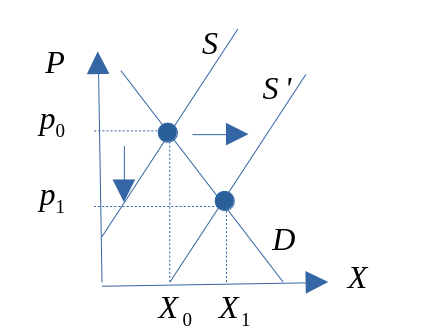
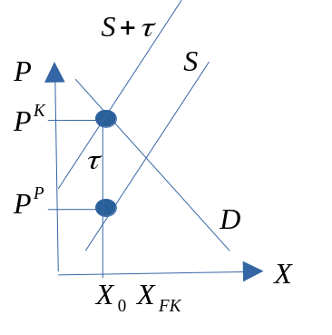
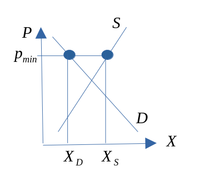
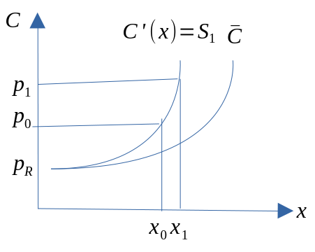

::: {.cell}

:::


# Praktisk informasjon

## Timeplan 


::: {.cell}
::: {.cell-output-display}
`````{=html}
<table class=" lightable-paper table" style='font-family: "Arial Narrow", arial, helvetica, sans-serif; width: auto !important; margin-left: auto; margin-right: auto; font-size: 16px; margin-left: auto; margin-right: auto;'>
 <thead>
  <tr>
   <th style="text-align:right;"> Antall </th>
   <th style="text-align:left;"> Tema </th>
   <th style="text-align:left;"> Kapittel </th>
   <th style="text-align:left;"> Ansvarlig </th>
   <th style="text-align:right;"> Uke </th>
   <th style="text-align:left;"> Dato </th>
  </tr>
 </thead>
<tbody>
  <tr>
   <td style="text-align:right;"> 1 </td>
   <td style="text-align:left;"> Introduksjon til mikroøkonomi. Overblikk over fulllkomen konkurranse </td>
   <td style="text-align:left;"> Kap. 1-3 </td>
   <td style="text-align:left;"> JIH </td>
   <td style="text-align:right;"> 2 </td>
   <td style="text-align:left;"> 2024-01-10 </td>
  </tr>
  <tr>
   <td style="text-align:right;"> 2 </td>
   <td style="text-align:left;"> Produksjonsteori kort sikt: Teknologi, inntekter og kostnader, optimering i produkt- og arbeidsmarkedet </td>
   <td style="text-align:left;"> Kap. 4 </td>
   <td style="text-align:left;"> JIH </td>
   <td style="text-align:right;"> 3 </td>
   <td style="text-align:left;"> 2024-01-17 </td>
  </tr>
  <tr>
   <td style="text-align:right;"> 3 </td>
   <td style="text-align:left;"> Produksjonsteori kort og lang sikt: Teknologi, inntekter og kostnader, optimering i produkt- og arbeidsmarkedet </td>
   <td style="text-align:left;"> Kap. 5 </td>
   <td style="text-align:left;"> JIH </td>
   <td style="text-align:right;"> 4 </td>
   <td style="text-align:left;"> 2024-01-24 </td>
  </tr>
  <tr>
   <td style="text-align:right;"> 4 </td>
   <td style="text-align:left;"> Produksjonsteori kort og lang sikt: Teknologi, inntekter og kostnader, optimering i produkt- og arbeidsmarkedet </td>
   <td style="text-align:left;"> Kap. 6 </td>
   <td style="text-align:left;"> JIH </td>
   <td style="text-align:right;"> 5 </td>
   <td style="text-align:left;"> 2024-01-31 </td>
  </tr>
  <tr>
   <td style="text-align:right;"> 5 </td>
   <td style="text-align:left;"> Konsumentens valg </td>
   <td style="text-align:left;"> Kap. 7 </td>
   <td style="text-align:left;"> JIH </td>
   <td style="text-align:right;"> 6 </td>
   <td style="text-align:left;"> 2024-02-07 </td>
  </tr>
  <tr>
   <td style="text-align:right;"> 6 </td>
   <td style="text-align:left;"> Konsumentens økonomiske adferd i gode- og arbeidsmarkedet </td>
   <td style="text-align:left;"> Kap. 8 </td>
   <td style="text-align:left;"> JIH </td>
   <td style="text-align:right;"> 7 </td>
   <td style="text-align:left;"> 2024-02-14 </td>
  </tr>
  <tr>
   <td style="text-align:right;"> 7 </td>
   <td style="text-align:left;"> Fullkommen konkurranse </td>
   <td style="text-align:left;"> Kap. 9 </td>
   <td style="text-align:left;"> JIH </td>
   <td style="text-align:right;"> 9 </td>
   <td style="text-align:left;"> 2024-02-28 </td>
  </tr>
  <tr>
   <td style="text-align:right;"> 8 </td>
   <td style="text-align:left;"> Ufullkommen konkurranse: monopol </td>
   <td style="text-align:left;"> Kap. 10 </td>
   <td style="text-align:left;"> JIH </td>
   <td style="text-align:right;"> 10 </td>
   <td style="text-align:left;"> 2024-03-06 </td>
  </tr>
  <tr>
   <td style="text-align:right;"> 9 </td>
   <td style="text-align:left;"> Ufullkommen konkurranse: kartel, duopol, oligopol og monopolistisk konkurranse </td>
   <td style="text-align:left;"> Kap. 11 </td>
   <td style="text-align:left;"> JIH </td>
   <td style="text-align:right;"> 11 </td>
   <td style="text-align:left;"> 2024-03-13 </td>
  </tr>
  <tr>
   <td style="text-align:right;"> 10 </td>
   <td style="text-align:left;"> Ufullkommen konkurranse: Prisdiskriminering. Andre emner: Litt spillteori, markedet for arbeidskraft </td>
   <td style="text-align:left;"> Kap. 12, 15.2, 18 </td>
   <td style="text-align:left;"> JIH </td>
   <td style="text-align:right;"> 12 </td>
   <td style="text-align:left;"> 2024-03-20 </td>
  </tr>
  <tr>
   <td style="text-align:right;"> 11 </td>
   <td style="text-align:left;"> Effektivitet, velferd og markedsvikt </td>
   <td style="text-align:left;"> Kap. 13 </td>
   <td style="text-align:left;"> JIH </td>
   <td style="text-align:right;"> 14 </td>
   <td style="text-align:left;"> 2024-04-03 </td>
  </tr>
  <tr>
   <td style="text-align:right;"> 12 </td>
   <td style="text-align:left;"> Tilpasning over tid. Gjennomgang av arbeidskrav </td>
   <td style="text-align:left;"> Kap. 14 </td>
   <td style="text-align:left;"> JIH </td>
   <td style="text-align:right;"> 15 </td>
   <td style="text-align:left;"> 2024-04-10 </td>
  </tr>
  <tr>
   <td style="text-align:right;"> 13 </td>
   <td style="text-align:left;"> Nærmere om eksamen, repetisjon og gjennomgang av fjorårets eksamen </td>
   <td style="text-align:left;">  </td>
   <td style="text-align:left;"> JIH </td>
   <td style="text-align:right;"> 16 </td>
   <td style="text-align:left;"> 2024-04-17 </td>
  </tr>
</tbody>
</table>

`````
:::
:::


[Romplan](https://tp.educloud.no/hiof/timeplan/timeplan.php?type=course&sem=24v&campus=&id[]=SFB10816%2C1)

---

## Anbefalte oppgaver


::: {.cell}
::: {.cell-output-display}
`````{=html}
<table class=" lightable-paper table" style='font-family: "Arial Narrow", arial, helvetica, sans-serif; width: auto !important; margin-left: auto; margin-right: auto; font-size: 24px; margin-left: auto; margin-right: auto;'>
 <thead>
  <tr>
   <th style="text-align:right;"> Kapittel </th>
   <th style="text-align:left;"> Oppgavenummer </th>
  </tr>
 </thead>
<tbody>
  <tr>
   <td style="text-align:right;"> 1 </td>
   <td style="text-align:left;"> 1.1, 1.2, 1.3 1.5, 1.6, 1.9, 1.12, 1.14 </td>
  </tr>
  <tr>
   <td style="text-align:right;"> 3 </td>
   <td style="text-align:left;"> 3.2, 3.3, 3.5, 3.6, 3.7, 3.8 </td>
  </tr>
  <tr>
   <td style="text-align:right;"> 4 </td>
   <td style="text-align:left;"> 4.1, 4.2, 4.3, 4.4, 4.5, 4.6, 4.8 </td>
  </tr>
  <tr>
   <td style="text-align:right;"> 5 </td>
   <td style="text-align:left;"> 5.1, 5.2, 5.3, 5.4, 5.5, 5.6, 5.7, 5.8, 5.9, 5.10 </td>
  </tr>
  <tr>
   <td style="text-align:right;"> 6 </td>
   <td style="text-align:left;"> 6.2, 6.3, 6.4, 6.5, 6.6 </td>
  </tr>
  <tr>
   <td style="text-align:right;"> 7 </td>
   <td style="text-align:left;"> 7.1, 7.2, 7.3, 7.4, 7.5, 7.6, 7.7, 7.8 </td>
  </tr>
  <tr>
   <td style="text-align:right;"> 8 </td>
   <td style="text-align:left;"> 8.1, 8.2, 8.3, 8.4, 8.5, 8.6, 8.7 </td>
  </tr>
  <tr>
   <td style="text-align:right;"> 9 </td>
   <td style="text-align:left;"> 9.1, 9.2, 9.3, 9.4 </td>
  </tr>
  <tr>
   <td style="text-align:right;"> 10 </td>
   <td style="text-align:left;"> 10.1, 10.2, 10.3, 10.4 </td>
  </tr>
  <tr>
   <td style="text-align:right;"> 11 </td>
   <td style="text-align:left;"> 11.1 (d,feil i fasit på grafisk illustrasjon), 11.2, 11.3, 11.4 </td>
  </tr>
  <tr>
   <td style="text-align:right;"> 12 </td>
   <td style="text-align:left;"> 12.1, (12.2, om du har tid) </td>
  </tr>
  <tr>
   <td style="text-align:right;"> 13 </td>
   <td style="text-align:left;"> 13.1, 13.2, 13,3, 13.4, og 13.5 </td>
  </tr>
  <tr>
   <td style="text-align:right;"> 14 </td>
   <td style="text-align:left;"> 14.1, 14.2 </td>
  </tr>
  <tr>
   <td style="text-align:right;"> 15 </td>
   <td style="text-align:left;"> 15.1, 15.2 </td>
  </tr>
</tbody>
</table>

`````
:::
:::


## Pensumliste 

:::: {.columns}

::: {.column width="50%"}
### Hovedbok

::: {.cell}
::: {.cell-output-display}
{width=25%}
:::
:::

[Andreassen, Bredesen og Thøgersen](https://www.cappelendammundervisning.no/_innforing-i-mikrookonomi-9788202640521)
:::

::: {.column width="50%"}
### Oppgavebok

::: {.cell}
::: {.cell-output-display}
{width=25%}
:::
:::

[Andreassen, Bredesen og Thøgersen](https://www.cappelendammundervisning.no/_innforing-i-mikrookonomi-ovingsoppgaver-med-losningsforslag-9788202656485)
:::

::::
## Kursgodkjennelse

Består av et obligatorisk arbeidskrav (som må være bestått) for å kunne gå opp til skriftlig eksamen. 

### Obligatorisk innleveringsoppgaver

Utlevert: **6.3**.

Innleveringsfrist: **31.3**.

### Eksamen

Eksamen avholdes den **3.5.2024(?), 09:00, 4 timer**.

Individuell, skriftlig firetimers eksamen.

Karakterregel: A-F.

Hjelpemidler: Godkjent kalkulator.


::: {.cell}

:::


# Kapittel 1: Introduksjon til mikroøkonomi. Overblikk over fulllkomen konkurranse

---

## Hva handler økonomi om?

- Hva handler økonomi om?
- Mikroøkonomi er en del av samfunnsøkonomi. Hvilke temaer forbinder du med samfunnsøkonomi?
- En kort historie om en tur i butikken.
  - Hvilke varer skal du kjøpe?
  - Hvor mye skal du kjøpe av de ulike varene?
- Hva har økonomi med dette å gjøre? Tre relevante forhold:
  - (i) Varene må ha blitt produsert.
  - (ii) Du må tilby noe for å bytte til deg varer. Betalingsmiddel
  - og handel.
  - (iii) Du må ha skaffet betalingsmiddelet.

---

**Altså ...**

- Selv i den «enkle» historien er det:
  - Flere beslutninger involvert.
  - Flere markeder involvert.

- Men: hvorfor får vi ikke alle varer vi vil ha? Rundt oss ser vi (og opplever selv) stor etterspørsel.Vi trenger jo en rekke ting, også i Norge.
  - Svaret er: KNAPPHET!

---

## Definisjon

- Definisjon av økonomi:

*Handler om bruken av knappe ressurser for å dekke menneskelig behov.*

- Den delen av samfunnsvitenskapene som studerer de valgene som individer, bedrifter, myndigheter og samfunn må ta, som følge av knapphet.
- To stikkord: behov og ressurser. Komme tilbake til…
- Bedriftsøkonomi og samfunnsøkonomi: Hvorfor skal dere lære samfunnsøkonomi på dette studiet? Relevant for bedrifter?

---

## Behov

- Økonomers behandling av behov og behovsdannelse. For enkelt? Psykologers behandling av samme tema…
- Et grovt skille:
  - Som må dekkes
  - Ønsker
- Behov avdekkes gjennom preferanser, som igjen kan avdekkes via etterspørsel.
- Kan behov skapes? Jepp. Men er slike skapte behov mer eller mindre viktig enn ”andre” behov, gitt knappe ressurser.
- En måte å skjære gjennom denne problemstillingen på er å legge til grunn *konsumentsuverenitet*.
  - ”Folk vet best selv hva som er best for dem”.

---

## Ressurser

- Innsatsfaktor eller produksjonsfaktor kan betegnes som synonyme ord.
<br> $\Rightarrow$ Faktorer som er ”input” i produksjonsprosessen.
- Kategorier:
  - Naturressurser: Fornybare og ikke-fornybare
  - Arbeidskraft
  - Realkapital: Kan brukes direkte eller indirekte
- Ressurser som er KNAPPE.
- Er penger ressurser??

---

## Så kjernen i økonomifaget er dermed:

- Ettersom det er knapphet på ressurser kombinert med store behov, er det ønskelig å bruke ressursene smartest mulig.
<br> $\Rightarrow$  Sikre at utnyttelsen av ressursene er optimal.
- Merk at ressurser ofte har alternativ anvendelse. Dette innebærer at dersom vi bruker en ressurs til å produsere en vare, kan ikke den samme ressursen brukes samtidig til å produsere en annen vare. Av og til ikke i det hele tatt.

---

## Alternativkostnad

- Dette er et helt sentralt begrep i økonomifaget.
- Bruk av ressurser tilfører en verdi som skal dekke menneskelige behov.
- Ressurser har en alternativ anvendelse. Den beste alternative anvendelse har også en verdi. Denne verdien tapes når vi bruker ressursen til et bestemt formål.
- Dette tapet er alternativkostnaden.
   - *Alternativkostnaden er altså verdien av beste alternative anvendelse.*


::: {.cell}
::: {.cell-output-display}
{width=50%}
:::
:::


---

## To sentrale spørsmål: spørsmål 1

- (1): Hvordan vil ulike valg bestemme hvilke goder som produseres, hvordan de produseres og for hvem?
  - Goder skal dekke behov og ønsker.
  - Men hva skal vi produsere og hvordan vet vi det?
  - Hvor mye skal produseres?
  - Hvordan? Vil ny teknologi erstatte arbeidskraft og føre til økt arbeidsledighet?
  - Hvem skal det produseres til? Inntektsulikhet.

---

## To sentrale spørsmål: spørsmål 2

- (2): Er det slik at valg som fremmer egeninteresse også fremmer samfunnets beste?
  - Brukes de knappe ressursene på best mulig måte?
  - Egeninteresse: valg som er best for en selv.
  - Sosial interesse: valg som er best for samfunnet som helhet.
  - Dine valg påvirker mange og valgene er knyttet sammen. Anta at alle valgene er gjort av egeninteresse, er det mulig at resultatet også er det beste for samfunnet som helhet?
  - Adam Smith: JA. «Usynlige hånd».

---

## Økonomisk tankemåte: metodologiske tradisjoner

- Økonomifaget defineres ut i fra tema som studeres, men det er en del metodiske tradisjoner.
  1. Et valg er en avveining (trade-off). Knapphet skaper valg.
  1. Kostnad: det du må gi opp.
  1. Fordel (benefit) eller nytte: Gleden du oppnår. Preferanser.
  1. Rasjonelle valg. Bruker all tilgjengelig informasjon, og veier så sammen kostnader og fordeler.
  1. Valg på marginen. Ikke enten-eller, men hvor mye. Marginalkostnad og marginalfordel.
  1. Valg responderer på incentiver. Incentiv: Belønning eller straff som følge av valg.

---

## Økonomi som vitenskap

### Modeller

- Bruker økonomiske modeller.
- Hva er en modell? En forenklet beskrivelse av virkeligheten. Bygger pr. definisjon på forutsetninger.
- Hvorfor bruke modeller? For å kunne fokusere på ett eller noen aspekter av virkeligheten. Virkeligheten er komplisert…
- Modeller gjør at vi kan rense vekk momenter som vi tror ikke har noen spesiell innvirkning på vårt spørsmål.

---

### Skillet mellom mikroøkonomi og makroøkonomi

- Det finnes flere måter å strukturere økonomifaget på. Disiplinen består av en rekke underområder.
  - Mikroøkonomi: Søker å forklare aktørers beslutninger, tilpasning og interaksjon.
  	- Aktører: Bedrifter, konsumenter, markeder.
  - Makroøkonomi: Søker å studere og forklare aggregerte størrelser. Økonomien under ett.
  	- Makroøkonomi kan deles inn i konjunkturteori og økonomisk vekst.


# Kapittel 3: En markedsmodell med fullkommen konkurranse

---

## Innledning

- Bytteøkonomi og markedsøkonomi: I en markedsøkonomi (pengeøkonomi) byttes varer *indirekte*.
- Et marked består av en tilbudsside og en etterspørselsside.
- Vi skal nå se på den enkleste markedsformen i økonomisk teori: Markedsmodell med fullkommen konkurranse
- Markedsformen er likevel nyttig:
  - Selvstendig analyseapparat.
  - Kan utvides langs mange dimensjoner.
  - Er samfunnsøkonomisk effektiv (hva som menes med dette skal vi bruke litt tid på nå, men mere tid på senere).
  - Er en referansemodell som andre modeller og resultater kan sammenlignes mot.

---

## Bakgrunn

- Store deler av kurset vil handle om teorien bak denne modellen. MERK at oppbyggingen gir oss flere selvstendige modeller som er nyttige for økonomiske analyser.
- Modellen går langt tilbake: 
  - Adam Smith (1723-1790) $\rightarrow$ 
  - Nyklassikerne og John Stuart Mill (1806-1873) $\rightarrow$ 
  - Alfred Marshall (1842-1924) $\rightarrow$ 
  -  Paul Samuelson (1915-2009) mfl.
- Vi skal komme tilbake til forutsetningene bak denne modellen i kapittel 9.
- Men merk spesielt: Aktørene er *pristakere* og har ingen innflytelse på pris som enkeltaktør, men *summen* av aktørenes adferd bestemmer markedsprisen.

---

## Markedsetterspørsel

- Etterspørsel etter varer og tjenester. Ofte kalles varer + tjenester for goder.
- Hva bestemmer etterspørselen? Priser, inntekt med mer. 
- Etterspørselsloven:
  - Økt pris $\rightarrow$ lavere etterspørsel, alt annet konstant (cet.par.). 
  - Flere forhold holdes her konstante. Vi ser kun på endringer i prisen på varen. En endring i denne vil flytte oss langs kurven.
  - En endring i konstantene vil føre til skift i kurven.
- Fra et individs etterspørsel til markedsetterspørsel.


::: {.cell}
::: {.cell-output-display}
{width=65%}
:::
:::


---

## Markedstilbud

- Tilbud av varer og tjenester. Tilbudet utgjøres av bedriftene eller produsentene. Tilbudet er altså produksjonen.
- Hva bestemmer tilbudet? Pris på ferdigvare og innsatsfaktorer. 
- Tilbudsloven:
  - Økt pris $\rightarrow$ økt tilbud, cet.par. Kurve.
  - Endringer i prisen på varen fører til bevegelse langs kurven.
  - En endring i konstantene fører til skift i kurven.
- Fra en bedrifts tilbud til markedstilbud.


::: {.cell}
::: {.cell-output-display}
{width=65%}
:::
:::


---

## Markedslikevekt 

- Utgangspunkt: markedets E-kurve og T-kurve.
- Likevekt: dersom ingen aktører ønsker å endre den eksisterende økonomiske tilpasning.
	-  $X^S = X^D$


::: {.cell layout-align="left"}
::: {.cell-output-display}
{fig-align='left' width=50%}
:::
:::

---

- Anta at prisen er lavere enn likevektspris (makspris).
  - Overskuddsetterspørsel: $X^D > X^S$
- Anta at prisen er over likevektsprisen (minpris).
  - Overskuddstilbud: $X^S > X^D$
- Merk: Ingenting i modellen som tilsier stabilitet. Men utenfor modellen kan vi resonnere markedskreftene alltid bringer oss tilbake til likevekt, slik det er beskrevet av Adam Smith.

---


## Konsument- produsent og sammfunnsøkonomisk overskudd

- I samfunnsøkonomi er vi naturlig nok opptatt av å vurdere om et marked eller et prosjekt eller politikkforslag er samfunnsøkonomisk lønnsomt. Når alt kommer til alt er det jo høyest mulig velferd for individene i samfunnet som er målet.
- For å vurdere velferden brukes begrepet samfunnsøkonomisk overskudd (SO).
- Dette består av konsumentoverskudd (KO) og produsentoverskudd (PO)
- Vi har derfor at SO er gitt ved:
\begin{equation*}
SO=PO+KO
\end{equation*}

---

### Konsumentoverskudd

- Hvor mye du er villig til å betale for kalles Betalingsvillighet.
- Betalingsvilligheten avhenger av hvor mye du har i utgangspunktet: $\Rightarrow B(X)$
- Det et imidlertid forskjell på det konsumenten er villig til å betale, og det han faktisk betaler. Det er denne differensen som er konsumentoverskuddet:
  - $\Rightarrow KO(X) = B(X) – PX$


::: {.cell}
::: {.cell-output-display}
{width=50%}
:::
:::


---

### Produsentoverskudd

- Produsentoverskudd defineres som summen av den ekstrainntekten som produsenten får, av å selge til en pris som er høyere enn den laveste de ville vært villige til å akseptere.
- Det vil si: differensen mellom produsentens samlede salgsinntekter og variable kostnader.
  - $\Rightarrow PO(X) = PX-CV(x)$


::: {.cell}
::: {.cell-output-display}
{width=40%}
:::
:::


---

### Samfunnsøkonomisk overskudd og fullkommen konkurranse

- Maksimalt SO finner vi ved 
\begin{equation*}
\underset{X}{\text{Maks}SO}=PO+KO=(PX-CV(X))+(B(X)-PX)
\end{equation*}


- Er løsningen til dette problemet tilfredsstilt i en markedsmodell med fullkommen konkurranse? JA (vi vil se nærmere på løsningen senere i dette kurset)!

---

## Komparativ statikk/ skift i kurvene

- Vi vet at tilbuds- og etterspørselskurvene er konstruert under en antagelse om at flere forhold antas konstante. Dersom det skjer endringer i noen av disse forholdene, vil kurvene forskyves i diagrammet.
La oss se på noen av disse forholdene.

:::: {.columns}

::: {.column width="40%"}
**Tilbudskurven**

- Ble tegnet for:
	- gitt teknologi for bedriften,
	- gitte priser på innsatsfaktorene.
:::

::: {.column width="60%"}
**Etterspørselskurven**

- Ble tegnet for:
	- en gitt behovsstruktur for konsumenten,
	- gitt samlet inntekt for konsumenten,
	- gitt inntektsfordeling,
	- gitte priser på andre goder.
:::

::::

---

**Helningens betydning**

- Helningen på tilbuds- og etterspørselskurven påvirker hvordan endringer i markedet påvirker pris og mengde.
La oss se på et eksempel der lavere pris på innsatsfaktorene har ført til et positivt skift i tilbudskurven.

:::: {.columns}

::: {.column width="50%"}
Skiftanalyse (slak/prisfølsom etterspørselskurve)

::: {.cell}
::: {.cell-output-display}
{width=50%}
:::
:::

:::

::: {.column width="50%"}
Skiftanalyse (slak/prisufølsom etterspørselskurve)

::: {.cell}
::: {.cell-output-display}
{width=50%}
:::
:::

:::

::::

---


## Effekten av en avgift

- En avgift kan ha flere hensikter, men spesielt er to ting viktig:
	i) Inntekt for staten
	ii) Endrer markedsresultatet. Aktuelt ved behov for korrigering av nåværende situasjon (tilpasning).
- Avgiften kan pålegges kjøperne og selgerne.

- Anta nå at avgiften $\tau$ blir pålagt selgerne

---

- Dersom avgiften pålegges produsentene, vil
kostnadene til bedriften stige. Dette skifter isolert sett
tilbudskurven innover. Den vertikale størrelsen på
skiftet er lik avgiften $\tau$.
Resultater:
 - Staten får inn $\tau$ kr. pr. enhet.
 - Konsumenten betaler: $P^K$
 - Produsenten mottar: $P^P$
Produsenten ”sender” nå avgiften til staten, men begge bærer byrden!!


::: {.cell}
::: {.cell-output-display}
{width=45%}
:::
:::


## Maksimal- og minsteprisen


:::: {.columns}

::: {.column width="50%"}
**Maksimalpris** har vi dersom markedsprisen blir overtyrt ved at myndighetene setter et makspris som er *lavere* enn markedsprisen.
<br>
<br>

::: {.cell}
::: {.cell-output-display}
{width=50%}
:::
:::

:::

::: {.column width="50%"}
**Minstrepris** har vi dersom markedsprisen blir overtyrt ved at myndighetene setter et minstepris som er *høyere* enn markedsprisen.

::: {.cell}
::: {.cell-output-display}
{width=50%}
:::
:::

:::

::::

---

## Produksjonsmulighetskurven (PMK)

- Produksjonsmulighetskurven (PMK)
- PMK: kurven kan brukes til å illustrere hvordan produksjonsmulighetene er begrenset. Dette fører til et ressursallokeringsproblem. Videre skal vi illustrere forskjellen på kort og lang sikt.
- Kurven bygger på en antagelse om at alternativkostnadene øker ved stadige overføringer av ressurser mellom sektorer.
- Forutsetninger: to produkter, gitt mengde produksjonsfaktorer (kort sikt) og produksjonsteknologien er konstant.

::: {.cell}
::: {.cell-output-display}
{width=100%}
:::
:::

::: {.cell}

:::

# Kapittel 4, 5 og 6: Innledning til produsentteorien


---


## Produsentens rolle, teknologiske forhold og produksjon

- Produsentene eller bedriftene er en av hovedaktørene i en økonomi.
- Produsentens rolle: tilby de varer og tjenester som etterspørres i et samfunn. Basert på konsumentens ønsker må produsenten vite hva som skal produseres, mengde og lokalisering.

- Teknologisk perspektiv: Produsenten bruker innsatsfaktorer til å omforme råvarer til ferdige produkter.
- Vi forenkler produksjonsbildet ved å anta at produsenten bruker to innsatsfaktorer, $N$ og $K$, til å produsere ett produkt, $x$. $N$ er arbeidskraft og $K$ er realkapital.


::: {.cell}
::: {.cell-output-display}
{width=100%}
:::
:::


---

- Bedriften må altså velge effektiv produksjonsprosess.
- Økonomisk perspektiv: Her består valget i å velge hvor mye bedriften skal produsere og tilby av produktet.
- For å kunne få størst mulig overskudd må vi kjenne til inntekter og kostnader. Kostnadene er igjen svært avhengig av det teknologiske valget.
- Vi må derfor sammenkoble elementer fra begge disse perspektivene.

- Vi tar utgangspunkt i produksjonsbildet med to innsatsfaktorer og ett produkt.
  - Produktfunksjonen:
  	- $x = f(N, K)$
  - Viser, for enhver mulig faktorkombinasjon, det maksimale antall enheter som kan produseres av produktet.
  - $f$ beskriver formen på avhengighetsforholdet mellom produksjonsmengden og innsatsfaktorene. Kan tolkes som forhold (faktorer) som endrer produksjonsmengden uten å endre mengden av innsatsfaktorene $N$ og $K$.

# Kapittel 4, 5 og 6: Produksjonsteori på kort sikt 

---


::: {.cell}

:::


### Produksjon og teknologiske forhold 

*Talleksempel på en produktfunksjon*

::: {.cell}
::: {.cell-output-display}
`````{=html}
<table class=" lightable-paper" style='font-family: "Arial Narrow", arial, helvetica, sans-serif; width: auto !important; margin-left: auto; margin-right: auto;'>
 <thead>
  <tr>
   <th style="text-align:right;"> Arbeidskraft (N) </th>
   <th style="text-align:right;"> Kapital (K) </th>
   <th style="text-align:right;"> Produksjon </th>
   <th style="text-align:right;"> Grenseprodukt. </th>
   <th style="text-align:right;"> Gjennomsnittsprod. </th>
  </tr>
 </thead>
<tbody>
  <tr>
   <td style="text-align:right;"> 1 </td>
   <td style="text-align:right;"> 20 </td>
   <td style="text-align:right;"> 10 </td>
   <td style="text-align:right;"> NA </td>
   <td style="text-align:right;"> 10 </td>
  </tr>
  <tr>
   <td style="text-align:right;"> 2 </td>
   <td style="text-align:right;"> 20 </td>
   <td style="text-align:right;"> 24 </td>
   <td style="text-align:right;"> 14 </td>
   <td style="text-align:right;"> 12 </td>
  </tr>
  <tr>
   <td style="text-align:right;"> 3 </td>
   <td style="text-align:right;"> 20 </td>
   <td style="text-align:right;"> 39 </td>
   <td style="text-align:right;"> 15 </td>
   <td style="text-align:right;"> 13 </td>
  </tr>
  <tr>
   <td style="text-align:right;font-weight: bold;"> 4 </td>
   <td style="text-align:right;font-weight: bold;"> 20 </td>
   <td style="text-align:right;font-weight: bold;"> 52 </td>
   <td style="text-align:right;font-weight: bold;"> 17 </td>
   <td style="text-align:right;font-weight: bold;"> 13 </td>
  </tr>
  <tr>
   <td style="text-align:right;font-weight: bold;"> 5 </td>
   <td style="text-align:right;font-weight: bold;"> 20 </td>
   <td style="text-align:right;font-weight: bold;"> 61 </td>
   <td style="text-align:right;font-weight: bold;"> 9 </td>
   <td style="text-align:right;font-weight: bold;"> 12 </td>
  </tr>
  <tr>
   <td style="text-align:right;font-weight: bold;"> 6 </td>
   <td style="text-align:right;font-weight: bold;"> 20 </td>
   <td style="text-align:right;font-weight: bold;"> 66 </td>
   <td style="text-align:right;font-weight: bold;"> 5 </td>
   <td style="text-align:right;font-weight: bold;"> 11 </td>
  </tr>
  <tr>
   <td style="text-align:right;"> 7 </td>
   <td style="text-align:right;"> 20 </td>
   <td style="text-align:right;"> 66 </td>
   <td style="text-align:right;"> 0 </td>
   <td style="text-align:right;"> 9 </td>
  </tr>
  <tr>
   <td style="text-align:right;"> 8 </td>
   <td style="text-align:right;"> 20 </td>
   <td style="text-align:right;"> 64 </td>
   <td style="text-align:right;"> -2 </td>
   <td style="text-align:right;"> 8 </td>
  </tr>
  <tr>
   <td style="text-align:right;"> 9 </td>
   <td style="text-align:right;"> 20 </td>
   <td style="text-align:right;"> 56 </td>
   <td style="text-align:right;"> -8 </td>
   <td style="text-align:right;"> 6 </td>
  </tr>
  <tr>
   <td style="text-align:right;"> 10 </td>
   <td style="text-align:right;"> 20 </td>
   <td style="text-align:right;"> 44 </td>
   <td style="text-align:right;"> -12 </td>
   <td style="text-align:right;"> 4 </td>
  </tr>
</tbody>
</table>

`````
:::
:::


---


**Forutsetninger om produktfunksjonen**

- For analytiske formål antas funksjonen kontinuerlig og to ganger deriverbar:

:::: {.columns}

::: {.column width="50%"}
Arbeidskraft


::: {.cell}
::: {.cell-output-display}
{width=80%}
:::
:::

- $\frac{\partial f}{\partial N} > 0$
- $\frac{\partial^2 f}{\partial N^2} < 0$
:::

::: {.column width="50%"}
- Positive, men avtagende grenseproduktiviteter.
- De førsteordens partielle deriverte uttrykker grenseproduktiviteten: hvor mye produsert kvantum endres ved en liten endring i bruken av vedkommende innsatsfaktor.
- Loven om avtakende utbytte gjelder altså her.
:::

::::


---

### Inntekter 


- Bedriftens inntekter bestemmes av antall enheter den selger, og prisen på disse enhetene.
  - Pris: $p$. Mengde: $x$.
  - Inntekt: $R=px$. Stigende i et $(x,R)$-diagram
  - Grenseinntekt: endring i inntekt ved en marginal endring i solgt kvantum: $R'(x)$
  - Gjennomsnitsinntekt: inntekt per produsert enhet: $\overline{R}$.


---

*Talleksempel for salgsinntekter*


::: {.cell}
::: {.cell-output-display}
`````{=html}
<table>
 <thead>
  <tr>
   <th style="text-align:right;"> Solge enheter </th>
   <th style="text-align:left;"> Pris per enhet </th>
   <th style="text-align:left;"> Salgsinntekt </th>
   <th style="text-align:left;"> Grenseinntekt </th>
   <th style="text-align:left;"> Gjennomsnittsinntekt </th>
  </tr>
 </thead>
<tbody>
  <tr>
   <td style="text-align:right;"> 1 </td>
   <td style="text-align:left;"> 1000 </td>
   <td style="text-align:left;"> 1000 </td>
   <td style="text-align:left;">  </td>
   <td style="text-align:left;"> 1000 </td>
  </tr>
  <tr>
   <td style="text-align:right;"> 2 </td>
   <td style="text-align:left;"> 1000 </td>
   <td style="text-align:left;"> 2000 </td>
   <td style="text-align:left;"> 1000 </td>
   <td style="text-align:left;"> 1000 </td>
  </tr>
  <tr>
   <td style="text-align:right;"> 3 </td>
   <td style="text-align:left;"> 1000 </td>
   <td style="text-align:left;"> 3000 </td>
   <td style="text-align:left;"> 1000 </td>
   <td style="text-align:left;"> 1000 </td>
  </tr>
</tbody>
</table>

`````
:::
:::

::: {.cell}
::: {.cell-output-display}
{width=50%}
:::
:::


---


### Kostnader 

- Kostnader: De beløp som påløper som følge av virksomhet.
  - Faste kostnader  $(C_F)$ : Kostnader som er uavhengige av produsert kvantum.
  - Variable kostnader $(C_V$): Varierer i takt med produsert kvantum 
    	- $C_V = C_{V}(x)$
  - Totale kostnader $(C)$: Summen av faste og variable kostnader
     	- $C = C_F + C_V$
  - Gjennomsnittskostnader (enhetskostnader): Disse finner vi ved å dividere de respektive kostnadene med antall produserte enheter. 
    	- $\overline{C}=\frac{C_F}{x}+\frac{C_V}{x}=\overline{C}_F+\overline{C}_V$
  - Grensekostnader ( $GK$ eller $C'$ ): Endringen i bedriftens totale kostnader ved en liten endring i produsert kvantum 
    	- $GK=\frac{dC(x)}{dx}=C'(x)$

---

**Sammenhengen mellom gjennomsnittskostnad og grensekostnad**

*Talleksempel a): med avtagende marginalproduktivitet (mest relevant for dette kurset) og uten faste kostnader*


::: {.cell}
::: {.cell-output-display}
`````{=html}
<table>
 <thead>
  <tr>
   <th style="text-align:right;"> Produserte enheter </th>
   <th style="text-align:left;"> Lønnskostnader </th>
   <th style="text-align:left;"> Antall arbeidere </th>
   <th style="text-align:left;"> Variable kostnader </th>
  </tr>
 </thead>
<tbody>
  <tr>
   <td style="text-align:right;"> 1 </td>
   <td style="text-align:left;"> 1000 </td>
   <td style="text-align:left;"> 1 </td>
   <td style="text-align:left;"> 1000 </td>
  </tr>
  <tr>
   <td style="text-align:right;"> 2 </td>
   <td style="text-align:left;"> 1000 </td>
   <td style="text-align:left;"> 2 </td>
   <td style="text-align:left;"> 2000 </td>
  </tr>
  <tr>
   <td style="text-align:right;"> 3 </td>
   <td style="text-align:left;"> 1000 </td>
   <td style="text-align:left;"> 3.1 </td>
   <td style="text-align:left;"> 3100 </td>
  </tr>
</tbody>
</table>

`````
:::
:::

<br>

::: {.cell}
::: {.cell-output-display}
`````{=html}
<table>
 <thead>
  <tr>
   <th style="text-align:left;"> Faste kostnader </th>
   <th style="text-align:left;"> Totale kostnader </th>
   <th style="text-align:left;"> Grensekostnader </th>
   <th style="text-align:left;"> Gjennomsnittskostnad </th>
  </tr>
 </thead>
<tbody>
  <tr>
   <td style="text-align:left;"> 0 </td>
   <td style="text-align:left;"> 1000 </td>
   <td style="text-align:left;">  </td>
   <td style="text-align:left;">  </td>
  </tr>
  <tr>
   <td style="text-align:left;"> 0 </td>
   <td style="text-align:left;"> 2000 </td>
   <td style="text-align:left;"> 1000 </td>
   <td style="text-align:left;"> 1000 </td>
  </tr>
  <tr>
   <td style="text-align:left;"> 0 </td>
   <td style="text-align:left;"> 3100 </td>
   <td style="text-align:left;"> 1100 </td>
   <td style="text-align:left;"> 1032 </td>
  </tr>
</tbody>
</table>

`````
:::
:::


---

*Talleksempel b): med økende marginalproduktivitet (mindre relevant) og uten faste kostnader*


::: {.cell}
::: {.cell-output-display}
`````{=html}
<table>
 <thead>
  <tr>
   <th style="text-align:right;"> Produserte enheter </th>
   <th style="text-align:left;"> Lønnskostnader </th>
   <th style="text-align:left;"> Antall arbeidere </th>
   <th style="text-align:left;"> Variable kostnader </th>
  </tr>
 </thead>
<tbody>
  <tr>
   <td style="text-align:right;"> 1 </td>
   <td style="text-align:left;"> 1000 </td>
   <td style="text-align:left;"> 1 </td>
   <td style="text-align:left;"> 1000 </td>
  </tr>
  <tr>
   <td style="text-align:right;"> 2 </td>
   <td style="text-align:left;"> 1000 </td>
   <td style="text-align:left;"> 2 </td>
   <td style="text-align:left;"> 2000 </td>
  </tr>
  <tr>
   <td style="text-align:right;"> 3 </td>
   <td style="text-align:left;"> 1000 </td>
   <td style="text-align:left;"> 2.9 </td>
   <td style="text-align:left;"> 2900 </td>
  </tr>
</tbody>
</table>

`````
:::
:::

<br>

::: {.cell}
::: {.cell-output-display}
`````{=html}
<table>
 <thead>
  <tr>
   <th style="text-align:left;"> Faste kostnader </th>
   <th style="text-align:left;"> Totale kostnader </th>
   <th style="text-align:left;"> Grensekostnader </th>
   <th style="text-align:left;"> Gjennomsnittskostnad </th>
  </tr>
 </thead>
<tbody>
  <tr>
   <td style="text-align:left;"> 0 </td>
   <td style="text-align:left;"> 1000 </td>
   <td style="text-align:left;">  </td>
   <td style="text-align:left;">  </td>
  </tr>
  <tr>
   <td style="text-align:left;"> 0 </td>
   <td style="text-align:left;"> 2000 </td>
   <td style="text-align:left;"> 1000 </td>
   <td style="text-align:left;"> 1000 </td>
  </tr>
  <tr>
   <td style="text-align:left;"> 0 </td>
   <td style="text-align:left;"> 2900 </td>
   <td style="text-align:left;"> 900 </td>
   <td style="text-align:left;"> 966 </td>
  </tr>
</tbody>
</table>

`````
:::
:::


---

*Talleksempel c): med avtagende marginalproduktivitet og med faste kostnader*


::: {.cell}
::: {.cell-output-display}
`````{=html}
<table>
 <thead>
  <tr>
   <th style="text-align:right;"> Produserte enheter </th>
   <th style="text-align:left;"> Lønnskostnader </th>
   <th style="text-align:left;"> Antall arbeidere </th>
   <th style="text-align:left;"> Variable kostnader </th>
  </tr>
 </thead>
<tbody>
  <tr>
   <td style="text-align:right;"> 1 </td>
   <td style="text-align:left;"> 1000 </td>
   <td style="text-align:left;"> 1 </td>
   <td style="text-align:left;"> 1000 </td>
  </tr>
  <tr>
   <td style="text-align:right;"> 2 </td>
   <td style="text-align:left;"> 1000 </td>
   <td style="text-align:left;"> 2 </td>
   <td style="text-align:left;"> 2000 </td>
  </tr>
  <tr>
   <td style="text-align:right;"> 3 </td>
   <td style="text-align:left;"> 1000 </td>
   <td style="text-align:left;"> 3.1 </td>
   <td style="text-align:left;"> 3100 </td>
  </tr>
</tbody>
</table>

`````
:::
:::

<br>


::: {.cell}
::: {.cell-output-display}
`````{=html}
<table>
 <thead>
  <tr>
   <th style="text-align:left;"> Faste kostnader </th>
   <th style="text-align:left;"> Totale kostnader </th>
   <th style="text-align:left;"> Grensekostnader </th>
   <th style="text-align:left;"> Gjennomsnittskostnad </th>
  </tr>
 </thead>
<tbody>
  <tr>
   <td style="text-align:left;"> 2000 </td>
   <td style="text-align:left;"> 3000 </td>
   <td style="text-align:left;">  </td>
   <td style="text-align:left;"> 3000 </td>
  </tr>
  <tr>
   <td style="text-align:left;"> 2000 </td>
   <td style="text-align:left;"> 4000 </td>
   <td style="text-align:left;"> 1000 </td>
   <td style="text-align:left;"> 2000 </td>
  </tr>
  <tr>
   <td style="text-align:left;"> 2000 </td>
   <td style="text-align:left;"> 5100 </td>
   <td style="text-align:left;"> 1100 </td>
   <td style="text-align:left;"> 1700 </td>
  </tr>
</tbody>
</table>

`````
:::
:::


---

:::: {.columns}

::: {.column width="50%"}
*Grensekostnad og gjennomsnittskostnad uten faste kostnader*


::: {.cell}
::: {.cell-output-display}
{width=50%}
:::
:::

:::

::: {.column width="50%"}
*Grensekostnad og gjennomsnittskostnad med faste kostnader*


::: {.cell}
::: {.cell-output-display}
{width=50%}
:::
:::

:::

::::

---

## Tilpasningen i gode og faktormarkedet

- Vi skal nå legge til grunn at bedriften har som mål å maksimere fortjenesten eller profitten.
- Vi skal også legge til grunn av bedriften betrakter alle priser som gitte (gode- og faktorpriser).
- Bedriften tilpasser seg på to markeder: 
  - godemarkedet
  - faktormarkedet: arbeidsmarkedet
- I faktormarkedet kjøper bedriften innsatsfaktorer og må velge de kvantum av faktorene som maksimerer fortjenesten.
- I godemarkedet må bedriften velge den produksjonsmengden som maksimerer fortjenesten. Altså: to valg!

---

### Hvor stor skal produksjonen være og bedriftens tilbud av produktet

- For å finne svar på dette, lar vi produksjonsmengden være variabel.
- Hensikten med denne tilnærmingen er å analysere hvordan bedriften varierer produsert kvantum/ antall enheter den produserer, for å oppnå høyest mulig fortjeneste.
- Produsentens valgvariabel er dermed kvantumet $x$.
- En fordel med denne tilnærmingen er at den gir sammenhengen mellom pris og produsert kvantum på en enkel måte. Dette kan så brukes til å utlede bedriftens tilbudskurve, og i neste omgang markedets tilbudskurve.

---

**Fortjenestemaksimering (kort sikt) med variabel produksjonsmengde**

- Produksjon: $x = f(N)$
- Kostnader: $C(x) = C_V(x) + C_F$
- Salgsinntekt: $R = px$
- Maks profitt: $F = R – C$ som gir $F=px – C_V(x) – C_F$

Bedriften ønsker å maksimere dette uttrykket mhp. bruken av arbeidskraften. Formelt kan vi uttrykke dette som:
$$
\underset{x}{\text{Maks }} F=px-C(x)
$$

---

**Løsning og tolkning**

1.ordensbetingelsen er gitt ved
$$
p = C'(x)
$$
Produksjonen tilpasser seg der hvor produktprisen er lik grensekostnaden.

2.ordensbetingelsen (som sikrer maksimum) 
$$
F''(x)=-C''(x) < 0 \Leftrightarrow C''(x) > 0 
$$

Kostnadsfunksjonen må være konveks (som vi tidligere har sett at kan komme som et resultat av avtagende grenseproduktivitet mhp. bruken av arbeidskraft)

---

:::: {.columns}

::: {.column width="50%"}
*Uten faste kostnader*

::: {.cell}
::: {.cell-output-display}
{width=45%}
:::
:::

:::

::: {.column width="50%"}
*Med faste kostnader*

::: {.cell}
::: {.cell-output-display}
{width=45%}
:::
:::

:::


::::

---


- Tilbudet til bedriften må bestemmes gjennom profittmaksimering eller kostnadsminimering.  
- Ettersom dette krever at bedriften er på grensekostnadskurven, vil tilbudskurven være ”den samme” som grensekostnadskurven.
- På kort vil bedriftens tilbud være stigende i et (x,p)-diagram.
- Reservasjonsprisen (minsteprisen) vil være der hvor $p_r=\overline{C}$
  	- Dersom de faste kostnadene er irrreversible (har en alternativ anvendelse), vil $\overline{C}=\overline{C}_V$ 
  	- Dersom de faste kostnadene er reversible (har en alternativ anvendelse), vil $\overline{C}=\overline{C}_V+\overline{C}_F$ 

---

**Øvelse om produksjonen**

Anta at produktprisen er gitt ved 100 og kostnadsfunksjonen som $C(x)=x^2$. Hva blir den optimale produksjon?

::: {.content-visible when-profile="internal"}


**Løsning**

Uttrykket for fortjeneste kan formuleres som 
$$
F=100\cdot x - x^2
$$

Vi ønsker å finne maksimal produksjon. Førsteordensbetingelsen vil hær være gitt ved
\begin{equation*}
F'(x)=100-2x=0 \\
2x=100 \\
x=100/2=50
\end{equation*}

Andreordensbetingelsen for maksimum er oppfylt siden
$$
F''(x)=-2<0
$$

Ved å sette $x=50$ tilbake i uttrykket for profitt finner vi at profitten er positiv og gitt ved
$$
F=100\cdot 50 - 50^2=2500
$$

:::

---

### Hvor stor skal etterspørselen etter arbeidskraft være?

- For å finne svar på dette spørsmålet betrakter vi innsatsfaktoren arbeidskraft som variable, og at disse utgjør beslutningsvariablene til bedriften.
- Bedriften ønsker størst mulig overskudd.
- Produksjon: $x = f(N)$
- Kostnader: $C = wN$
- Salgsinntekt: $R = px$
- Profitten er gitt som inntekter (R) minus kostnader (C): $F = R – C$

Bedriften ønsker å maksimere dette uttrykket mhp. bruken av arbeidskraften. Formelt kan vi uttrykke dette som:
$$
\underset{N}{\text{Maks }} F=pf(N)-wN
$$

---

**Løsning og tolkning**

1.ordensbetingelsen er gitt ved
$$
pf'(N)=W
$$
Bruken av arbeidskraften bestemmes der hvor verdien av grenseproduktiviteten er lik det nominelle lønnsnivået.


::: {.cell}
::: {.cell-output-display}
{width=50%}
:::
:::


2.ordensbetingelsen (som sikrer optimum) 
$$
pf''(N) < 0
$$

---


**Øvelse om bruk av arbeidskraft**

Anta at produktprisen er gitt ved 10, lønnskostnadene gitt ved 1, og produktfunsjonen $x=\sqrt{N}$

::: {.content-visible when-profile="internal"}

**Løsning**

Uttrykket for fortjeneste kan formuleres som 
$$
F=10N^{0.5}-N
$$

Vi ønsker å finne maksimal bruk av arbeidskraft. Førsteordensbetingelsen vil være gitt ved

\begin{equation*}
F=1/2\cdot 10N^{0.5-1}-1=0 \\
5\cdot N^{(-0.5)}=1 \\
N^{-0.5}=1/5 \\
N^{0.5}=5 \\
N=5^2 = 25
\end{equation*}

2.ordensbetingelsen (som sikrer optimum) $-2.5\cdot N^{-1.5} < 0$, mens optimal forjeneste er positiv og gitt som 
$F=10\cdot 25^{1/2}-25=25$

:::


::: {.cell}

:::


