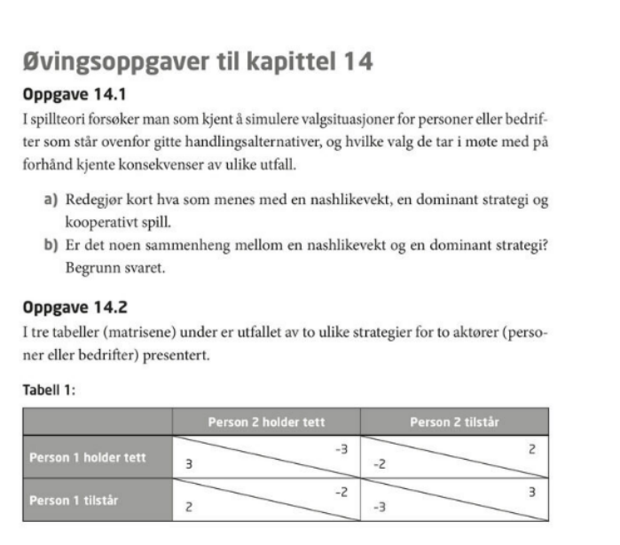

```{r, echo=F, eval=F}
filn <-'Regneverksted3_losning.Rmd'
rmarkdown::render(filn)
system('brave Regneverksted3_losning.html')
#system('source /home/joernih/homepageJIH/initsetup/alias_jih_sh; okindle', intern=T)
```

Versjon 1.0

# Tema: Husholdningens tilpasning

## Oppgave 4
a. Markedet for moteklær kan studeres som et frikonkurransemarked. Hva menes med markedsmekanismen og likevekt i dette frikonkurransemarkedet? Illustrer grafisk og knytt forklaringer til den grafiske presentasjonen.
<div class="solution">
Se læreboka figur 3.5. Man bør gjengi forutsetningene for markedsformen, særlig viktig er forutsetningene om pristageradferd, fri etablering og ingen eksterne effekter. Markedstilbudskurven gjenspeiler bedriftenes grensekostnadskurver og er stigende i pris, fordi høyere pris gir rom for større produksjon da grensekostnadene er økende i pris. Etterspørselskurven er fallende i pris da lavere pris på et gode gjør godet relativt sett billigere sammenlignet med andre goder, slik at konsumentene på marginen vil etterspørre mer av det aktuelle godet. Dette er substitusjonseffekten. I tillegg vil prisreduksjonen gi konsumentene økt kjøpekraft, og for noen goder vil dette, isolert sett, gi økt etterspørsel. Selv om godet er mindreverdig, vil totalvirkningen av en prisreduksjon på et gode være en økning i etterspørselen etter det samme godet.  

Ta utgangspunkt i en pris lavere likevektpeis, da har vi et etterspørselsoverskudd, og forklar hvordan prisene fører markedet tilbake til likevekt, hvor tilbud er lik etterspørsel. Gjør deretter det samme med en pris høyere enn likevektspris, da har vi et tilbudsoverskudd.

Markedsmekanismen er knyttet til den rollen som prisene og ubalanse mellom tilbud og etterspørsel spiller for å føre markedet tilbake til likevekt. Det er dette som skal forklares. 
</div>

```{r, eval=T, echo=F}
# Git relaterte
#knitr::knit_exit()
```

b. Blant annet på grunn av koronakrisen, har etterspørselskurven etter moteklær skiftet kraftig innover. Forklar og vis grafisk hvilke konsekvenser dette har for den nye likevekten på markedet.
<div class="solution">
Poenget her er at markedet via prisendringer kommer tilbake til likevekt etter at etterspørselskurven har skiftet innover. Ved den «gamle» prisen har man da et midlertidig tilbudsoverskudd, med pris over likevektspris. Prisene presses nedover, lagrene reduseres, og man kommer til en ny likevekt med lavere priser og lavere omsatt kvantum av moteklær.
</div>
c. Anta at markedet midlertidig er ute av likevekt på grunn av etterspørselssvikt. Illustrer ulikevekten grafisk og knytt forklaringer til figuren. Forklar hvordan man kan komme tilbake til likevekt.
<div class="solution">
Her skal vi tenke oss at tilbyderne ønsker å påvirke prisen slik at vi kommer tilbake til den opprinnelige markedsprisen, men ikke til det samme kvantumet. For å få til dette, må tilbyderne kutte produksjonen slik at tilbudskurven får et skift innover (venstreskift i tilbudet). Da vil de, ved et passende produksjonskutt kunne løfte prisen tilbake til det opprinnelige nivået, men da til en mye lavere produksjon. Vi har dermed fått ett venstreskift i etterspørselen og ett venstreskift i tilbudet som til sammen har resultert i uendret prisnivå, men (betydelig) lavere omsatt mengde.
</div>
d. Anta at produsentene av moteklær inngår en samarbeidsavtale om å redusere produksjonen. Anta videre at noen av aktørene ikke overholder produksjonsavtalen. Hvordan påvirker dette muligheten til å komme tilbake til likevekt?
<div class="solution">
Dersom en, eller flere av aktørene, bryter et prissamarbeid og øker sin produksjon, vil det trolig ha en liten effekt på markedspris og markedsomsetning. I frikonkurranse er det jo svært mange tilbydere som hver for seg har en marginal innflytelse på markedspris og omsetning. Men når én aktør først bryter samarbeidet, og tjener på det, vil mange andre også bli fristet til å gjøre det samme. Hver enkelt aktør vil jo tjene på dette, under forutsetning av at alle andre følger avtalen. Dersom alle, eller mange av tilbyderne, bryter avtalen er vi tilbake i frikonkurranseløsningen slik vi fant den i oppgave b.   
</div>
e. Etterspørselskurven på frikonkurransemarkedet er gitt ved følgende uttrykk:$X= 20-P$. Tilbudet er gitt ved  $X=3P$. I dette tilfellet angir X mengde og P er lik pris. Finn likevekten i markedet og illustrer svaret ditt grafisk.
<div class="solution">
Vi ser at likevektspris blir lik 5 kr og likevektsmengde blir lik 15. I diagrammet har vi tegnet inn en fallende etterspørselskurve. Skjæringspunktet må markeres eksplisitt. Vi har også en stigende tilbudskurve som starter i origo. 
Likevekten finner vi matematisk ved å sette etterspørsel lik tilbud, og først løse med hensyn på p. Deretter ser vi verdien for p (=5) inn i for eksempel etterspørselskurven og finner likevektmengden (x=15). 
</div>
f. Definer og kalkuler produsent- og konsument overskuddet i likevekt. Forklar hvorfor det samfunnsøkonomiske overskuddet maksimeres i dette tilfellet?
<div class="solution">
Konsumentoverskuddet (KO) i et marked er lik konsumentenes samlede, maksimale betalingsvilje minus det de faktisk må betale. KO er et mål på konsumentens velferd. Grafisk angis det ved området under etterspørselskurven og over prisen frem til likevektsmengden 15.  Det beregnes som arealet av trekanten: KO=[15*(20-5)]/2=112.50 kroner. 
Produsentoverskudd (PO) er definert som pris minus det minste produsentene må ha for å være villige til å produsere. Vi finner det som areal under prisen og over tilbudskurven (som er lik summen av alle bedrifters grensekostnadskurver). PO=(15*5)/2=37,5. PO er dermed lik pris minus grensekostnader i produksjonen av de omsatte enhetene. 

Samfunnsøkonomisk overskudd (SØO) er lik summen av KO og PO i dette tilfellet. Vi ser at SØO=150 kroner. 

Det samfunnsøkonomiske overskuddet maksimeres fordi marginal betalingsvillighet er lik grensekostnadene i produksjon for den siste enheten som omsettes. Marginal betalingsvillighet defineres som det konsumentene er villig til å betale for en ekstra enhet av godet. Dersom vi produserer en enhet mindre enn 15 enheter vil den marginale betalingsviljen være høyere enn grensekostnadene, og det samfunnsøkonomiske overskuddet kan økes ved å øke produksjonen med en enhet. Dersom vi produserer en enhet mer enn 15, vil grensekostnadene i produksjon være høyere enn den marginale betalingsvilligheten. Det koster altså mer å produsere den siste enheten enn det konsumentene er villig til å betale for den. Vi kan dermed øke det samfunnsøkonomiske overskuddet ved å redusere produksjonen med en enhet. Frikonkurranselikevekten maksimerer dermed det samfunnsøkonomiske overskuddet. 
</div>
g. Anta at det pålegges en stykkskatt lik 4 kroner per produsert enhet. Finn den nye likevekten.
<div class="solution">
En avgift vil ha den samme virkning på omsatt kvantum, uavhengig av om den blir pålagt produsentene eller konsumentene. Vi antar her at avgiften pålegges produsentene, noe som betyr at tilbudskurven skifter oppover (venstreskift). For hver solgt enhet, må nå konsumentene betale den tidligere prisen (uten avgiften) tillagt avgiften (pD). Ny etterspørselsfunksjon på prisform: 20-. Ny tilbudsfunksjon blir: . Likevektsbetingelsen er den samme:  I tillegg har vi ligningen for sammenhengen mellom konsumentprisen (pD) og produsentprisen (pS). Dette er jo lik stykkskatten (t): pD = pS + 4.  Vi setter inn dette uttrykket i tilbudsfunksjonen, og vi har dermed en ligning og en ukjent som er lik konsumentprisen: 
20-x=(1/3)x + 4, dette gir x =12 enheter
Setter likevektsmengden inn i etterspørselsfunksjonen: 20-
pS = pD – 4 = 8 – 4 = 4 bc
</div>
h. Hva blir konsument- og produsentoverskuddet i dette tilfellet? Hvilke konsekvenser får skatten for samfunnsøkonomisk overskudd? Forklar og illustrer svaret ditt med beregninger.
<div class="solution">
KO og PO blir redusert i dette tilfellet. KO er lik maksimal betalingsvilje minus det man betaler. Det betyr at KO = (12*12)/2=72 kroner. PO=(4*12)/2=24. I tillegg så betaler man skatt til myndighetene. Total skatt er lik 48 kroner (4*12). SØO blir dermed 72+24+48=144 kroner. Reduksjonen i SØO er lik 6 kroner. Det er dette som er samfunnsøkonomiske tap ved skatt, og er verdien (maksimal betalingsvillighet minus grensekostnader) av alle de enhetene man ikke produserer sammenlignet med frikonkurranselikevekt. Vi kan alternativt beregne dødvektstapet som (4*3)/2=6 kroner. 
</div>
i. Hvem bærer den minste andelen av skattebyrden? Begrunn svaret ditt.
<div class="solution">
I dette tilfellet bærer konsumentene den største skattebyrden, mens produsenten bærer den minste delen. Konsumentene bærer 3 kroner (de må betale 3 kroner mer for en enhet), mens produsentene bærer 1 krone (de får 1 krone mindre betalt per enhet). Det er den som har den mest uelastiske kurven i likevektpunktet før skatt som bærer den største andelen. Konsumentens etterspørselskurve er dermed mer prisuelastisk enn det tilbudskurven er. Dette kan vi vise eksplisitt ved å beregne de respektive priselastisitetene. Priselastisiteten definerer vi som tilnærmet lik den prosentvise endringen i etterspørselen (eventuelt tilbudet) av et gode som følge av prosentvis endring i prisen på godet. 
</div>
j. Begrunn hvorfor de totale skatteinntektene ikke er en del av det samfunnsøkonomiske tapet ved skatt.
<div class="solution">
Dødvektstapet på grunn av skatt er lik verdien av det som ikke produserer på grunn av at skatten skaper en kile mellom konsumentpris og produsentpris, vi har ikke likhet mellom marginal betalingsvillighet og grensekostnader i produksjon.  Selve skatteinntektene er en overføring fra konsumentene og produsentene i privat sektor til det offentlige, Skatteinntektene brukes til å finansiere offentlig sektor. Dette er altså en del av det samfunnsøkonomiske overskuddet på linje med KO og PO. 
</div>

## Oppgave 5
(a) Anta at en monopolist står overfor følgende etterspørselsfunksjon: $P(X)=5.000-2X$. Totalkostnadene er gitt ved: $C(X)=100.000+3.000X$. I dette tilfellet er X omsatt mengde av produktet.
Forklar med utgangspunkt i dette talleksempelet hva vi mener med grenseinntekt for monopolisten. Hvorfor er grenseinntekten for monopolisten ikke lik prisen på produktet?
<div class="solution">
Grenseinntekt er lik økning i inntekt ved økt produksjon og omsetning. R’(x)=5000+4x. Den er lavere enn pris fordi ved økt produksjon og fravær av prisdiskriminering må man sette ned prisen på alle enhetene man produserer dersom man ønsker å øke omsetning. Begrunnelsen er at monopolisten ikke kan fastsette pris uavhengig av etterspørselskurven. Monopolisten står overfor en fallende etterspørselskurve, og må ta hensyn til det. 
</div>
(b) Forklar og vis med utgangspunkt i talleksempelet hvordan monopolisten vil tilpasse seg. Illustrer tilpasningen grafisk. Hva blir fortjenesten til monopolisten?
<div class="solution">
Bedriften vil tilpasse seg slik grenseinntekt er lik grensekostnader. Dette kan forklares grafisk som vist i figur 10.6 i læreboka. Grensekostnader i oppgaven er konstante og lik 3000. Optimal produksjon er 500, pris er 4000. Fortjenesten er gitt ved 400.000. Grafisk: 
</div>
(c) Forklar hvorfor vi får et dødvektstap ved monopol. Beregn dødvektstapet og illustrer svaret ditt grafisk.
<div class="solution">
Dødvektstap er verdien av det man ikke produserer, det vil si produksjon som er lavere enn det som svarer til tilpasning slik at pris er lik grensekostnad (x=1000). Alternativt: dersom man produserer slik at marginal betalingsvillighet er høyere enn grensekostnader i produksjon vil man få et dødvektstap (effektivitetstap). I figuren over er dette gitt ved verdien utover grensekostnad av all produksjon mellom 500 og 1000 enheter. Verdien er gitt ved forskjellen mellom betalingsvillighet og grensekostnader for disse enhetene. Utregnet blir tapet lik 250.000 kroner. (KO=250.000 kr, PO=500.000kr)
</div>
(d) Hva blir fortjenesten dersom monopolisten velger å produsere 600 enheter av produktet? Illustrer den nye tilpasningen grafisk. Vil du anbefale monopolisten å øke produksjonen? Begrunn svaret ditt. Hva skjer med dødvektstapet og det samfunnsøkonomiske overskuddet i dette tilfellet?
<div class="solution">
Ved omsatt mengde lik 600, har vi høyere produksjon enn det som svarer til fortjenestemaksimering. Vi forventer en lavere fortjeneste fordi kostnadene ved økt produksjon vil øke mer enn inntektene. Prisen til den nye mengden er lik 3800, og fortjenesten vil bli lik 380.000 (R=2.280.000, C=1.900.000). Denne mengden vil ikke maksimere monopolistens fortjeneste, men det samfunnsøkonomiske overskuddet vil øke. Dødvektstapet reduseres til: 160.000 kroner. (KO=360.000, PO=480.000kr). SØO økes til: 840000 kr. 
</div>

## Oppgave 6

```{r, echo=FALSE, out.width="45%", fig.cap=""}
knitr::include_graphics("bilder/kap13.png")
```

## Oppgave 7

```{r, echo=FALSE, out.width="45%", fig.cap=""}

```

```{r, eval=T, echo=F}
# Git relaterte
knitr::knit_exit()
```

```{r, eval=T, echo=F}
# Git relaterte
knitr::knit_exit()
```

Oppgave 1
    a) Markedet for moteklær kan studeres som et frikonkurransemarked. Hva menes med markedsmekanismen og likevekt i dette frikonkurransemarkedet? Illustrer grafisk og knytt forklaringer til den grafiske presentasjonen.  

Svarforslag: Se læreboka figur 3.5. Man bør gjengi forutsetningene for markedsformen, særlig viktig er forutsetningene om pristageradferd, fri etablering og ingen eksterne effekter. Markedstilbudskurven gjenspeiler bedriftenes grensekostnadskurver og er stigende i pris, fordi høyere pris gir rom for større produksjon da grensekostnadene er økende i pris. Etterspørselskurven er fallende i pris da lavere pris på et gode gjør godet relativt sett billigere sammenlignet med andre goder, slik at konsumentene på marginen vil etterspørre mer av det aktuelle godet. Dette er substitusjonseffekten. I tillegg vil prisreduksjonen gi konsumentene økt kjøpekraft, og for noen goder vil dette, isolert sett, gi økt etterspørsel. Selv om godet er mindreverdig, vil totalvirkningen av en prisreduksjon på et gode være en økning i etterspørselen etter det samme godet.  

Ta utgangspunkt i en pris lavere likevektpeis, da har vi et etterspørselsoverskudd, og forklar hvordan prisene fører markedet tilbake til likevekt, hvor tilbud er lik etterspørsel. Gjør deretter det samme med en pris høyere enn likevektspris, da har vi et tilbudsoverskudd.

Markedsmekanismen er knyttet til den rollen som prisene og ubalanse mellom tilbud og etterspørsel spiller for å føre markedet tilbake til likevekt. Det er dette som skal forklares. 


    b) Blant annet på grunn av koronakrisen, har etterspørselskurven etter moteklær skiftet kraftig innover. Forklar og vis grafisk hvilke konsekvenser dette har for den nye likevekten på markedet. 
Svarforslag: Poenget her er at markedet via prisendringer kommer tilbake til likevekt etter at etterspørselskurven har skiftet innover. Ved den «gamle» prisen har man da et midlertidig tilbudsoverskudd, med pris over likevektspris. Prisene presses nedover, lagrene reduseres, og man kommer til en ny likevekt med lavere priser og lavere omsatt kvantum av moteklær. 

    c) Anta at markedet midlertidig er ute av likevekt på grunn av etterspørselssvikt. Illustrer ulikevekten grafisk og knytt forklaringer til figuren. Forklar hvordan man kan komme tilbake til likevekt. 
Svarforslag: Her skal vi tenke oss at tilbyderne ønsker å påvirke prisen slik at vi kommer tilbake til den opprinnelige markedsprisen, men ikke til det samme kvantumet. For å få til dette, må tilbyderne kutte produksjonen slik at tilbudskurven får et skift innover (venstreskift i tilbudet). Da vil de, ved et passende produksjonskutt kunne løfte prisen tilbake til det opprinnelige nivået, men da til en mye lavere produksjon. Vi har dermed fått ett venstreskift i etterspørselen og ett venstreskift i tilbudet som til sammen har resultert i uendret prisnivå, men (betydelig) lavere omsatt mengde.  

    d) Anta at produsentene av moteklær inngår en samarbeidsavtale om å redusere produksjonen. Anta videre at noen av aktørene ikke overholder produksjonsavtalen. Hvordan påvirker dette muligheten til å komme tilbake til likevekt? 

Svarforslag: Dersom en, eller flere av aktørene, bryter et prissamarbeid og øker sin produksjon, vil det trolig ha en liten effekt på markedspris og markedsomsetning. I frikonkurranse er det jo svært mange tilbydere som hver for seg har en marginal innflytelse på markedspris og omsetning. Men når én aktør først bryter samarbeidet, og tjener på det, vil mange andre også bli fristet til å gjøre det samme. Hver enkelt aktør vil jo tjene på dette, under forutsetning av at alle andre følger avtalen. Dersom alle, eller mange av tilbyderne, bryter avtalen er vi tilbake i frikonkurranseløsningen slik vi fant den i oppgave b.     

    e) Etterspørselskurven på frikonkurransemarkedet er gitt ved følgende uttrykk:
= 20-p. Tilbudet er gitt ved =3p. I dette tilfellet angir x mengde og p er lik pris. Finn likevekten i markedet og illustrer svaret ditt grafisk. 

Svarforslag: Vi ser at likevektspris blir lik 5 kr og likevektsmengde blir lik 15. I diagrammet har vi tegnet inn en fallende etterspørselskurve. Skjæringspunktet må markeres eksplisitt. Vi har også en stigende tilbudskurve som starter i origo. 
Likevekten finner vi matematisk ved å sette etterspørsel lik tilbud, og først løse med hensyn på p. Deretter ser vi verdien for p (=5) inn i for eksempel etterspørselskurven og finner likevektmengden (x=15). 


 		Kroner (pris)
                                20


                          5


                                                   15                20
                                                                               Mengde (x)

    f) Definer og kalkuler produsent- og konsument overskuddet i likevekt. Forklar hvorfor det samfunnsøkonomiske overskuddet maksimeres i dette tilfellet?

Svarforslag: 
Konsumentoverskuddet (KO) i et marked er lik konsumentenes samlede, maksimale betalingsvilje minus det de faktisk må betale. KO er et mål på konsumentens velferd. Grafisk angis det ved området under etterspørselskurven og over prisen frem til likevektsmengden 15.  Det beregnes som arealet av trekanten: KO=[15*(20-5)]/2=112.50 kroner. 
Produsentoverskudd (PO) er definert som pris minus det minste produsentene må ha for å være villige til å produsere. Vi finner det som areal under prisen og over tilbudskurven (som er lik summen av alle bedrifters grensekostnadskurver). PO=(15*5)/2=37,5. PO er dermed lik pris minus grensekostnader i produksjonen av de omsatte enhetene. 

Samfunnsøkonomisk overskudd (SØO) er lik summen av KO og PO i dette tilfellet. Vi ser at SØO=150 kroner. 

Det samfunnsøkonomiske overskuddet maksimeres fordi marginal betalingsvillighet er lik grensekostnadene i produksjon for den siste enheten som omsettes. Marginal betalingsvillighet defineres som det konsumentene er villig til å betale for en ekstra enhet av godet. Dersom vi produserer en enhet mindre enn 15 enheter vil den marginale betalingsviljen være høyere enn grensekostnadene, og det samfunnsøkonomiske overskuddet kan økes ved å øke produksjonen med en enhet. Dersom vi produserer en enhet mer enn 15, vil grensekostnadene i produksjon være høyere enn den marginale betalingsvilligheten. Det koster altså mer å produsere den siste enheten enn det konsumentene er villig til å betale for den. Vi kan dermed øke det samfunnsøkonomiske overskuddet ved å redusere produksjonen med en enhet. Frikonkurranselikevekten maksimerer dermed det samfunnsøkonomiske overskuddet. 

    g) Anta at det pålegges en stykkskatt lik 4 kroner per produsert enhet. Finn den nye likevekten. 
Svarforslag:  
En avgift vil ha den samme virkning på omsatt kvantum, uavhengig av om den blir pålagt produsentene eller konsumentene. Vi antar her at avgiften pålegges produsentene, noe som betyr at tilbudskurven skifter oppover (venstreskift). For hver solgt enhet, må nå konsumentene betale den tidligere prisen (uten avgiften) tillagt avgiften (pD). Ny etterspørselsfunksjon på prisform: 20-. Ny tilbudsfunksjon blir: . Likevektsbetingelsen er den samme:  I tillegg har vi ligningen for sammenhengen mellom konsumentprisen (pD) og produsentprisen (pS). Dette er jo lik stykkskatten (t): pD = pS + 4.  Vi setter inn dette uttrykket i tilbudsfunksjonen, og vi har dermed en ligning og en ukjent som er lik konsumentprisen: 
20-x=(1/3)x + 4, dette gir x =12 enheter
Setter likevektsmengden inn i etterspørselsfunksjonen: 20-
pS = pD – 4 = 8 – 4 = 4 

 		


    h) Hva blir konsument- og produsentoverskuddet i dette tilfellet? Hvilke konsekvenser får skatten for samfunnsøkonomisk overskudd? Forklar og illustrer svaret ditt med beregninger. 

KO og PO blir redusert i dette tilfellet. KO er lik maksimal betalingsvilje minus det man betaler. Det betyr at KO = (12*12)/2=72 kroner. PO=(4*12)/2=24. I tillegg så betaler man skatt til myndighetene. Total skatt er lik 48 kroner (4*12). SØO blir dermed 72+24+48=144 kroner. Reduksjonen i SØO er lik 6 kroner. Det er dette som er samfunnsøkonomiske tap ved skatt, og er verdien (maksimal betalingsvillighet minus grensekostnader) av alle de enhetene man ikke produserer sammenlignet med frikonkurranselikevekt. Vi kan alternativt beregne dødvektstapet som (4*3)/2=6 kroner. 

    i) Hvem bærer den minste andelen av skattebyrden? Begrunn svaret ditt. 

I dette tilfellet bærer konsumentene den største skattebyrden, mens produsenten bærer den minste delen. Konsumentene bærer 3 kroner (de må betale 3 kroner mer for en enhet), mens produsentene bærer 1 krone (de får 1 krone mindre betalt per enhet). Det er den som har den mest uelastiske kurven i likevektpunktet før skatt som bærer den største andelen. Konsumentens etterspørselskurve er dermed mer prisuelastisk enn det tilbudskurven er. Dette kan vi vise eksplisitt ved å beregne de respektive priselastisitetene. Priselastisiteten definerer vi som tilnærmet lik den prosentvise endringen i etterspørselen (eventuelt tilbudet) av et gode som følge av prosentvis endring i prisen på godet. 

    j) Begrunn hvorfor de totale skatteinntektene ikke er en del av det samfunnsøkonomiske tapet ved skatt. 
Dødvektstapet på grunn av skatt er lik verdien av det som ikke produserer på grunn av at skatten skaper en kile mellom konsumentpris og produsentpris, vi har ikke likhet mellom marginal betalingsvillighet og grensekostnader i produksjon.  Selve skatteinntektene er en overføring fra konsumentene og produsentene i privat sektor til det offentlige, Skatteinntektene brukes til å finansiere offentlig sektor. Dette er altså en del av det samfunnsøkonomiske overskuddet på linje med KO og PO. 

Oppgave 2
    a) Anta at en monopolist står overfor følgende etterspørselskurve: 
P(X)=5.000-2X. Totalkostnadene er gitt ved: C(X)=100.000+3.000X. I dette tilfellet er X omsatt mengde av produktet. 
Forklar med utgangspunkt i dette talleksempelet hva vi mener med grenseinntekt for monopolisten. Hvorfor er grenseinntekten for monopolisten lavere enn prisen?
Grenseinntekt er lik økning i inntekt ved økt produksjon og omsetning. R’(x)=5000+4x. Den er lavere enn pris fordi ved økt produksjon og fravær av prisdiskriminering må man sette ned prisen på alle enhetene man produserer dersom man ønsker å øke omsetning. Begrunnelsen er at monopolisten ikke kan fastsette pris uavhengig av etterspørselskurven. Monopolisten står overfor en fallende etterspørselskurve, og må ta hensyn til det. 

b) Forklar og vis med utgangspunkt i talleksempelet hvordan monopolisten vil tilpasse seg. Illustrer tilpasningen grafisk. Hva bli fortjenesten til monopolisten?
Bedriften vil tilpasse seg slik grenseinntekt er lik grensekostnader. Dette kan forklares grafisk som vist i figur 10.6 i læreboka. Grensekostnader i oppgaven er konstante og lik 3000. Optimal produksjon er 500, pris er 4000. Fortjenesten er gitt ved 400.000. Grafisk: 


c) Forklar hvorfor vi får et dødvektstap ved monopol. Beregn dødvektstapet og illustrer svaret ditt grafisk. 

Dødvektstap er verdien av det man ikke produserer, det vil si produksjon som er lavere enn det som svarer til tilpasning slik at pris er lik grensekostnad (x=1000). Alternativt: dersom man produserer slik at marginal betalingsvillighet er høyere enn grensekostnader i produksjon vil man få et dødvektstap (effektivitetstap). I figuren over er dette gitt ved verdien utover grensekostnad av all produksjon mellom 500 og 1000 enheter. Verdien er gitt ved forskjellen mellom betalingsvillighet og grensekostnader for disse enhetene. Utregnet blir tapet lik 250.000 kroner. (KO=250.000 kr, PO=500.000kr)

    d) Hva blir fortjenesten dersom monopolisten velger å produsere 600 enheter av produktet? Illustrer den nye tilpasningen grafisk. Vil du anbefale monopolisten å øke produksjonen? Begrunn svaret ditt. Hva skjer med dødvektstapet og det samfunnsøkonomiske overskuddet i dette tilfellet? 

Ved omsatt mengde lik 600, har vi høyere produksjon enn det som svarer til fortjenestemaksimering. Vi forventer en lavere fortjeneste fordi kostnadene ved økt produksjon vil øke mer enn inntektene. Prisen til den nye mengden er lik 3800, og fortjenesten vil bli lik 380.000 (R=2.280.000, C=1.900.000). Denne mengden vil ikke maksimere monopolistens fortjeneste, men det samfunnsøkonomiske overskuddet vil øke. Dødvektstapet reduseres til: 160.000 kroner. (KO=360.000, PO=480.000kr). SØO økes til: 840000 kr. 

