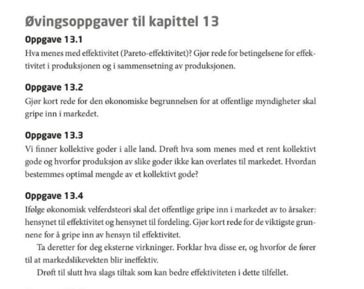
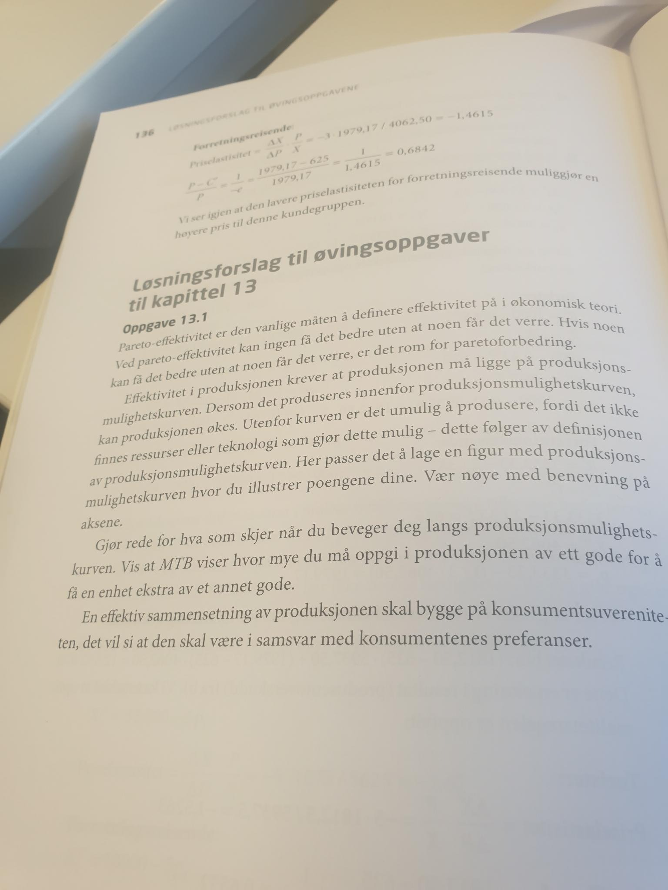
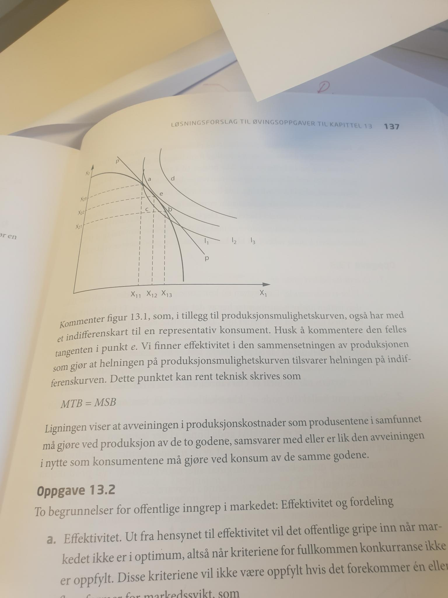
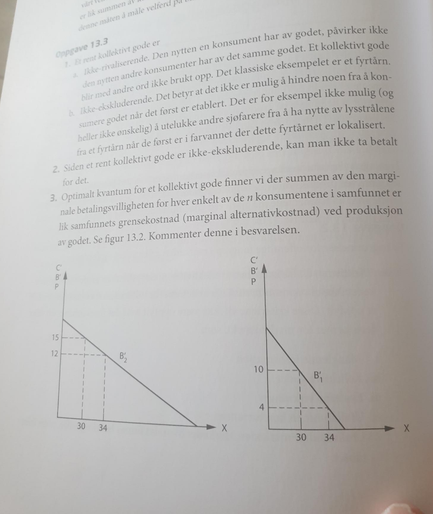
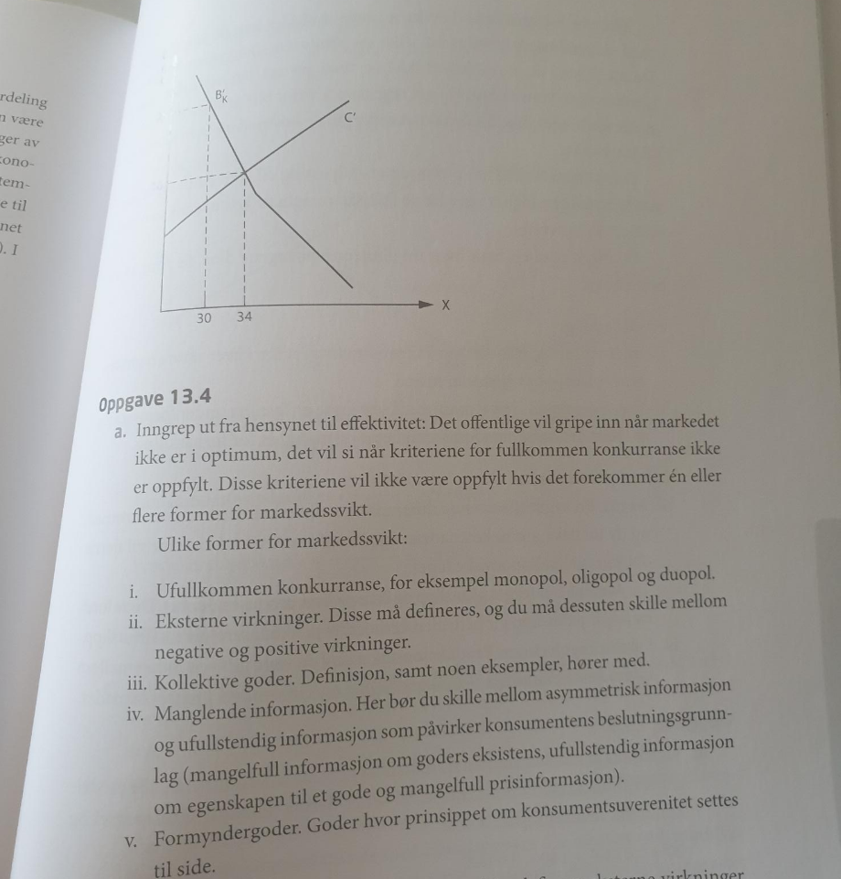
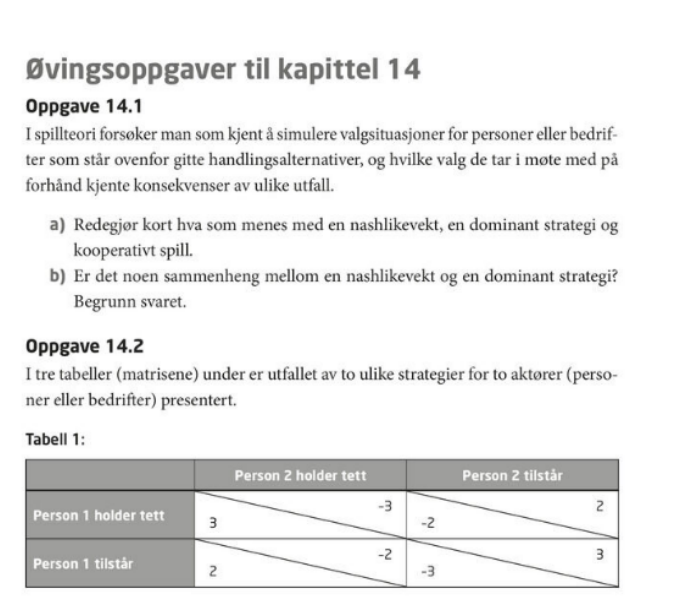
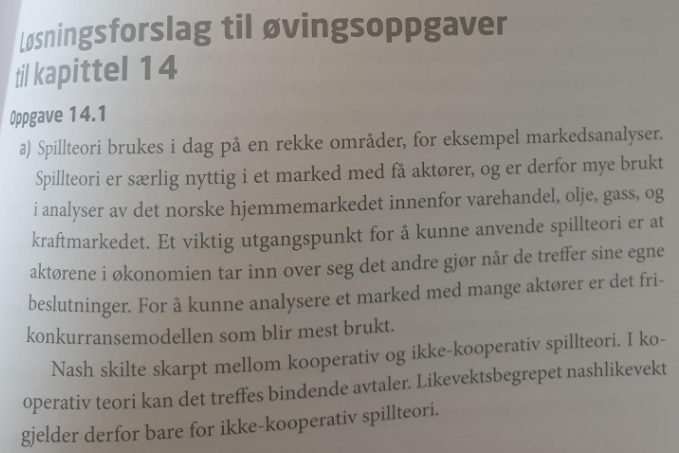
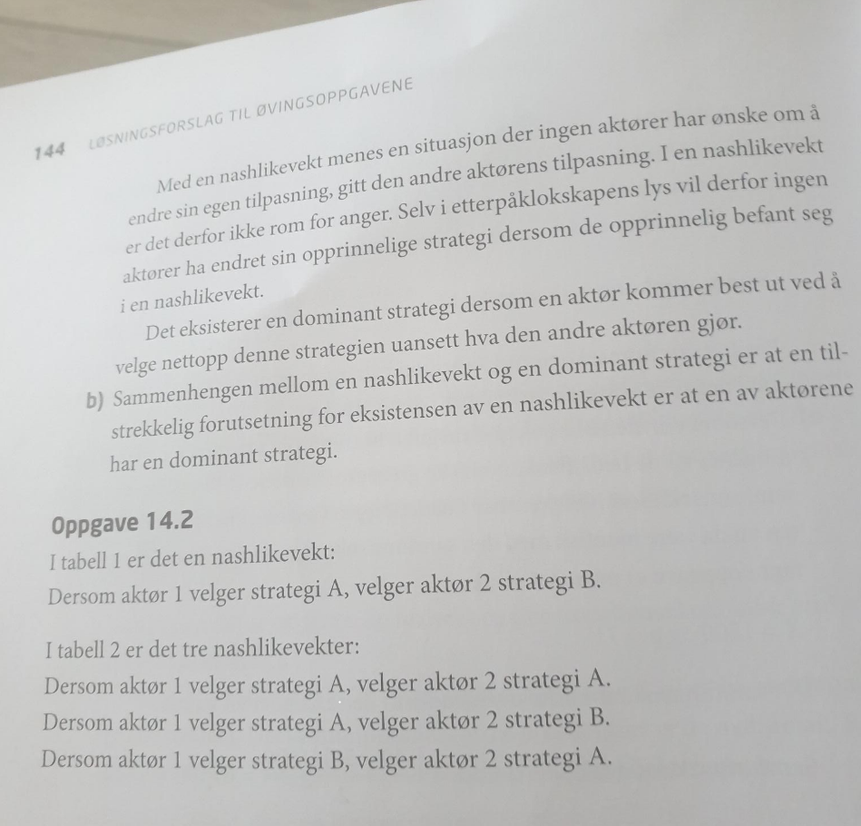

# Monopolistens tilpasning
## Oppgave 5
(a) Anta at en monopolist står overfor følgende etterspørselsfunksjon: $P(X)=5.000-2X$. Totalkostnadene er gitt ved: $C(X)=100.000+3.000X$. I dette tilfellet er X omsatt mengde av produktet.
Forklar med utgangspunkt i dette talleksempelet hva vi mener med grenseinntekt for monopolisten. Hvorfor er grenseinntekten for monopolisten ikke lik prisen på produktet?
<div class="sol">
Grenseinntekt er lik økning i inntekt ved økt produksjon og omsetning. R’(x)=5000-4x. Den er lavere enn pris fordi ved økt produksjon og fravær av prisdiskriminering må man sette ned prisen på alle enhetene man produserer dersom man ønsker å øke omsetning. Begrunnelsen er at monopolisten ikke kan fastsette pris uavhengig av etterspørselskurven. Monopolisten står overfor en fallende etterspørselskurve, og må ta hensyn til det. 
</div>
(b) Forklar og vis med utgangspunkt i talleksempelet hvordan monopolisten vil tilpasse seg. Illustrer tilpasningen grafisk. Hva blir fortjenesten til monopolisten?
<div class="sol">
Bedriften vil tilpasse seg slik grenseinntekt er lik grensekostnader. Dette kan forklares grafisk som vist i figur 10.6 i læreboka. Grensekostnader i oppgaven er konstante og lik 3000. Optimal produksjon er 500, pris er 4000. Fortjenesten er gitt ved 400.000. Grafisk: 
</div>
(c) Forklar hvorfor vi får et dødvektstap ved monopol. Beregn dødvektstapet og illustrer svaret ditt grafisk.
<div class="sol">
Dødvektstap er verdien av det man ikke produserer, det vil si produksjon som er lavere enn det som svarer til tilpasning slik at pris er lik grensekostnad (x=1000). Alternativt: dersom man produserer slik at marginal betalingsvillighet er høyere enn grensekostnader i produksjon vil man få et dødvektstap (effektivitetstap). I figuren over er dette gitt ved verdien utover grensekostnad av all produksjon mellom 500 og 1000 enheter. Verdien er gitt ved forskjellen mellom betalingsvillighet og grensekostnader for disse enhetene. Utregnet blir tapet lik 250.000 kroner. (KO=250.000 kr, PO=500.000kr)
</div>
(d) Hva blir fortjenesten dersom monopolisten velger å produsere 600 enheter av produktet? Illustrer den nye tilpasningen grafisk. Vil du anbefale monopolisten å øke produksjonen? Begrunn svaret ditt. Hva skjer med dødvektstapet og det samfunnsøkonomiske overskuddet i dette tilfellet?
<div class="sol">
Ved omsatt mengde lik 600, har vi høyere produksjon enn det som svarer til fortjenestemaksimering. Vi forventer en lavere fortjeneste fordi kostnadene ved økt produksjon vil øke mer enn inntektene. Prisen til den nye mengden er lik 3800, og fortjenesten vil bli lik 380.000 (R=2.280.000, C=1.900.000). Denne mengden vil ikke maksimere monopolistens fortjeneste, men det samfunnsøkonomiske overskuddet vil øke. Dødvektstapet reduseres til: 160.000 kroner. (KO=360.000, PO=480.000kr). SØO økes til: 840000 kr. 
</div>
## Oppgave 6

```{r, echo=FALSE, out.width="45%", fig.cap=""}

```
```{r, echo=FALSE, out.width="45%", fig.cap=""}

```
```{r, echo=FALSE, out.width="45%", fig.cap=""}

```
```{r, echo=FALSE, out.width="45%", fig.cap=""}

```
```{r, echo=FALSE, out.width="45%", fig.cap=""}

```

## Oppgave 7
```{r, echo=FALSE, out.width="45%", fig.cap=""}

```
```{r, echo=FALSE, out.width="45%", fig.cap=""}

```
```{r, echo=FALSE, out.width="45%", fig.cap=""}

```

```{r, eval=T, echo=F}
knitr::knit_exit()
```

